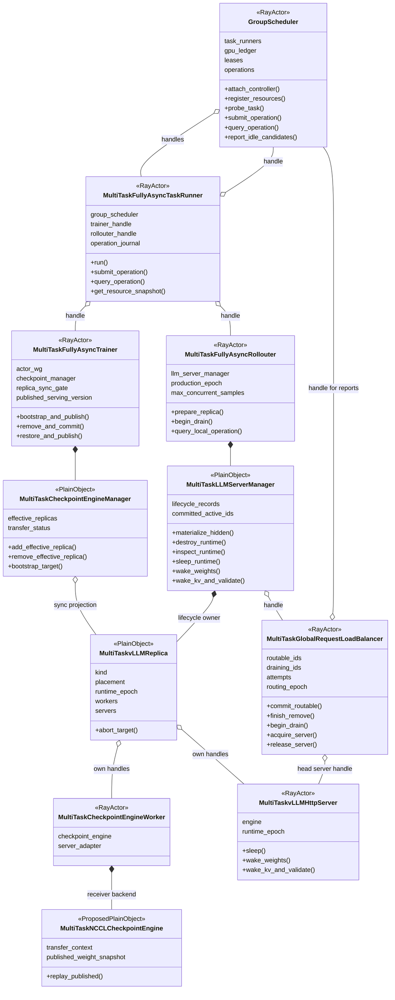
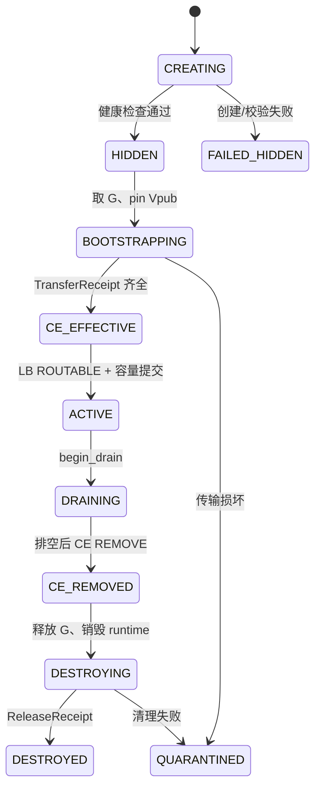
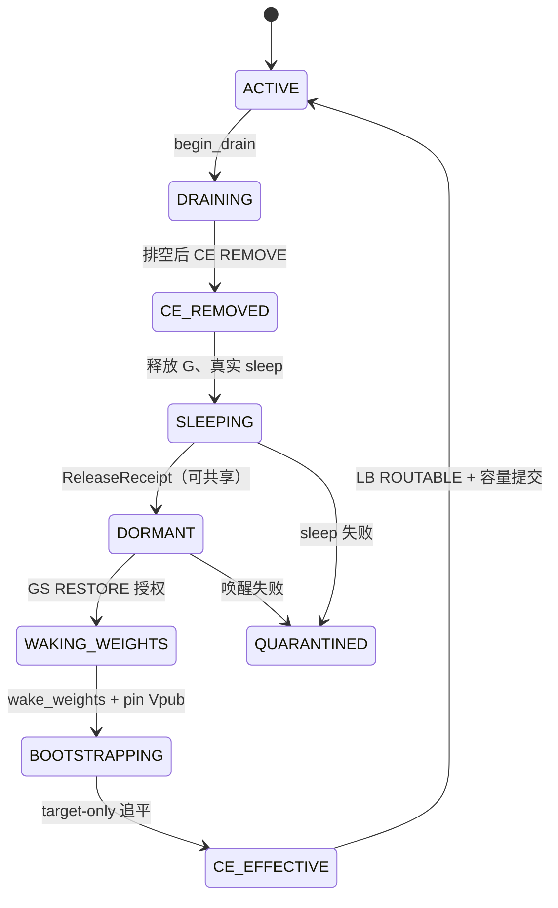
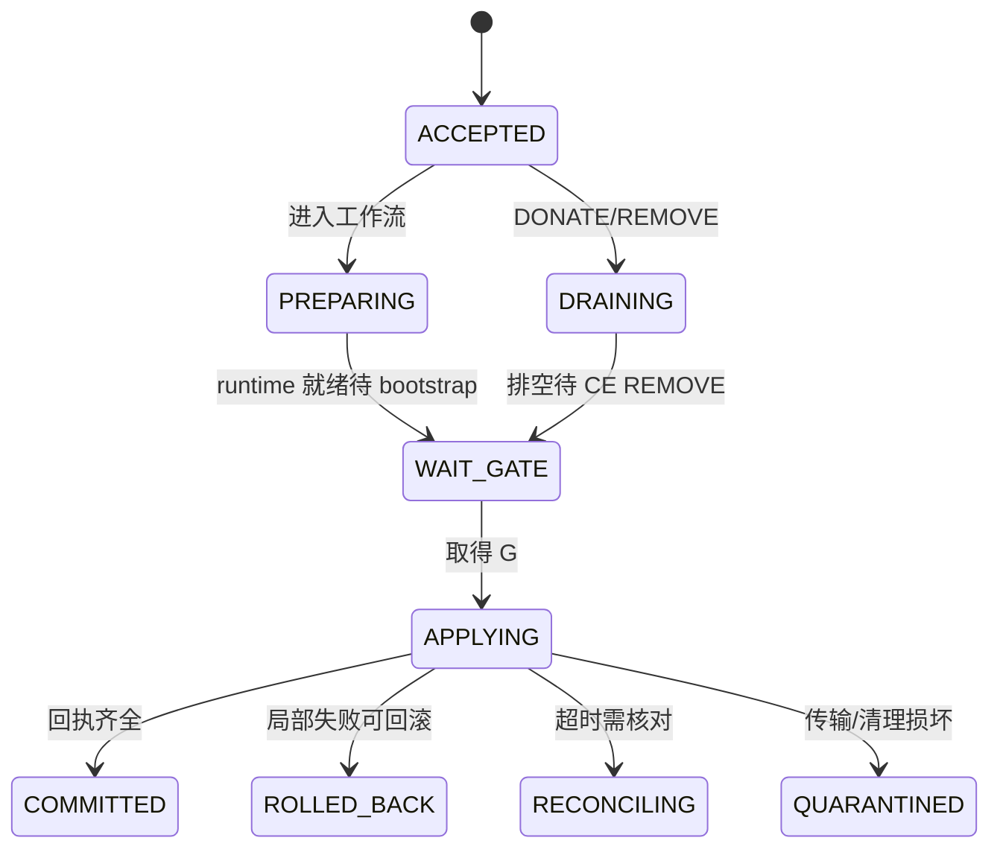
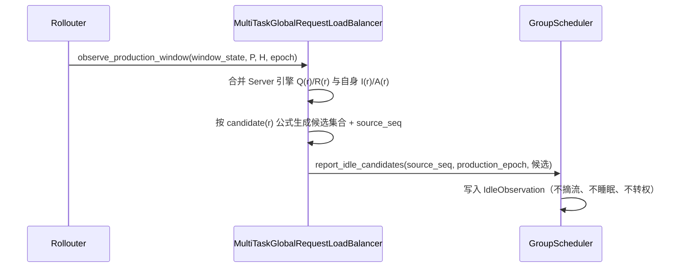
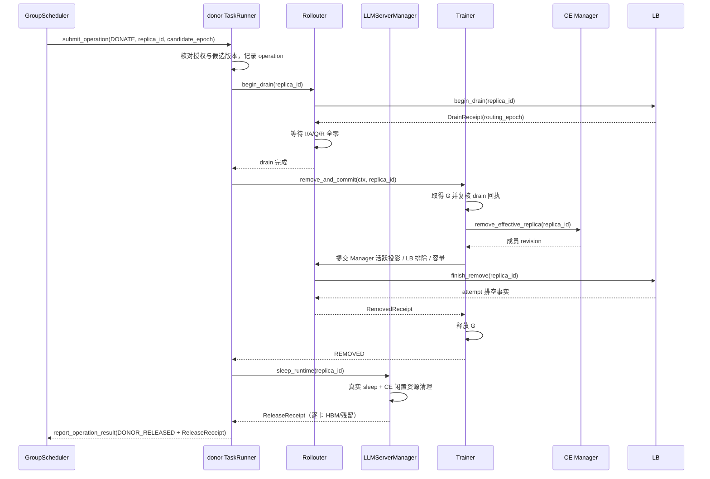
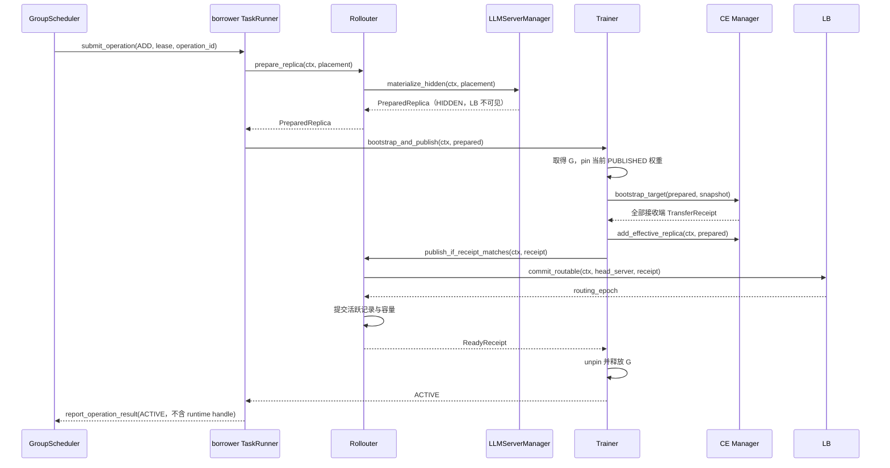
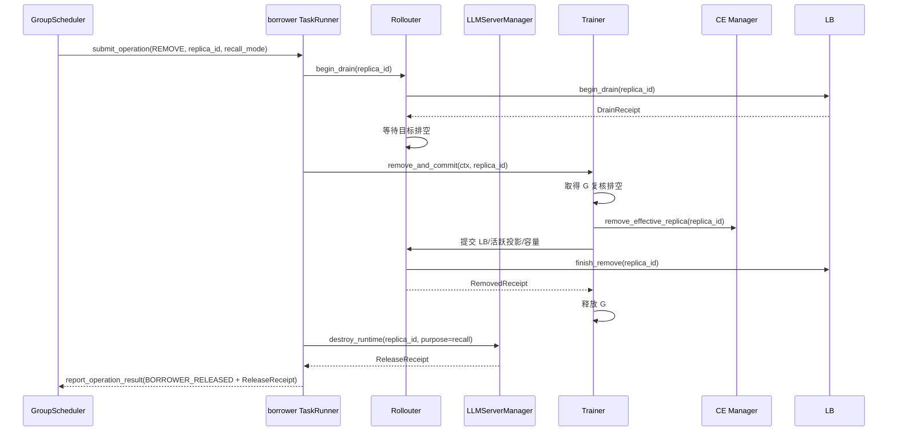
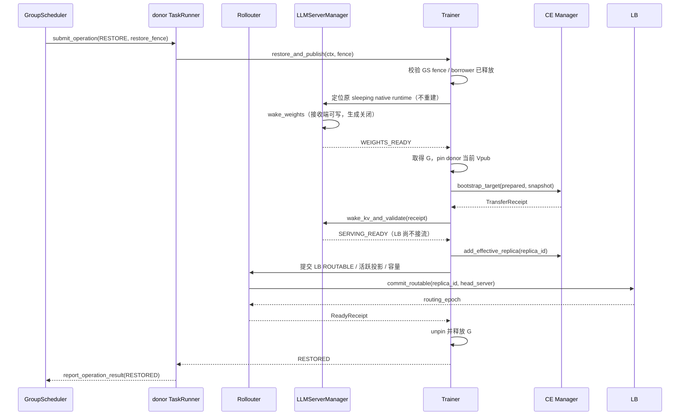
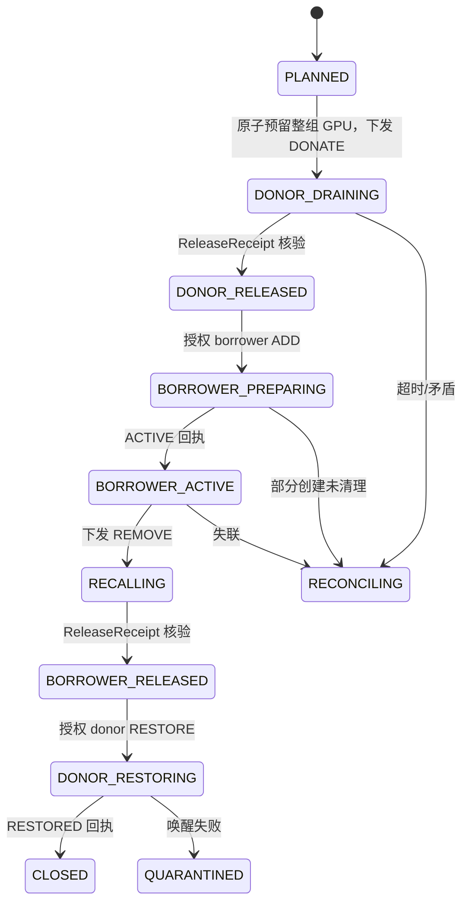

# 多 RL 任务资源共享调度 —— 动态流程编排详细设计

> 文档状态：**待评审（TO-BE 详细设计）**。本文所有新增接口、类、字段、状态与 backend 名称均为 **Proposed**，尚未在伴生仓或 verl 原生仓实现，也未完成 GPU 验证。
> 适用基线：experimental Fully Async + 纯 STANDALONE + vLLM 非 PD。HYBRID 模式与 Trainer mode `colocate_async` 不套用本文的单集合、单 gate 协议。
> 本文依据 `D:/多RL任务/multi_task_verl/multi_task_scheduler/多RL任务资源共享调度对接VERL_补充.md`（下称《补充》），把其中 §5.2 原语、§5.3 任务内编排、§5.4 GS 交互细化为一份面向「空泡感知与上报、replica 动态接入、移除、休眠与唤醒」的完整设计，包含接口设计、类图、逻辑视图、新增数据结构与数据流图。

---

## 1. 范围、术语与设计基线

### 1.1 范围

本设计覆盖动态流程编排的四个能力面（对应《补充》§5.3 与 §5.4）：

1. **空泡感知与上报**：任务内的 Load Balancer（LB）依据生产窗口、请求账本与引擎状态判定「可捐出 replica」，并向 GroupScheduler（GS）上报空卡事实；上报本身不摘流、不睡眠、不转移使用权。
2. **replica 动态接入（ADD）**：borrower 任务在 GS 授权的 node/GPU 租约上创建自己的 hidden replica，追平已发布权重，再进入 CE effective 集合与 LB 路由。
3. **replica 移除（REMOVE）**：borrower 自然排空并销毁自有 runtime；具备能力时支持定向强制回收与续推。
4. **replica 休眠与唤醒（sleep / wake-up）**：donor 摘流、CE 排除后真实睡眠；收到 GS RESTORE 授权后分阶段唤醒并追平自身当前已发布版本。

四者由 GS 的租约状态机串成一条跨任务的闭环：**DONATE → ADD → REMOVE → RESTORE**。本文不包含 §5.5 的调度策略算法与 §5.6 的自动故障恢复，只定义策略执行所需的原语、合同与流程。

### 1.2 术语

| 术语 | 定义 |
|---|---|
| GroupScheduler（GS） | 全局调度单例 Ray Actor，维护物理 GPU 使用权账本，协调多个 RL 任务共享 rollout 卡。旧文称 GlobalScheduler。 |
| TaskRunner | 任务控制 Ray Actor（本文为 `MultiTaskFullyAsyncTaskRunner`），GS 进入任务内部的唯一控制入口。 |
| Trainer | 训练侧 Ray Actor（`MultiTaskFullyAsyncTrainer`），持有 Checkpoint Engine（CE）Manager 与参数版本。 |
| Rollouter | 推演侧 Ray Actor（`MultiTaskFullyAsyncRollouter`），持有 LLMServerManager、生产窗口与并发容量。 |
| CE | Checkpoint Engine，参数同步组件；本文语境下指 STANDALONE 的权重传输后端。 |
| LB | GlobalRequestLoadBalancer，请求负载均衡 Ray Actor。 |
| native replica | 任务按自身初始资源创建的推理实例。 |
| borrowed replica | borrower 任务在租借 GPU 上创建的推理实例，创建起归 borrower 所有。 |
| donor / borrower | 捐出 GPU 的任务 / 借入 GPU 的任务。 |
| effective_replicas（E） | 任务当前参加参数同步的接收端集合 = 未借出的 native + 已提交的 borrowed。 |
| Vpub | Trainer 已成功发布的 serving 版本；区别于可能领先的 live weights。 |
| G | replica-sync gate，Trainer 内的任务内门锁，串行化 bootstrap、CE ADD/REMOVE、路由/容量提交与原生参数同步。 |

### 1.3 源码基线（AS-IS 事实）

- verl：`D:/多RL任务/verl`，HEAD `f92febf5`；伴生仓：`D:/多RL任务/verl-multi-task`，HEAD `293d6fa2`。
- 伴生仓当前实现（`src/multi_task_scheduler/`）**仅做类型替换与 GS 句柄登记，无任何编排逻辑**，是本设计的 GAP 起点：
  - `scheduler/group_scheduler.py`：`GroupScheduler` 只保存 `task_runners: dict[str, ActorHandle]`，`attach_task/detach_task/get_task_runners/schedule`（`schedule` 返回空 `[]`）。
  - `integration/verl/experimental_fully_async/task_runner.py`：`run()` 仅在 try/finally 中 attach/detach GS；无训练期间控制入口。
  - `integration/verl/experimental_fully_async/trainer.py`：仅替换 CE Manager 类，无 replica-sync gate、无 Vpub。
  - `integration/verl/experimental_fully_async/rollouter.py`：仅替换 Manager 类型并透传 `group_scheduler`。
  - `rollout/load_balancer.py`：仅保存 `group_scheduler` 句柄，路由全部继承原生。
  - `rollout/replica.py`、`rollout/http_server.py`、`checkpoint/checkpoint_engine_worker.py`、`checkpoint/checkpoint_engine_manager.py`：空扩展或仅换类。

- verl 原生关键接线点（行号为当前定位点，升级需重核）：
  - 原生 `FullyAsyncTrainer._fit_update_weights()` 仅在 `local_trigger_step == 1` 时真正同步（`verl/verl/experimental/fully_async_policy/fully_async_trainer.py:690`）。
  - 原生 `CheckpointEngineManager.add_replicas/remove_replicas` 只改 `self.replicas`、无锁（`verl/verl/checkpoint_engine/base.py:449、457`）；`update_weights` 汇其 Workers 传权（`:504`）。
  - STANDALONE 的普通 `sleep()/wake_up()` 为「skip」，同步专用 `release_kv_cache()` 才释放再唤醒 weights（`verl/verl/workers/rollout/vllm_rollout/vllm_async_server.py:833、854、876`）。
  - 原生 standalone 初始化新建 ResourcePool/WorkerGroup（`verl/verl/workers/rollout/replica.py:189`）；Server 启动从 Worker 的 Ray accelerator IDs 取卡号（`vllm_async_server.py:1295`），borrowed 不申报 Ray GPU 时不能沿用。

---

## 2. 逻辑视图：组件、所有权与不变量

### 2.1 组件清单与所有权

| 实体 | 运行类型 | 创建者 | 本设计赋予的状态/能力 |
|---|---|---|---|
| `GroupScheduler` | Ray Actor（detached named） | 首个任务经 discovery 创建 | 全局 GPU 账本、租约、operation 记录；不持有任何 Worker/Server runtime |
| `MultiTaskFullyAsyncTaskRunner` | Ray Actor | main | 持有 GS/Trainer/Rollouter 句柄；operation journal；训练期间控制入口 |
| `MultiTaskFullyAsyncTrainer` | Ray Actor | TaskRunner | 持有 CE Manager、replica-sync gate G、`published_serving_version`（Vpub） |
| `MultiTaskFullyAsyncRollouter` | Ray Actor | TaskRunner | 持有 LLMServerManager、`production_epoch`、`max_concurrent_samples` |
| `MultiTaskCheckpointEngineManager` | Trainer Actor 内普通对象 | Trainer | 唯一 `effective_replicas`（E）与传输协调；不拥有远端 Replica 销毁权 |
| `MultiTaskLLMServerManager` | Rollouter Actor 内普通对象 | Rollouter | 唯一拥有 native/borrowed Replica 生命周期记录与运行时引用 |
| `MultiTaskvLLMReplica` | Manager 内普通对象 | Manager | 按租约放置、保存 CE Worker/Server 句柄与清理清单；native/borrowed 不同初始化分支 |
| `MultiTaskCheckpointEngineWorker` | Ray Actor | Replica | borrower 自有 receiver/ServerAdapter/CE backend；报告实际设备与传输完成 |
| `MultiTaskvLLMHttpServer` | Ray Actor（内起 vLLM 子进程） | Replica | 生成入口、定向中断、休眠/分阶段唤醒、引擎就绪检查 |
| `MultiTaskGlobalRequestLoadBalancer` | Ray Actor | Manager | `routable_ids`、`draining_ids`、attempt 账本、`routing_epoch`；只向 READY Server 分发 |
| `MultiTaskNCCLCheckpointEngine`（Proposed） | 各相关 Worker 内普通 backend | 显式配置加载 | 原生传输 + 已发布权重保留 + target-only 重放 + 通信组清理 |

所有权边界（与《补充》§3.2、§5.2.2 一致）：

- Manager 是 Replica 的**唯一生命周期所有者**；CE Manager 只持有「同步投影」，跨 Actor 传输后不是同一 Python 对象，按稳定 `replica_id/session` 更新。
- borrowed replica 从创建起完全归 borrower；borrower 不得到 donor 的 Worker、PG、资源池或 Adapter 句柄，不重绑定 donor endpoint。
- GS 只存元数据、摘要与回执；Replica/Worker/ServerAdapter/Server 的 ActorHandle 一律不进 GS 账本、不经 GS 转交 borrower。

### 2.2 类图（STANDALONE TO-BE）

图中绿色为伴生扩展，黄色为 Proposed 新增；实线组合表示进程内对象所有权，聚合表示 ActorHandle 或同步/路由引用。



### 2.3 四份任务内状态与唯一写入者

任务内部并存四份独立状态视图，互不自动推导（对应《补充》§5.3.1）：

| 状态 | 唯一写入者 | 内容与读取方式 |
|---|---|---|
| Manager 生命周期记录 | Rollouter 内的 Manager | native/borrowed 全部 runtime，含 HIDDEN、DORMANT、销毁中、隔离实例 |
| CE `effective_replicas`（E） | Trainer 内的 CE Manager | 一份同步接收端集合；用稳定 replica_id/session 操作 |
| LB 路由与请求记录 | LB Actor | head server、路由状态、attempt 账本、routing_epoch |
| Rollouter 活跃容量 | Rollouter | committed active IDs、`max_concurrent_samples`、生产窗口与容量历史 |

记 `W(r)` 为 replica `r` 的已装载权重版本，`Vpub` 为 Trainer 已发布版本，`G` 为 replica-sync gate。核心不变量：

```text
LB 可向 r 分配新请求
  => r ∈ E，W(r) = Vpub，runtime/lease/session 有效，r 非 DRAINING
native sync 持 G
  => E 从 abort、取成员、建组、传权、清理到恢复期间不变
销毁或共享休眠 r
  => LB 已摘流且请求排空，r ∉ E，无在途传输/IPC 使用者
GS 可将卡授权给另一使用者
  => 已收到与本次 fence 匹配的 ReleaseReceipt
```

---

## 3. 新增数据结构（数据合同）

下列类型是**跨进程/跨组件合同**，不要求为每个类型新建服务或 Actor（对应《补充》§5.2.3、§5.4.1、§5.4.2）。

### 3.1 任务间执行合同

| 类型 | 必需字段 | 边界 |
|---|---|---|
| `OperationContext` | `protocol_version`、`gs_epoch`、`task_id`、`task_session`、`operation_id`、`lease_id`、`lease_epoch`、`command_seq`、`expected_revision` | 每次副作用都校验同一身份；超时/重试不改变 operation 身份 |
| `PlacementSpec` | 有序 `node_blocks`（每块含 immutable `node_id`、GPU UUIDs、有序物理 GPU IDs、global/local ranks）；TP/DP/PP、`model_signature` | GPU ID 是物理卡标识而非进程内 `cuda:0`；每张卡必须属于本次授权 |
| `PreparedReplica` | `replica_id`、`runtime_epoch`、`operation_id`、`placement_digest`、`receiver_descriptors`、`head_server_descriptor`、`health` | 仅任务内部携带 borrower 的 ActorHandle；不返回 GS，不携带 donor runtime |
| `TransferReceipt` | `transfer_id`、`kind`、`target_version`、`manifest_digest`、`expected_receiver_ids`、各 receiver 完成状态、`cleanup_state` | receiver「完成」必须含权重装载与 CUDA 工作完成，不能只确认已排队 |
| `ReleaseReceipt` | `replica_id`、`runtime_epoch`、`lease_epoch`、LB/CE 排除证据、无在途传输证据、进程清理/休眠证据、逐 GPU HBM 与残留占用、`release_kind` | `release_kind` 区分 donor 可共享休眠与 borrower 完全释放 |
| `RuntimeCapabilities` | `placement`、`sleep`、`full_weight_replay`、`target_abort_resume`、`transport_rebuild` 及适用版本/拓扑 | 能力缺失或版本未验时明确拒绝，不能降级为假成功 |

`model_signature` 至少覆盖模型结构、权重名字/形状/dtype、并行布局、量化/LoRA/MTP 配置；donor 与 borrower 可不同模型，校验比较的是 borrower 的模型、快照与新引擎是否兼容。

### 3.2 指令与回执

```text
Command = {
  protocol_version, gs_epoch,
  target_task_id, target_task_session,
  operation_id, payload_digest,
  kind: DONATE | ADD | REMOVE | RESTORE,
  lease_id, lease_epoch, command_seq,
  replica_id, expected_runtime_epoch, expected_revision,
  placement?, candidate_epoch?, recall_mode?, remaining_budget_ms
}

OperationResult = {
  identity_fields, phase, phase_revision,
  state: ACCEPTED | RUNNING | COMMITTED | REJECTED | ROLLED_BACK | RECONCILING | QUARANTINED,
  actual_replica_state, routing_epoch, ce_revision,
  serving_version?, release_receipt?, error?
}
```

- GS 在首次下发前生成并保存 `operation_id`，TaskRunner 与各组件沿用，重试不生成新 ID；相同 ID 相同摘要返回已有状态，不同摘要返回 CONFLICT。
- `epoch` 是逻辑隔离标识，不自动停止 GPU 内核。`gs_epoch` 标记 GS 生命周期，`task_session` 标记任务本次启动，`lease_epoch` 标记目标卡集合授权代次，`runtime_epoch` 区分 Replica 不同运行实例。
- `deadline`/`remaining_budget_ms` 是等待/回收预算，过期只触发 recall 或隔离，绝不直接把 GPU 置为 FREE。

### 3.3 GS 全局数据模型

| 记录 | 主键 | 主要字段 | 权威来源/更新规则 |
|---|---|---|---|
| `TaskRecord` | `task_id + task_session` | TaskRunner handle、状态、配置/模型/能力摘要、初始资源、min/max、last_probe | 注册与心跳；同 task_id 重启生成新 session |
| `NativeReplicaRecord` | `owner_task_session + replica_id` | node_blocks、GPU UUIDs、runtime_epoch、状态/revision | 启动后查实际 Worker，不从配置卡数推测 |
| `GpuRecord` | `cluster_epoch + node_id + GPU UUID` | `physical_id`、`native_owner`、`current_user`、`lease_id/epoch`、`state` | `native_owner` 来自登记；`current_user` 仅由 GS 授权与回执核验变更 |
| `LeaseRecord` | `lease_id` | donor/borrower sessions、整组 GPU keys、lease_epoch、state、operation IDs、deadline、placement/model 约束 | GS 唯一写入；一次 lease 覆盖整个 Replica 放置需求 |
| `IdleObservation` | `source_session + replica_id` | `source_seq`、`production_epoch`、`observed_age`、有效期、候选原因 | LB 上报；心跳读同一状态核对 |
| `OperationRecord` | `operation_id` | 完整指令、payload digest、command_seq、accepted/phase/final result | GS 记意图，任务报事实，两者分开保存 |
| `ProtocolInstance` | `protocol_version` | `runtime_kind`、`gs_epoch`、sharing namespace、恢复状态 | GS 实例与部署配置 |

`native_owner` 在租借期间不变；`current_user` 表示唯一被授权执行模型/传输工作的任务。donor sleeping CUDA context 的少量残留记为 `reserved_residual`，不代表允许 donor 同时训练/推理。

### 3.4 状态机

borrowed Replica 生命周期（`→` 为正常，`⇢` 为异常终态）：



donor native Replica 生命周期（休眠/唤醒，不走借卡销毁）：



任务内操作状态机：



---

## 4. 接口设计

### 4.1 任务内接口（跨 Actor 提交）

| 接口（Proposed） | 所有者 | 输入 → 输出 | 关键约束 |
|---|---|---|---|
| `prepare_replica(ctx, placement)` | Rollouter | PlacementSpec → PreparedReplica | 只登记 HIDDEN，不发布 CE/LB |
| `begin_drain(ctx, replica_id)` | Rollouter → LB | 目标 → DrainReceipt | 原子推进 routing_epoch 并移出 routable_ids |
| `query_local_operation(operation_id)` | Rollouter | 身份 → 各阶段状态 | 幂等查询，供超时核对 |
| `bootstrap_and_publish(ctx, prepared)` | Trainer | PreparedReplica → ReadyReceipt | 全程持 G；pin Vpub，CE target-only bootstrap |
| `remove_and_commit(ctx, replica_id)` | Trainer | 目标 → RemovedReceipt | 持 G 复核排空，CE REMOVE 后再提交 |
| `restore_and_publish(ctx, restore_fence)` | Trainer | fence → RestoredReceipt | 在 G 内唤醒、追平、CE ADD、LB/容量提交 |
| `add_effective_replica(ctx, prepared)` | CE Manager | prepared → 成员 revision | 仅 bootstrap 成功后调用 |
| `remove_effective_replica(ctx, replica_id)` | CE Manager | 目标 → 成员 revision | 必须先持 G |
| `bootstrap_target(prepared, snapshot)` | CE Manager | prepared + 快照 → TransferReceipt | 建立「已验证缓存发送端 + 目标全部接收端」临时组 |
| `commit_routable(ctx, head_server, receipt)` | LB | head + receipt → routing_epoch | 校验 bootstrap/CE 回执与同一 operation |
| `finish_remove(ctx, replica_id)` | LB | 目标 → attempt 排空事实 | 仅目标已 CE 排除且 attempt 终结时删 Server |
| `query_routing_operation(operation_id)` | LB | 身份 → 路由阶段状态 | 回执丢失后查询是否已发布 |
| `observe_production_window(...)` / `refresh_idle_candidates(...)` | Rollouter → LB | 窗口事实 → source_seq、候选 | 只刷新空卡事实，非需求请求 |

### 4.2 执行原语（borrowed 创建/销毁与休眠/唤醒）

| 方法（Proposed） | 所在对象 | 输入 → 输出 | 前置条件与副作用 |
|---|---|---|---|
| `materialize_hidden(ctx, placement, model_config)` | Manager | PlacementSpec → PreparedReplica | GS 已授权 lease；成功后仅 HIDDEN |
| `inspect_runtime(ctx, replica_id)` | Manager/Replica | 身份 → RuntimeStatus | 查询实际 node/GPU/进程/引擎状态，只读 |
| `sleep_runtime(ctx, replica_id)` | Replica → Server/CE Worker | 目标 → ReleaseReceipt | 路由排空、CE 排除、无传输；保留 native 进程与资源锚点 |
| `wake_weights(ctx, replica_id)` | Replica → Server | 目标 → WEIGHTS_READY | 只恢复接权所需状态，生成仍关闭 |
| `wake_kv_and_validate(ctx, receipt)` | Replica → Server | 接权回执 → SERVING_READY | 恢复 KV、清旧 prefix/MM 缓存并查引擎；LB 尚不接流 |
| `destroy_runtime(ctx, replica_id, purpose)` | Manager | 目标 → ReleaseReceipt | borrowed 回收/失败清理；native 仅限明确退出用途 |
| `abort_target(ctx, replica_id)` | Replica → 所有相关 Server | 目标 → request IDs/abort receipt | 强制回收仅限 borrowed |

borrowed 创建顺序（与《补充》§5.2.4 一致）：

1. Manager 校验 lease、session、Replica 身份与模型布局，预留唯一 `runtime_epoch`；同 operation 重试先查已有记录。
2. Manager 为每块 `node_block` 生成 borrower 自有 Worker/Server/端口/rendezvous 清单，名称含 task_session、replica_id、runtime_epoch，禁止复用 donor 名称。
3. borrowed Actors 用硬 NodeAffinity，显式声明 CPU/内存；GPU 放置由 lease 管理，不再次申请 donor PG 预留的 Ray GPU。
4. 创建参数显式传有序设备映射、RANK/WORLD_SIZE、LOCAL_RANK/LOCAL_WORLD_SIZE、MASTER_ADDR/PORT；CE 的 CPU Gloo 会合组独立属于 borrower。
5. `MultiTaskCheckpointEngineWorker` 在父类构造前保存 PlacementSpec，覆盖 `_setup_env_cuda_visible_devices()`：native 分支委托父类，borrowed 分支校验并设有序 `CUDA_VISIBLE_DEVICES` 与进程内 LOCAL_RANK，再选设备（父类 `Worker.__init__` 内被调用，`verl/verl/single_controller/base/worker.py:180、230`）。原生 NOSET 分支读空 accelerator IDs（`:272`），borrowed 不能不加覆盖直接调用。
6. Worker 身份 RPC 返回实际 node_id、GPU UUID/ID、local rank；Manager 逐项比对 lease 后创建 borrower ServerAdapter 与 HTTP Server。
7. Manager 检查接收端与 Server 健康、模型签名、进程归属、设备映射与端口后返回 PreparedReplica；不调用原生完整 `create()`（其会初始化 LB）。
8. 任一步失败按清单逆序清理；清理失败记 QUARANTINED，不报告可用卡。

### 4.3 通信拓扑原语（Proposed）

`prepare_transfer(ctx, kind, receivers, version)`、`run_transfer(plan)`、`finalize_transfer(plan)`、`abort_transfer(plan)`。

- `kind` 为 NATIVE 或 BOOTSTRAP；`transfer_id` 每次传输唯一，重试用新号但归同一 operation。
- NATIVE 接收端直接来自持 G 的 E；BOOTSTRAP 接收端仅为目标 Replica。
- 收发两端统一开启重建或显式销毁旧组，不只看 world_size，换一张卡/一个 Worker 也按成员身份重建。NCCL group_name、ZMQ topic/地址、rendezvous 按 task_session、transfer_id 隔离。
- 接收端装载与 CUDA 同步完成后才返回 TransferReceipt；finalize 释放通信组/桶/IPC/订阅 socket，不释放 PUBLISHED 权重缓存。
- finalize/abort 可重复调用；传输结果未知时隔离相关拓扑，不在同一损坏通信资源上开始下一次 native sync。

### 4.4 GS ↔ 任务接口

| 接口（Proposed） | 方向 | 返回/副作用 |
|---|---|---|
| `attach_controller(task_id, task_session, handle, protocol)` | TaskRunner → GS | 建立控制引用，状态 INITIALIZING |
| `register_resources(registration_id, manifest)` | TaskRunner → GS | 校验卡唯一、能力/版本匹配后 READY |
| `probe_task(probe_id, known_revisions)` | GS → TaskRunner | 返回 sessions、状态、组件存活/进展、资源/租约摘要、操作阶段 |
| `report_idle_candidates(report)` | LB → GS | 只更新 IdleObservation，不摘流/睡眠/转权 |
| `submit_operation(command)` | GS → TaskRunner | ACCEPTED/已存在/REJECTED；接收 ≠ 执行成功 |
| `query_operation(operation_id)` | GS → TaskRunner | 阶段与终态回执，超时后重查 |
| `get_resource_snapshot(expected_session)` | GS → TaskRunner | Manager/CE/LB 元数据与各自 revision/age |
| `report_operation_result(result)` | TaskRunner → GS | 可重试推送；GS 幂等合并并主动查询确认 |

注册分两阶段（§5.4.3）：先 `attach_controller` 建立控制引用，原生初始化完成后查询真实 native 放置元数据与首次发布版本/能力，再 `register_resources`。`min_active_gpus / max_active_gpus` 以整 Replica 粒度校验 `min ≤ 初始规模 ≤ max`。

### 4.5 训练期间控制并发分区

| 组件 | 执行分区 | 允许动作 |
|---|---|---|
| TaskRunner | lifecycle（1）跑原生 run；control（小配额）probe/submit/query；workflow（1）执行单任务伸缩 | control 只登记/查询；workflow 用 Trainer/Rollouter handles 执行 |
| Trainer | 业务事件循环跑 fit/CE/G；独立 control 组读缓存/投递工作 | control 不持/访问 G，不直接改 E，不在另一事件循环用 asyncio.Lock |
| Rollouter | 业务事件循环拥有 Manager/生产窗口/容量；control 组读缓存 | 创建/发布/drain 转交唯一所有者；本地状态锁只保护短修改 |
| GroupScheduler | async Actor，定时 probe 与调度协程 | ledger 修改为无 await 短提交；网络 RPC 并发等待，不持账本锁等任务 |

`submit_operation` 在短锁内保存 ACCEPTED 后投递 workflow 并立即返回，避免 GS 长 RPC 等待。禁止出现「GS → TaskRunner → Trainer 持 G → Rollouter → Trainer 等同一 G」的循环（§5.4.4）。

---

## 5. 数据流图与关键流程

### 5.1 空泡感知与上报

三类带版本观测汇入 LB：Rollouter 生产窗口、LB 自身请求账本、Server 引擎状态；Manager 提供 native/borrowed、租约与生命周期事实。判定公式（§5.3.5）：

```text
candidate(r) =
  所有观测新鲜且 production_epoch 一致
  AND 原生生产窗口已因 staleness/背压关闭，或本轮可提交样本已耗尽
  AND P = 0 AND H = 0                          # P=可提交 pending，H=processor 已取未提交
  AND I(r) = A(r) = Q(r) = R(r) = 0            # 在途 / admitting / 引擎 queued / running
  AND r 是 ACTIVE native，无并发传输/validation/伸缩
  AND 摘除后任务仍满足 min_active_gpus 且至少一个 routable replica
```



要点：

- 原生 processor 在 `pending_queue.get()` 后才等容量（`fully_async_rollouter.py:950`），故 `pending_queue` 为空仍可能 `H=1`；无法区分 eligible/withheld pending 时不报候选。
- 生产恢复、`reset_staleness`、任何新 acquire、引擎请求出现、状态或窗口变更都使旧候选失效；LB 发布更高 `source_seq` 的候选集合（可为空）并推进 `production_epoch`。
- 即使失效通知丢失，GS 的 DONATE 命令也带候选版本，任务摘流前复核并可拒绝 `STALE_OBSERVATION`。
- 数值例（§5.3.5）：任务 4 个 native、各 4 卡，`min_active_gpus=8`；生产已关闭且 P=H=0，R0/R1 的 I=12/5，R2/R3 全零 → 上报 R2/R3 两个 4 卡候选；GS 此时仍不能租出 8 卡，须等 DONATE 排空、CE 排除与真实 sleep 回执。

### 5.2 借出（DONATE）

修正旧时序「先 sleep 后取 gate」：目标仍在 E 内时不能先休眠，否则与 native sync 传权/唤醒竞争。先持 G 等原生传输完整结束并排除 CE，再真实 sleep；sleep 完成前 GS 不转移使用权。



sleep 失败时目标保持隔离，不自动恢复接流。GS 仅在释放证据齐全后授权 borrower CREATE。

### 5.3 动态接入（ADD）

borrower 在 donor 真实释放后，从 GS 取得 lease 与 operation_id，创建自有 hidden runtime、追平 Vpub、提交 CE 与 LB。全程持 G 保证 bootstrap 期间不发新版本。



要点：

- 有资源被释放时先 `wake_kv_and_validate` 再 CE ADD；接流条件必须含 bootstrap 版本、operation/lease/runtime 身份、CE 包含证据与健康状态，仅凭 Actor 名或 `health=ok` 不足以发布。
- 多卡 Replica 必须等全部接收端成功，不能按部分 GPU 成功增加容量。
- ADD 不递增参数版本、不 reset staleness、不 abort 已有 replica、不让已有 replica 参与传输。

### 5.4 移除（REMOVE 与强制回收）

自然 REMOVE：



强制回收仅针对 borrowed Replica，追加协议（§5.3.7）：

- LB 先摘流，再由 Manager 对**目标** Replica 执行 `abort_target`；不调用会中断全部有效实例的原生 `rebalance_requests` 冒充定向回收。
- 每个逻辑 sample/turn 有稳定 ID，每次生成 attempt 有唯一 ID；客户端保留 token_ids、log_probs、剩余 token budget、多模态输入引用、routed_experts 与参数版本记录。
- `partial_rollout=true` 时可复用原生客户端循环（`verl/verl/workers/rollout/llm_server.py:274`），由新 acquire 转其余 routable Replica 续推；需验证前缀/logprob 对齐、最大生成长度与完成样本只入队一次。
- `partial_rollout=false` 时首版返回 `UNSUPPORTED_FORCE_RECALL`，继续自然排空或隔离，不丢样本、不静默开 partial、不把半条 trajectory 当成功。
- abort 回执只证明引擎响应；客户端释放旧 attempt、已有前缀有存活所有者/确认可续推后才出 EvacuationReceipt。客户端故障致前缀丢失属于明确任务错误，不声称无损恢复。
- 无剩余可接流实例时不开始强制回收，不能让 client 永久在空 LB 重试。

### 5.5 休眠与唤醒（sleep / wake-up + RESTORE）

donor 的 native Replica 不销毁，睡眠须同时满足「请求排空、CE 排除、无在途传输、引擎停止生成」。唤醒顺序固定为「GS 确认 borrower 释放 → wake_weights → bootstrap 当前 donor serving version → wake_kv_and_validate → 恢复 CE/LB」，不得先恢复生成再追平权重。



唤醒与真实休眠的工程要点（§5.2.5）：

- 创建 native 引擎时就启用并验证 sleep 支持；共享休眠调用 vLLM 实际 sleep 能力，覆盖该 Replica 全部 TP/DP/节点进程，只有 head Server 发起的接口须有全体后端完成证据。
- Level 1 可能保留主机侧权重备份，Level 2 丢弃更多状态；首轮按完整权重恢复验证选择，不把需保留状态的 LoRA/MTP 硬套 Level 2。vLLM 分标签唤醒支持先恢复 weights 再恢复 kv_cache（[vLLM Sleep Mode](https://docs.vllm.ai/en/latest/features/sleep_mode/)）。
- CE Worker 清掉传输桶、IPC 引用与闲置通信组；donor 保留 CUDA context 等残留时，ReleaseReceipt 报告残留预算。
- GPU 可共享条件：donor 非活跃、未知进程不存在、剩余显存满足 borrower 模型 + KV + 传输桶 + 安全余量；GS 逐卡核验，任一卡不满足则整个 Replica 不授权。

### 5.6 全局租约状态机（跨任务闭环）



每次改变授权都先在 GS ledger 写入意图并预留目标卡，再发指令；相邻状态必须有相应 operation 回执支撑，不能仅靠 RPC 已发送推进。

---

## 6. 原子性与并发：replica-sync gate

G 位于 Trainer 业务事件循环，由异步上下文管理器持有，记录 `owner_operation`、阶段、等待起点与 deadline。它不是全局 GS 锁，也不能跨多个 Ray concurrency group 的事件循环使用。

| 操作阶段 | 是否持 G | 规则 |
|---|---|---|
| 创建 hidden runtime、健康检查 | 否 | 不得发布有效集合与路由 |
| 候选空泡上报、GS 选择、心跳 | 否 | 不触发同步 |
| LB begin_drain、自然等待排空 | 否 | 排空后必须在 G 内复核 |
| bootstrap、CE ADD/REMOVE、关联路由/容量提交或补偿 | 是 | 成功回执或隔离门控确认前不得作为成功解锁 |
| 原生权重更新 | 是 | 覆盖整次传输与可路由版本发布 |
| 已永久排除目标的物理清理 | 可在外 | 目标不可再进入 E；同 replica 事务串行 |

原生参数同步的发布点（§5.3.4）：

1. MultiTask Trainer 在真正同步分支取得 G，确认无未清理传输与不兼容的 validation/checkpoint。
2. Rollouter/LB 建立本次 `sync_admission_token`，暂停新路由；各 Server 关闭扩展同步准入标志。原生 CE 仍执行 abort、建组、传权、finalize、resume。
3. CE backend 捕获 candidate 权重；E 在完整 update_weights 中不变。
4. 全部 receiver 装载、CUDA 完成与通信清理成功后，保留父类原本一次 `reset_staleness`；回执齐全后 Trainer 在 G 内提交 `PublishedWeightSnapshot` 与 Vpub。
5. 校验并释放 `sync_admission_token`：先确认 Server 扩展同步准入恢复，再恢复 LB 当前 ROUTABLE 集合路由，释放 G；DRAINING 实例不因 native resume 自动可选。
6. 发布点前失败不推进 Vpub；发布点后路由恢复失败保持已发布新版本并核对，不倒退 Vpub。

`sync_admission_token` 是准入标志，不是第二把 membership 锁。路由票据含 `runtime_epoch` 与 `sync_epoch`；旧票据或同步暂停返回可重试结果，客户端确认旧 attempt 未执行后重新 acquire。原生 abort 的 admitting 屏障超时只记警告（`vllm_async_server.py:957`），扩展须有明确零计数确认，超时保持暂停并进核对。

G 使用有序等待，不不断插入 ADD 使 native sync 饥饿；一个 lease 操作释放后才处理下一操作。超时取消**等待者**可结束等待，已发出的 Ray/GPU 操作不因 asyncio timeout 自动撤销，必须按 §7 核对与清理。

---

## 7. 失败恢复与对账

| 失败位置 | 任务侧处理 | GS 可观察结果 |
|---|---|---|
| CREATE 部分失败 | 按 runtime 清单清理；无 CE/LB 发布 | ROLLED_BACK / QUARANTINED，不据超时换 borrower |
| bootstrap 失败且通信已清理 | 目标保持 HIDDEN；清理/销毁目标；释放 G | ROLLED_BACK（TRANSFER_FAILED），其他 native sync 可继续 |
| bootstrap 传输未终止 | 禁止复用其收发资源，阻断相关同步，转隔离恢复 | RECONCILING / QUARANTINED，无释放授权 |
| CE ADD 成功、LB 明确未发布 | G 内回滚 CE，恢复容量/Manager 记录 | ROLLED_BACK |
| LB 发布成功、回执丢失 | 查 LB operation 状态；已成功则补齐，需回滚则先摘流排空再移出 CE | 结果未知 ≠ 未发布，禁止盲删 |
| CE REMOVE 成功、sleep/destroy 失败 | 保持不可路由、保留所有权记录，继续核对清理 | QUARANTINED，卡不可再租 |
| native sync 发布前部分成功 | 暂停相关新路由，保留旧 Vpub 元数据，恢复统一版本或失败停训 | SYNC_FAILED |
| RESTORE 部分成功 | 重新关闭路由、清理传输、回滚 CE，保持 DORMANT_FAILED/隔离 | 不返回 RESTORED |
| 同 operation 重试/迟到响应 | 比对摘要、phase_revision、runtime_epoch，返回/补齐已有结果 | 旧命令不覆盖新租约 |

对账规则（§5.4.7）：GS 同时维护 intent 与 observed，desired 状态不直接覆盖 GPU 实际占用。operation 超时后 GS 用同 operation_id 查询任务，再对分歧 replica 取带来源 revision 的事实。较低 `source_seq`、旧 `task_session`、旧 `lease_epoch`、旧 `phase_revision` 的回执只记历史。协议保证 session 内阶段幂等与结果可查询，不声称网络 exactly-once。

失联与重启（§5.4.8）：心跳超时不等于 GPU 已释放；borrower 死亡需 Actor 死亡 + vLLM 子进程退出 + CE/CUDA/IPC 不再使用目标卡证据齐全才允许 donor 恢复；donor 死亡使原 PG 可能被 Ray 释放，相关 lease 立即隔离；GS 重启首版不自动高可用，新实例先 RECOVERY_ONLY、新 gs_epoch、隔离共享范围、核对全部任务与节点。

---

## 8. 验收场景与落地清单

### 8.1 覆盖的验收场景（§5.3.10）

native 先于 ADD、ADD 先于 native、REMOVE 在 native 中到达、RESTORE 与 native 相遇、重复发布不清零 inflight、sticky/hash 不进 DRAINING、pending=0 但 H=1 不报空泡、回执丢失后核对、旧 lease_epoch 被拒绝、partial=true 续推与 false 拒绝、无剩余实例、同步损坏后不混版接流。

### 8.2 联合验收（§5.4.10 摘录）

- 重复 command、内容冲突、旧 session/epoch、same-size 换成员 → 幂等返回/明确拒绝。
- 两个控制线程同时申请重叠 4 卡集合 → 仅一份 reserve 成功。
- TaskRunner.run/Trainer.fit 仍运行时 probe 与 ADD 到达 → control 可回应，无跨 loop 锁/循环等待。
- 两任务 A/B 各 16 rollout 卡、每 Replica 4 卡，A 下限 8、B 上限 24 → A 两实例休眠，B 自有实例分别使用两份 4 卡 lease，B 不含 A runtime。
- A/B 模型不同，B 先发布 V20 再训到 live V21 后 ADD → 新 borrowed 先装 V20，下次 native 才统一发布后续版本。
- borrower CREATE、CE ADD、LB 提交分别失败 → 新实例不误接流、状态可核对、未知释放的卡不复用。
- 强制回收 partial=true/false、client 死亡、无剩余实例 → 已验证续推只完成一次；不支持或丢前缀时明确失败。

### 8.3 开发顺序（§5.4.9）

版本/入口与合同 → CPU 控制并发/账本 → §5.2 三个 GPU 原语证明（指定卡独立创建、真实休眠、权重重放、动态通信组、模型兼容）→ 手动 DONATE/ADD/REMOVE/RESTORE → 定向强制回收与全场景故障注入 → §5.5 自动策略。

### 8.4 真实实施前重点验证

borrowed Worker 设备初始化的窄覆盖（`_setup_env_cuda_visible_devices` 的 borrowed 分支）、单发送端缓存重放经 Worker 同步分发边界（`execute_checkpoint_engine`）适配、sleep 对全后端的完成证明、Trainer/Rollouter 原生阻塞区对控制并发的影响、部署版本兼容性。这些是技术验收项，不是已实现能力。
