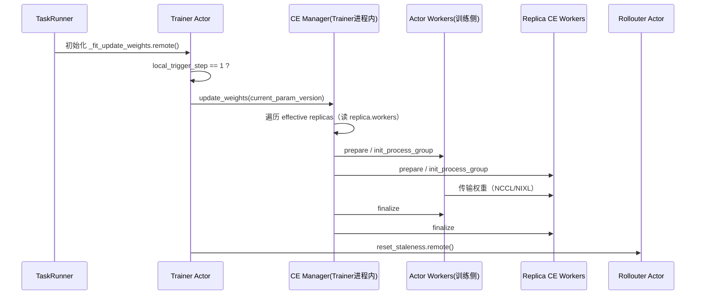
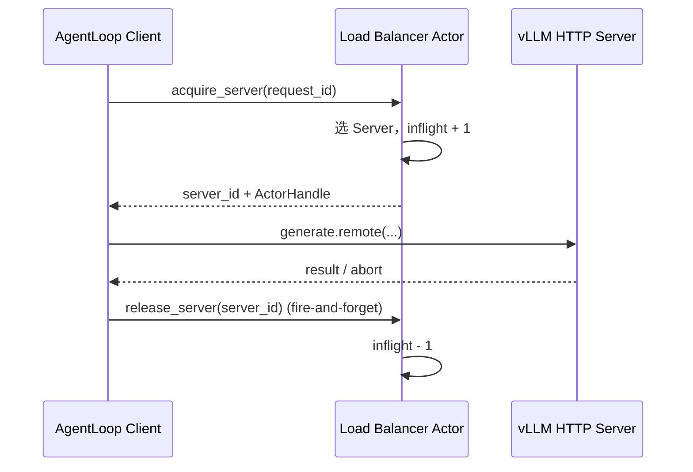

# VERL 5.3 源码模块详解：动态流程编排与参数同步

> 本文是 `verl-5.3-source-reading-guide.md` 的**逐模块深入版**。阅读指南给出八个位置的骨架和阅读目的，本文把每个模块的内部结构、外部连接、调用逻辑和数据流讲透。
>
> 核对日期：2026-09-11。
> 适用范围：experimental Fully Async、纯 STANDALONE、vLLM、非 PD、非 naive Checkpoint Engine。
> 源码基准：`verl` @ `f92febf`，`verl-multi-task` @ `293d6fa`。
> 本文只解释“如何调用、状态归谁”，不展开 PPO loss、advantage、vLLM 内核、NCCL 实现等算法细节。

---

## 0. 阅读本文前先建立的三个心智模型

### 0.1 谁是 Ray Actor，谁是普通对象

这是理解整条链路的第一前提。**Ray Actor 是独立进程里的远程对象**，调用它的方法必须 `.remote()`（异步 RPC），要拿结果用 `ray.get()` 或 `await asyncio.wrap_future(f.future())`。**普通 Python 对象只存在于当前 Actor 进程内**，可以同步直接调用，也可以 `await` 它自己的 async 方法。

完整归属关系（每一行缩进代表“进程内包含”）：

```text
Driver（原生入口 main()）
└── TaskRunner：Ray Actor（FullyAsyncTaskRunner / MultiTaskFullyAsyncTaskRunner）
    │
    │  ── 通过 ActorHandle（RPC）持有的远端对象 ──
    ├── Trainer ActorHandle（FullyAsyncTrainer / MultiTaskFullyAsyncTrainer）
    ├── Rollouter ActorHandle（FullyAsyncRollouter / MultiTaskFullyAsyncRollouter）
    ├── MessageQueue ActorHandle
    └── GroupScheduler ActorHandle（仅 MultiTask 有）

Trainer Actor 进程内（普通对象）
├── actor_wg / actor_rollout_wg：RayWorkerGroup（训练侧 Worker 集合）
└── CheckpointEngineManager（普通对象，MultiTask 版为 MultiTaskCheckpointEngineManager）
    └── self.replicas：RolloutReplica 对象列表

Rollouter Actor 进程内（普通对象）
├── llm_server_manager：FullyAsyncLLMServerManager / MultiTaskLLMServerManager（普通对象）
│   ├── rollout_replicas：STANDALONE Replica 列表
│   ├── hybrid_replicas：预注册 hybrid Replica（sleeping）
│   ├── alive_replicas / alive_addresses：已激活 hybrid Replica
│   └── global_load_balancer：ActorHandle（Load Balancer 是 Ray Actor）
├── async_rollout_manager：FullyAsyncAgentLoopManager
└── reward_loop_manager / teacher_model_manager
```

关键推论：**Trainer 和 Rollouter 分属两个 Ray Actor 进程**，它们之间不能共享普通 `list`、`asyncio.Lock` 或对象引用，只能通过 `.remote()` 传递可序列化数据或 ActorHandle。这也是为什么 `CheckpointEngineManager`（Trainer 进程内）和 `LLMServerManager`（Rollouter 进程内）虽然都在管 Replica，却**不是同一个对象**。

### 0.2 Replica：训练参数同步与推理服务的最小单元

`RolloutReplica`（`verl/workers/rollout/replica.py:70`）代表一个能独立处理 rollout 推理请求的模型服务实例，占用一张或多张 GPU。它内部聚合了三样东西：

```text
Replica（普通 Python 对象，RolloutReplica 抽象基类）
├── workers：CheckpointEngineWorker ActorHandle 列表   ← 参数接收端
├── servers：vLLMHttpServer ActorHandle 列表           ← 对外 HTTP 生成服务
├── _server_handle / _server_address                  ← LB 使用的服务句柄与地址
├── resource_pool / bundle_indices                     ← 资源与放置信息
├── replica_rank / world_size / nnodes                 ← 该副本的规模信息
└── rollout_mode：HYBRID | COLOCATED | STANDALONE      ← 运行模式
```

- `workers` 是 `CheckpointEngineWorker`（`checkpoint_engine/base.py:304`）Actor，负责**接收训练端传过来的权重**（`receive_weights`），再通过 CUDA IPC 交给同 GPU 上的 vLLM 引擎。一个 Replica 跨多张卡时 `workers` 就有多个（`world_size` 个），这就是“一个 Replica 内为什么可能有多个 CE Worker”的答案。
- `servers` 是 `vLLMHttpServer` Actor（跨节点时每个节点一个），对外暴露 `generate()` 处理 token 生成请求，`_server_handle` 是 `servers[0]`。
- `RolloutMode` 枚举（`replica.py:54`）区分 HYBRID（训推同进程）、COLOCATED（同 placement group 不同进程）、STANDALONE（独立 GPU 资源，本文范围）。

### 0.3 三份不能混为一谈的状态

动态 ADD/REMOVE 要协调三份**独立且异步更新**的视图：

| 状态所有者 | 所在 Actor 进程 | 回答的问题 | 数据结构 |
|---|---|---|---|
| `LLMServerManager` | Rollouter | Replica 是否存在、由谁拥有、能否休眠/销毁？ | `rollout_replicas` / `hybrid_replicas` / `alive_replicas` |
| `CheckpointEngineManager` | Trainer | 下一次原生参数同步包含哪些 Replica？ | `self.replicas` |
| `GlobalRequestLoadBalancer` | 独立 Actor | 当前哪些 Server 能接新请求？ | `_servers` / `_inflight_requests` |

三者互不包含。“Manager 已创建 Replica” ≠ “Replica 已加入 CE” ≠ “已加入 LB 可接流”。这是后文 5.3 目标流程里“用 operation ID + 跨组件回执做提交边界”的根本原因。

---

## 1. 模块一：`fully_async_main.py` —— TaskRunner 与组件创建顺序

文件：`verl/experimental/fully_async_policy/fully_async_main.py`
关键类：`FullyAsyncTaskRunner`（`@ray.remote(num_cpus=1)`，第 35–36 行）
它是**原生 Driver 创建的顶层调度 Actor**。

### 1.1 角色定位

`FullyAsyncTaskRunner` 是整个 Fully Async 任务的**编排者**：它不自己训练、不自己生成样本，只负责（1）按正确顺序创建并连接所有子组件，（2）启动并监视 Trainer/Rollouter 两个长期运行的 `fit()`。它是 `run_ppo(config, task_runner_class=FullyAsyncTaskRunner)` 的入参（`main()` 第 238 行）。

### 1.2 内部结构与字段

```python
@ray.remote(num_cpus=1)
class FullyAsyncTaskRunner:
    def __init__(self):
        self.running = False
        self.components = {}          # 存放 tokenizer/processor/trainer/rollouter/message_queue 等
        self.shutdown_event = threading.Event()
```

`self.components` 里放的都是 **ActorHandle**（trainer、rollouter、message_queue）或普通对象（tokenizer、processor、config、role_worker_mapping）。

### 1.3 `run()` 与 `_initialize_components()` 的调用逻辑

```python
def run(self, config):
    self._initialize_components(config)   # ① 组件初始化
    self._run_training_loop()             # ② 长期训练循环
```

`_initialize_components()`（第 51 行）按以下顺序执行，每一步都标注了“谁调用谁、同步还是 RPC”：

| 步 | 动作 | 调用方式 | 说明 |
|---|---|---|---|
| 1 | `copy_to_local` + `hf_tokenizer`/`hf_processor` | 本地同步 | 加载 tokenizer/processor，存 `components["tokenizer"/"processor"]` |
| 2 | `create_role_worker_mapping(config)` | 本地同步 | 产出 `role_worker_mapping` 和 `ray_worker_group_cls` |
| 3 | `self._create_trainer(config)` | 内部方法 | **先创建 Trainer Actor** |
| 4 | `self._setup_hybrid_worker_group(config)` | 内部方法 | 需要 hybrid 时，从 Trainer 取 `actor_wg` 注入 Rollouter |
| 5 | `self._create_rollouter(config)` | 内部方法 | **后创建 Rollouter Actor** |
| 6 | `trainer.set_rollouter.remote(rollouter)` | RPC + `ray.get` | 把 Rollouter 句柄交给 Trainer |
| 7 | `rollouter.get_total_train_steps` / `trainer.set_total_train_steps` | RPC | 同步总步数 |
| 8 | 创建 `MessageQueue.remote(...)` + `MessageQueueClient` | RPC | 把 client 分别 `set_message_queue_client` 给两侧 |
| 9 | `trainer.load_checkpoint` / `rollouter.load_checkpoint` | RPC | 双侧恢复 checkpoint |
| 10 | `trainer._fit_update_weights.remote()` | **RPC** | 第一次参数同步 |
| 11 | 按需 `trainer._fit_validate.remote(True)` | RPC | 训练前验证 |

三个关键细节：

**(a) Trainer 先于 Rollouter 创建**（`_create_trainer` 第 138 行 → `_create_rollouter` 第 117 行）。原因是 hybrid 模式需要先把 Trainer 的 `actor_wg`（训练 Worker 组）抽出来，在 Rollouter 的 `init_workers()` **之前**注入（`set_hybrid_worker_group`，见 `_create_rollouter` 第 128–130 行注释：`set_hybrid_worker_group must be called BEFORE init_workers()`）。

**(b) 创建后互传 ActorHandle。** 第 87 行 `trainer.set_rollouter.remote(rollouter)` 让 Trainer 拿到 Rollouter 句柄，从而能在训练侧发起参数同步和验证；而 MessageQueue client（第 102–103 行）则同时发给两侧，让 Rollouter 能 `put_sample`、Trainer 能 `get_sample`。

**(c) 初始参数同步与训练期间同步是同一个方法。** 第 110 行直接 `ray.get(self.components["trainer"]._fit_update_weights.remote())`。这意味着 5.3 若给 `_fit_update_weights()` 加 gate，必须同时覆盖“初始化同步”和“训练期间同步”两条路径。

### 1.4 `_run_training_loop()` 的调用逻辑

```python
rollouter_future = self.components["rollouter"].fit.remote()
trainer_future   = self.components["trainer"].fit.remote()
futures = [rollouter_future, trainer_future]
while futures:
    done, remaining = ray.wait(futures, num_returns=1, timeout=None)
    for f in done:
        ray.get(f)          # 谁先结束谁被处理；出错则取消另一个并抛出
    futures = remaining
finally:
    asyncio.run(self.components["message_queue_client"].clear_queue())
```

两个 `fit()` **并发**运行：`fit.remote()` 返回的是 ObjectRef（future），不是最终训练结果，因此 `ray.wait()` 能同时监视二者。任一组件异常时，取消另一个并重新抛出。这就是回答“`fit.remote()` 为什么不会立即返回训练结果”的地方。

### 1.5 与 5.3 的关系

当前 `run()` 是长生命周期调用，训练期间没有对外暴露控制入口。5.3 要让 GS 在训练期间下发 ADD/REMOVE，就必须让 TaskRunner 在 `run()` 未结束时仍能响应控制 RPC——这属于 5.4 控制入口的前置条件，5.3 的编排方法最终由这些控制 RPC 调用。

---

## 2. 模块二：MultiTask `task_runner.py` —— 替换创建目标

文件：`verl-multi-task/src/multi_task_scheduler/integration/verl/experimental_fully_async/task_runner.py`
关键类：`MultiTaskFullyAsyncTaskRunner`（`@ray.remote(num_cpus=1)`，第 34–35 行）

### 2.1 继承策略：先拆再装

```python
@ray.remote(num_cpus=1)
class MultiTaskFullyAsyncTaskRunner(unwrap_native_actor_class(FullyAsyncTaskRunner)):
```

原生 `FullyAsyncTaskRunner` 已被 `@ray.remote` 包装成 `ActorClass`，不能直接继承。`unwrap_native_actor_class`（`integration/verl/ray_actor.py:4`）取出 `__ray_actor_class__` 属性得到**底层纯 Python 类**：

```python
def unwrap_native_actor_class(actor_class):
    native_class = getattr(actor_class, "__ray_actor_class__", None)
    if not isinstance(native_class, type):
        raise TypeError(...)
    return native_class
```

于是：先拿到底层类 → 继承它 → 再 `@ray.remote` 包装回 Ray Actor。目的不是复制训练入口，而是**复用原生 `run()`、初始化流程和训练循环，只替换必要创建点**。

### 2.2 `run()` 增加 GS 生命周期

```python
def run(self, config):
    self.group_scheduler = get_or_create_group_scheduler()
    context = ray.get_runtime_context()
    task_id = context.get_actor_id()
    try:
        ray.get(self.group_scheduler.attach_task.remote(task_id, context.current_actor), timeout=30)
        return super().run(config)          # 复用原生完整初始化 + 训练循环
    finally:
        try:
            ray.get(self.group_scheduler.detach_task.remote(task_id), timeout=30)
        except Exception:
            logger.warning("Could not detach TaskRunner ...", exc_info=True)
```

- `get_or_create_group_scheduler()`（`scheduler/discovery.py:7`）用固定 name + namespace 的 `detached` Actor 跨 Ray job 发现同一个 `GroupScheduler`，`get_if_exists=True` 保证并发首个调用者也能拿到同一实例。
- `attach_task` / `detach_task`（`group_scheduler.py:24/35`）只是把 TaskRunner 的真实 `ActorHandle` 存进/移出 `task_runners` 字典——**当前 GroupScheduler 没有任何资源调度逻辑**，`schedule()` 返回空列表。
- `finally` 的语义：无论 `super().run(config)` 正常结束还是抛错，都尝试 detach；且 detach 失败时只 `logger.warning`，**不掩盖原始训练/初始化错误**。

### 2.3 只覆盖两个工厂方法

- `_create_trainer()`（第 78 行）：把 `FullyAsyncTrainer.remote(...)` 换成 `MultiTaskFullyAsyncTrainer.remote(...)`，其余参数不变。
- `_create_rollouter()`（第 57 行）：换成 `MultiTaskFullyAsyncRollouter.remote(...)`，**额外传入 `group_scheduler=self.group_scheduler`**。

两者都显式保留原生 `main.py` 对应行的结构（注释 `Preserve native main.py:117-136 / 138-157`），只替换类型和 GS 参数。这是伴生开发的既定原则：**覆盖窄扩展点，不复制整段 VERL 主循环**。

### 2.4 调用链总结

```text
run_ppo(config, task_runner_class=MultiTaskFullyAsyncTaskRunner)
  └─ TaskRunner.run()
       ├─ get_or_create_group_scheduler()          → GroupScheduler ActorHandle
       ├─ attach_task(task_id, self_handle)        → 登记
       ├─ super().run(config)                       → 原生 _initialize_components + _run_training_loop
       │     └─ _create_trainer()   → MultiTaskFullyAsyncTrainer
       │     └─ _create_rollouter() → MultiTaskFullyAsyncRollouter(+ group_scheduler)
       └─ finally: detach_task(task_id)             → 注销
```

### 2.5 当前能力边界（AS-IS 缺口）

只完成 GS attach/detach 和类型替换。尚未实现：训练期间控制方法、ADD/REMOVE/RESTORE 命令入口、operation journal、操作状态查询与回执重放、控制 RPC 与长时间 `run()` 的并发隔离。

---

## 3. 模块三：`fully_async_trainer.py` —— 参数版本与同步条件

文件：`verl/experimental/fully_async_policy/fully_async_trainer.py`
关键类：`FullyAsyncTrainer`（`@ray.remote(num_cpus=10)`，第 53–54 行，继承 `SeparateRayPPOTrainer`）

### 3.1 角色定位

Trainer 是**训练侧 Actor**：从 MessageQueue 消费样本做 PPO 更新，并在满足触发条件时通过 `CheckpointEngineManager` 把新参数发布给 Rollouter。它是 CE 有效集合的**唯一写入者**（CE Manager 就在它的进程内）。

### 3.2 三个关键变量（版本推进的核心）

```python
self.local_trigger_step = 1                                      # 第 140 行
self.current_param_version = 0                                   # 第 143 行
self.trigger_parameter_sync_step = config.async_training.trigger_parameter_sync_step  # 第 146 行
```

| 变量 | 含义 |
|---|---|
| `current_param_version` | 当前**已发布给 rollout 的参数版本**（也是 checkpoint 目录名、metrics 的 step） |
| `local_trigger_step` | 当前版本周期内的**本地训练步位置**（1 ~ trigger_parameter_sync_step） |
| `trigger_parameter_sync_step` | 经过多少本地更新后发布下一版 |

### 3.3 版本如何推进：`_fit_update_local_step()`（第 676 行）

```python
def _fit_update_local_step(self):
    if self.local_trigger_step < self.trigger_parameter_sync_step:
        self.local_trigger_step += 1
    else:
        self.current_param_version += 1
        self.local_trigger_step = 1
```

每做一次本地 PPO 更新就调用一次（在 `fit_step()` 第 593 行）。到达周期末端时，版本 +1、步位置重置为 1。注意这是**版本递增的唯一地方**——5.3 的 bootstrap 绝不能碰它。

### 3.4 同步触发条件：`_fit_update_weights()`（第 690 行）

```python
async def _fit_update_weights(self):
    if self.local_trigger_step != 1:
        return None                       # 非周期起点：no-op，直接返回 None
    ...
    with marked_timer("timing_s/param_sync", self.timing_raw):
        if not self.only_hybrid:
            await self.checkpoint_manager.update_weights(
                global_steps=self.current_param_version)   # 核心：CE 传权
        if self.dynamic_schedule_enabled and should_activate:
            await self.dynamic_resource_controller.sync_hybrid_weights(...)
            await self.dynamic_resource_controller.activate_hybrid_replicas(...)
    timing_raw = await asyncio.wrap_future(self.rollouter.reset_staleness.remote().future())
    ...
    return timing_raw
```

只有 `local_trigger_step == 1` 才执行真正同步。随后（纯 STANDALONE 路径）调用 `checkpoint_manager.update_weights(global_steps=current_param_version)`，最后调用 `rollouter.reset_staleness()` 让 rollout 侧基于新版本恢复陈旧度控制。**返回值约定**：真正同步返回 `timing_raw`，no-op 返回 `None`，调用方用“是否非 None”判断“是否发生了同步”。

### 3.5 `fit_step()` 内的完整调用链（第 536 行）

```text
fit_step()
├─ _fit_generate()            → _get_samples_from_queue()  从 MessageQueue 取 required_samples 条样本
├─ _fit_compute_reward / _fit_compute_log_prob / _fit_compute_ref_log_prob
├─ _fit_compute_critic / _fit_compute_advantage
├─ _fit_update_critic / _fit_update_actor
├─ _fit_update_local_step()                                 ← 推进 local_trigger_step / current_param_version
├─ _fit_update_weights()                                    ← 满足条件才同步参数（上面 3.4）
├─ _fit_dump_data / _record_train_resource_utilization
├─ _fit_validate()                                          ← 仅 local_trigger_step==1 且 test_freq 命中才做
├─ _fit_save_checkpoint()
└─ _fit_collect_metrics / _fit_postprocess_step
```

### 3.6 `_setup_checkpoint_manager()` 与 `set_rollouter()`（第 217 / 346 行）

CE Manager 在 Trainer 侧创建，但它需要从 Rollouter 拿 Replica 集合：

```python
async def set_rollouter(self, rollouter):
    self.rollouter = rollouter
    await self._setup_checkpoint_manager()          # 第 217 行
    await self._setup_hybrid_checkpoint_manager()
    if self.dynamic_schedule_enabled:
        await self._setup_dynamic_resource_controller()

async def _setup_checkpoint_manager(self):
    replicas = await self.rollouter.get_replicas.remote()      # 从 Rollouter 取当前 Replica 列表
    checkpoint_engine_config = omega_conf_to_dataclass(self.config...checkpoint_engine)
    self.checkpoint_manager = CheckpointEngineManager(
        config=checkpoint_engine_config, actor_wg=self.actor_wg, replicas=replicas)
```

这条链回答了“CE 有效集合最初从哪来”：**TaskRunner 创建两侧后 `set_rollouter` → Trainer 反向 `rollouter.get_replicas.remote()` 拉取 Replica 集合 → 存入 `self.replicas`**。`get_replicas()` 在 Rollouter 侧返回 `llm_server_manager.get_replicas()`（`llm_server.py:513`，即 `rollout_replicas` 列表）。

### 3.7 5.3 必须保持的语义

- GS 不能新增“现在同步所有权重”的触发规则，原生同步仍由 `_fit_update_weights` 的 hook 和条件触发。
- 建议由 **MultiTask Trainer** 持有唯一的 task-local `replica-sync gate`：因为 CE Manager 就在 Trainer 进程内，且 Trainer 应是 CE 有效集合唯一写入者。
- 后续实现应**窄包装** `super()._fit_update_weights()`，不要整段复制——否则 VERL 更新同步指标、profiler、staleness 或动态调度逻辑时，伴生实现会悄悄落后。
- 注意父类在 `local_trigger_step != 1` 时本就 no-op（快速返回 `None`），实现要确保这个快速返回不会造成无意义的长锁等待，并测试初始化同步也受保护。

---

## 4. 模块四：`checkpoint_engine/base.py` —— 有效集合与传权

文件：`verl/checkpoint_engine/base.py`
关键类：`CheckpointEngineManager`（第 380 行）、`CheckpointEngineWorker`（第 304 行）、`CheckpointEngine`（第 116 行抽象基类）、`CheckpointEngineRegistry`（第 49 行）

### 4.1 角色定位与整体图

这里的 CE（Checkpoint Engine）是**训推参数同步系统**，不是“把 checkpoint 存盘”。Manager 在 Trainer 侧协调，Worker 在 Replica 侧接收，NCCL/NIXL 等 backend 负责通信拓扑和数据搬运。文件内 `CheckpointEngineManager` 的 docstring 画了完整的拓扑图（第 389–401 行）：

```text
Actor 侧（训练）：ME0..MEn（模型引擎，FSDP/Megatron 等）
                 └─ CE（checkpoint engine）──┐
                                              │ nccl / nixl / ...
Rollout 侧（推理）：Replica 0..N 每张卡一个    │
                 CE Worker ←── cuda ipc ──────┘  （收到权重后经 CUDA IPC 交给同卡 vLLM）
```

### 4.2 `CheckpointEngineRegistry`（第 49 行）

注册表把 backend 名字（`"naive"`、`"nccl"`、`"nixl"`、`"hccl"`…）映射到 CE 类。`register(backend)` 是装饰器，`get(backend)` 取类，`new(backend, ...)` 建实例。各 backend 模块按需可选导入，导入失败的记录在 `_import_errors`，报错时给出“已注册 backends + 导入失败模块”的清晰提示。`ColocatedCheckpointEngine`（第 247 行）是 `"naive"` backend——训推同卡时直接把权重生成器存起来再 `yield`，不建通信组。

### 4.3 `CheckpointEngineWorker`（第 304 行，接收端）

这是 Replica 侧每个 worker 的类，继承 `Worker`。核心方法：

```python
@register(dispatch_mode=Dispatch.ONE_TO_ALL, blocking=False)
async def update_weights(self, global_steps=None):
    weights = self.checkpoint_engine.receive_weights(global_steps=global_steps)
    await self.server_adapter.update_weights(weights, global_steps=global_steps, ...)

@register(dispatch_mode=Dispatch.DP_COMPUTE, blocking=False)
def execute_checkpoint_engine(self, method, *args, **kwargs):
    return getattr(self.checkpoint_engine, method)(*args, **kwargs)
```

`update_weights` 负责收权重并交给 `server_adapter`（即 rollout 引擎适配器，最终驱动 vLLM 更新权重）。`execute_checkpoint_engine` 是通用透传，用来在 worker 上调用 `prepare` / `init_process_group` / `finalize` 等 CE backend 方法。`_worker_cls = ray.remote(CheckpointEngineWorker)`（第 377 行）是 Manager 临时建组时用的 ActorClass。

### 4.4 `CheckpointEngineManager.__init__`（第 409 行）

```python
def __init__(self, config, actor_wg, replicas):
    self.backend = config.backend
    self.backend_cls = CheckpointEngineRegistry.get(config.backend)
    self.actor_wg = actor_wg        # 训练侧 WorkerGroup（参数发送方）
    self.replicas = replicas        # rollout Replica 集合（参数接收方视图）
```

- `actor_wg`：参数发送方（训练 Worker 组）。
- `replicas`：参数接收方视图——**对 5.3 而言这就是第一版唯一的 `effective_replicas`**，不要另存一份 snapshot 或 desired membership，否则两份列表会失去一致性。
- `backend_cls`：负责 NCCL/NIXL 等通信拓扑。

### 4.5 原生 ADD/REMOVE 只改列表（第 449 / 457 行）

```python
def add_replicas(self, replicas):
    self.replicas.extend(replicas)

def remove_replicas(self, replicas):
    replicas_set = set(replicas)
    self.replicas = [r for r in self.replicas if r not in replicas_set]
```

没有锁、没有 operation ID、没有状态检查、没有 bootstrap、没有 LB 提交、没有失败回滚。它们**只能作为 CE 集合修改原语**，不能代表完整多任务 ADD/REMOVE 成功。

### 4.6 原生 `update_weights()` 八步流程（第 504 行）

```python
async def update_weights(self, global_steps=None):
    if self.backend == "naive":                        # naive：直接广播，返回空指标
        ray.get(self.actor_wg.update_weights(global_steps=global_steps, mode=self.backend))
        return {}

    await self.abort_replicas()                         # ① 中断并保存未完成请求
    workers = []                                        # ② 遍历 self.replicas 收集全部 Replica Workers
    for replica in self.replicas:
        workers.extend(replica.workers)
    rollout = RayWorkerGroup(worker_handles=workers, ray_cls_with_init=RayClassWithInitArgs(cls=_worker_cls))
    await self.release_kv_cache_replicas()              # ③ 释放 KV cache，保留权重 buffer
    self.build_process_group(rollout)                   # ④ prepare、构建拓扑、初始化通信组
    results = ray.get(                                  # ⑤ 训练侧与 rollout 侧执行参数传输
        actor_wg.update_weights(global_steps=global_steps, mode=self.backend)
        + rollout.update_weights(global_steps=global_steps))
    ray.get(actor_wg.execute_checkpoint_engine(["finalize"]*...)   # ⑥ 两侧 finalize
           + rollout.execute_checkpoint_engine(["finalize"]*...))
    await self.resume_kv_cache_replicas()               # ⑦ 恢复 KV cache
    await self.resume_generation_replicas()             # ⑧ 恢复生成
    return sync_metrics
```

其中第 ② 步的 `for replica in self.replicas: workers.extend(replica.workers)` 是**有效集合被读取的关键点**：后续通信拓扑正是按这批 Worker 建立。因此从“读取 `self.replicas`”到“finalize + 恢复生成”期间，有效集合都不能变。

`build_process_group()`（第 422 行）内部三小步：先 `prepare` 所有 worker 收集 metadata，再 `backend_cls.build_topology(actor_world_size, rollout_world_size, metadata)` 算出两侧通信拓扑，最后 `init_process_group` 建组。

### 4.7 为什么 gate 必须覆盖整个 `update_weights()`

- 同步**读取完 Worker 后**发生 ADD → CE 列表含新 Replica，但当前通信组没有它 → 版本混用。
- 同步**建组后**发生 REMOVE 并销毁 → 通信组仍引用已销毁的旧 Worker → Ray Actor 错误或 NCCL 建组/传输失败。

所以 gate 必须覆盖完整 `update_weights()`，不只是第 ⑤ 步的数据传输。这对应阅读指南 15.4 的“只给 NCCL 传输语句加锁”是错误做法。

### 4.8 bootstrap 与原生同步的区别

| 对比项 | 新 Replica bootstrap | 原生参数同步 |
|---|---|---|
| 目标 | 只同步新 Replica | 同步全部 effective replicas |
| 数据版本 | 当前已发布 serving version | Trainer 按原生周期发布的新版本 |
| 是否递增版本 | 否 | 按 `_fit_update_local_step` 推进 |
| 是否 reset 全局 staleness | 否 | 是 |
| 触发来源 | ADD/RESTORE 事件 | Trainer 原生 hook |

bootstrap 不能拿可能已领先的 Trainer live weights 标成旧 serving version，它需要读取**不可变的已发布版本来源**——该能力当前仍是 5.2/5.3 之间的实现缺口。

---

## 5. 模块五：`fully_async_rollouter.py` —— Replica 与并发容量

文件：`verl/experimental/fully_async_policy/fully_async_rollouter.py`
关键类：`FullyAsyncRollouter`（第 330 行）、`FullyAsyncLLMServerManager`（第 54 行）

### 5.1 角色定位

Rollouter 是**生成侧 Actor**：持续从 dataloader 取 prompt、经 agent loop 生成样本、把完成的 `RolloutSample` 塞进 MessageQueue。它还**拥有 `LLMServerManager`**，因此是“本任务 Replica 运行时引用”的所有者。

### 5.2 `FullyAsyncLLMServerManager`（第 54 行，普通对象）

继承 `LLMServerManager`，新增三份 hybrid 相关字典：

```python
self.hybrid_replicas: dict[str, RolloutReplica] = {}   # 预注册 hybrid Replica（sleeping，未进 LB）
self.alive_replicas: dict[str, RolloutReplica] = {}    # 已激活（awake + 在 LB）的 hybrid 子集
self.alive_addresses: dict[str, str] = {}              # resource_id → server_address
```

`_initialize_llm_servers()`（第 78 行）做两阶段初始化：先借父类创建 hybrid Replica（`worker_group` 非空时），再临时清空 `worker_group` 走 standalone 分支创建 STANDALONE Replica。hybrid 迁移到 `hybrid_replicas` 并清空父类跟踪列表，standalone 留在 `rollout_replicas`。因此 `get_replicas()`（父类 `llm_server.py:513`）返回的 `rollout_replicas` **只含 STANDALONE**（`get_standalone_replicas` 第 284 行也印证这一点）。

### 5.3 Manager 的原生动态入口（第 144 / 206 行）

```python
async def add_replicas(self, resource_ids):
    servers_to_add = {}
    for rid in resource_ids:
        if rid in self.alive_replicas: ...continue        # 已在活跃集，跳过
        replica = self.hybrid_replicas.get(rid)
        if replica is None: ...continue                    # 未注册，跳过
        servers_to_add[replica._server_address] = replica._server_handle
    if not servers_to_add: return 0
    await self.global_load_balancer.add_servers.remote(servers=servers_to_add)  # 单次批量 RPC 加入 LB
    for rid in valid_resource_ids:                         # 本地补记 server_addresses / rollout_replicas / alive_replicas
        ...
    return len(valid_resource_ids)
```

`remove_replicas` 结构对称：先 `remove_servers.remote()` 从 LB 摘除，再清理本地 `server_addresses` / `rollout_replicas` / `alive_replicas` / `alive_addresses`。二者都只管理**预注册的 hybrid Replica**，异常时返回 0 而不是抛出。

### 5.4 Rollouter 侧的 `add_replicas` / `remove_replicas`（第 1199 / 1205 行）

```python
async def add_replicas(self, resource_ids):
    n = await self.llm_server_manager.add_replicas(resource_ids)
    if n > 0:
        self._update_max_concurrent_samples()
    return n
```

Manager 成功修改活跃 Replica 后，Rollouter 重算最大并发样本数。

### 5.5 并发容量怎么算：`_update_max_concurrent_samples()`（第 1274 行）

```python
def _update_max_concurrent_samples(self):
    if self.max_required_samples is None: return
    new_val = len(self.llm_server_manager.get_replicas()) * self.concurrent_samples_per_replica
    new_val = min(new_val, self.max_required_samples)
    self.max_concurrent_samples = new_val
    self._record_active_count()
```

`max_concurrent_samples = min(活跃 Replica 数 × concurrent_samples_per_replica, max_required_samples)`。初值在 `set_max_required_samples()`（第 491 行）同样用 `get_active_server_count() * concurrent_samples_per_replica` 计算。**动态 ADD/REMOVE 会改变 Rollouter 的生产背压**：`_processor_worker`（第 902 行）用 `len(self.active_tasks) >= self.max_concurrent_samples` 控制同时提交的样本数。

- ADD 后若不更新 → 新 Replica 存在但得不到足够请求；
- REMOVE 后若不更新 → Rollouter 仍按旧容量启动过多样本。

### 5.6 Rollouter 的生成主循环（数据流）

```text
fit()（第 1076 行）
└─ _streaming_generation_main()（第 1017 行）
    ├─ _feed_samples()（第 859 行）      dataloader → pending_queue（asyncio.Queue）
    └─ _processor_worker()（第 902 行）  pending_queue → 限流(active_tasks < max_concurrent) → 提交
         └─ _process_single_sample_streaming()（第 991 行）
              ├─ async_rollout_manager.generate_sequences_single()
              │     └─ LLMServerClient.generate()（经 LB acquire_server → vLLMHttpServer.generate）
              └─ message_queue_client.put_sample(rollout_sample)   → MessageQueue（Trainer 消费）
```

`_processor_worker` 里的 `_should_pause_generation()`（第 1142 行）在队列满或 staleness 超阈值时暂停生成；`reset_staleness()`（第 594 行）在每次参数同步后重置 `staleness_samples` 并返回 `timing_raw`（含 `dynamic_resource/rollout_resource_utilization`）。

### 5.7 不能直接复用的原因 + 5.3 建议扩展

原生 `add_replicas(resource_ids)` 只管理预注册 hybrid Replica，没有：按跨任务租约（node ID/GPU IDs）创建 borrowed Replica、target-only bootstrap、CE 集合事务、donor/borrower 所有权隔离、多组件提交回执与失败回滚。可以复用“Manager 成功后更新容量”的思想，但不能把它当完整 ADD。

5.3 建议 Rollouter 提供 `prepare_replica()` / `commit_routable()` / `begin_drain()` / `wait_drained()` / `finish_remove()`，且**不应反向调用需要取同一 gate 的 Trainer 方法**（否则 Trainer 持 gate 等 Rollouter 回执时形成跨 Actor 循环等待）。

---

## 6. 模块六：`router.py` —— 路由与 in-flight 账本

文件：`verl/workers/rollout/router.py`
关键类：`GlobalRequestLoadBalancer`（第 133 行）

### 6.1 角色定位

`GlobalRequestLoadBalancer` 是**所有 AgentLoopWorker 共享的全局负载均衡器**。它是一个普通 Python 类，在实例化时被 `ray.remote(...)` 包装成 Ray Actor（见 `_create_global_sticky_inflight` 第 301 行 / `get_router_handle` 第 397 行），所以运行时的 LB 是 Actor，调用它必须 `.remote()`。

### 6.2 两份核心字典 + 一份 sticky cache

```python
self._servers: dict[str, ActorHandle] = dict(servers)          # server_id → ActorHandle
self._inflight_requests: dict[str, int] = {sid: 0 for sid in servers}   # server_id → 在途请求数
self._request_id_to_server: LRUCache = LRUCache(maxsize=max_cache_size)  # request_id → server_id（sticky）
```

- `_servers`：server ID 到 ActorHandle 的映射（server ID 就是 `server_address`，见 `llm_server.py:485` 的 `dict(zip(self.server_addresses, self.server_handles))`）。
- `_inflight_requests`：每个 Server 的在途请求计数。
- `_request_id_to_server`：sticky session，让多轮对话路由到同一 Server 以命中 prefix cache。

### 6.3 请求进入与退出：`acquire_server()` / `release_server()`（第 170 / 206 行）

```python
def acquire_server(self, request_id):
    if request_id in self._request_id_to_server:                 # ① sticky 命中
        server_id = self._request_id_to_server[request_id]
        if server_id in self._inflight_requests:                 #    仍在池内 → 计数+1 返回
            self._inflight_requests[server_id] += 1
            return server_id, self._servers[server_id]
        del self._request_id_to_server[request_id]               #    已被移除 → 清 stale 重选
    if not self._inflight_requests:
        raise RuntimeError("No available servers in load balancer")
    if self._full_determinism:                                   # ② 确定性路由：hash 固定
        server_id = list(self._servers)[hash(request_id) % len(self._servers)]
    else:                                                        # ③ 最小负载：随机挑 in-flight 最小者
        min_count = min(self._inflight_requests.values())
        candidates = [sid for sid,c in self._inflight_requests.items() if c == min_count]
        server_id = random.choice(candidates)
    self._request_id_to_server[request_id] = server_id
    self._inflight_requests[server_id] += 1
    return server_id, self._servers[server_id]
```

`acquire_server` 在**单个 Ray RPC 里原子地**返回 `(server_id, handle)` 并把计数 +1——这是它必须原子返回 ID 和 handle 的原因（否则 ID 和 handle 之间可能发生移除，造成悬空引用）。`release_server`（第 206 行）只做 `inflight[server_id] -= 1`，由 client 在 `finally` 里 fire-and-forget 调用（`llm_server.py:83` `_release_server`）。

### 6.4 原生 `add_servers` / `remove_servers` 的行为

- `add_servers()`（第 227 行）：同时登记 ActorHandle 并把 inflight 初始化为 0。
- `remove_servers()`（第 242 行）：

```python
for sid in server_ids:
    self._inflight_requests.pop(sid, None)   # 直接删在途账本
    self._servers.pop(sid, None)
```

如果 Server 仍有请求，这会**把 in-flight 账本直接删除**。因此 `inflight == 0` 只说明“当前没有已登记请求”，不能单独证明 GPU 已可安全捐赠；动态回收也不能把 `remove_servers()` 直接当“摘流”。

### 6.5 5.3 需要两阶段移除

建议 MultiTask LB 引入至少两种状态：`ROUTABLE`（可接新请求）与 `DRAINING`（不可接新请求，但保留 handle 和 inflight 计数）。流程：`begin_drain → 从可选路由集合排除 → 保留并等 inflight==0 → CE REMOVE → finish_remove → 删 handle 和计数`。同时 sticky cache 指向 DRAINING Server 时必须失效重选，不能继续把同一 request ID 路由过去。

---

## 7. 模块七：MultiTask `llm_server_manager.py` —— 接入点

文件：`verl-multi-task/src/multi_task_scheduler/integration/verl/experimental_fully_async/llm_server_manager.py`
关键类：`MultiTaskLLMServerManager`（第 12 行）

### 7.1 角色定位

`MultiTaskLLMServerManager` 是 Rollouter Actor 进程内的**普通对象**（不是 Actor），继承 `FullyAsyncLLMServerManager`。它是“本任务 Replica 运行时引用”的所有者，适合维护 replica_id / kind（native|borrowed）/ state / node_id / gpu_ids / Replica 对象 / server address / lease_epoch / operation_id 等元数据。

### 7.2 当前只替换类型（第 15–20 行）

```python
class MultiTaskLLMServerManager(FullyAsyncLLMServerManager):
    def __init__(self, config, worker_group=None, rollout_resource_pool=None, *, group_scheduler=None):
        self.group_scheduler = group_scheduler
        self.rollout_replica_class = MultiTaskvLLMReplica   # ① 先指定 Replica 类
        super().__init__(config, worker_group, rollout_resource_pool)
        self._load_balancer_cls = MultiTaskGlobalRequestLoadBalancer   # ② 父类完成后再选 MultiTask LB
```

顺序很重要：**先**指定 `rollout_replica_class`，**再**调父类 `__init__`（父类 `llm_server.py:384` 只在 `not hasattr(self, "rollout_replica_class")` 时才设默认类，避免覆盖伴生的选择）；父类完成后**再**设 `_load_balancer_cls`。于是父类 `create()` → `_initialize_llm_servers()` 会用 `MultiTaskvLLMReplica`，`_init_global_load_balancer()` 会用 `_load_balancer_cls`。

### 7.3 LB 如何成为 Ray Actor（第 22–30 行）

```python
async def _init_global_load_balancer(self):
    self.global_load_balancer = ray.remote(self._load_balancer_cls).remote(
        servers=dict(zip(self.server_addresses, self.server_handles, strict=True)),
        max_cache_size=DEFAULT_ROUTING_CACHE_SIZE,
        full_determinism=getattr(self.rollout_config, "full_determinism", False),
        group_scheduler=self.group_scheduler,
    )
```

覆盖父类的 `_init_global_load_balancer`（父类 `llm_server.py:481` 走 `get_router_handle`），直接 `ray.remote(self._load_balancer_cls).remote(...)`。所以**运行时的 LB 是 Ray Actor，Manager 保存的是 ActorHandle**，调用其方法必须 `.remote()`。`MultiTaskGlobalRequestLoadBalancer`（`rollout/load_balancer.py:6`）本身只是继承 `GlobalRequestLoadBalancer` 并额外存一个 `group_scheduler` 引用的普通类，**所有路由方法原样继承，没有任何调度副作用**。

### 7.4 GS 句柄传递链

```text
MultiTask TaskRunner（create_rollouter 传 group_scheduler）
→ MultiTask Rollouter Actor（__init__ 存 self.group_scheduler）
→ MultiTask LLMServerManager（__init__ 收 group_scheduler）
→ MultiTask Load Balancer Actor（ray.remote(...).remote(group_scheduler=...)）
```

当前这条链**只建立引用，没有调度副作用**。LB 可以向 GS 上报候选空闲信息，但不该自己做跨任务分配决策。

### 7.5 5.3 中 Manager 的职责边界

Manager 负责创建、休眠、唤醒、销毁的底层调用；但完整 ADD/REMOVE 的**事务顺序**应由编排层（Trainer/Rollouter 的 gate + 回执协议）协调，不能塞进一个 Manager 列表修改方法。为什么 borrower 只能接收 node/GPU 租约而不能接收 donor Manager 的 Replica 对象？因为 Replica 对象绑定 donor 的 ResourcePool/Placement Group 和进程上下文，跨任务不可直接传递，borrower 必须用租约自己创建。

---

## 8. 模块八：MultiTask `replica.py` —— Server 与 CE Worker

文件：`verl-multi-task/src/multi_task_scheduler/rollout/replica.py`
关键类：`MultiTaskvLLMReplica`（第 13 行）

### 8.1 角色定位

`MultiTaskvLLMReplica` 继承原生 `vLLMReplica`（`vllm_async_server.py:1279`），只替换两个 ActorClass 选择点，让 HTTP Server 和 CE Worker 的扩展在伴生仓完成，**不改原生资源初始化与放置方式**。

### 8.2 选择 MultiTask HTTP Server（第 16–18 行）

```python
def __init__(self, *args, **kwargs):
    super().__init__(*args, **kwargs)
    self.server_class = ray.remote(MultiTaskvLLMHttpServer)
```

原生 `vLLMReplica.launch_servers()`（`vllm_async_server.py:1295`）用 `self.server_class.options(...).remote(...)` 启动 Server，所以这里只需在 `__init__` 后替换 `server_class`，父类启动时就会用 `MultiTaskvLLMHttpServer`（`rollout/http_server.py:6`，目前空子类，所有方法继承）。

### 8.3 选择 MultiTask CE Worker（第 20–26 行）

```python
def get_ray_class_with_init_args(self):
    return RayClassWithInitArgs(
        cls=ray.remote(MultiTaskCheckpointEngineWorker),
        rollout_config=self.config,
        model_config=self.model_config,
        replica_rank=self.replica_rank,
    )
```

覆盖父类 `RolloutReplica.get_ray_class_with_init_args()`（`replica.py:228`，默认返回 `CheckpointEngineWorker`）。原生 `init_hybrid` / `init_standalone` / `init_colocated`（`replica.py:131/189/160`）会调用它建 `RayWorkerGroup`，从而创建 `MultiTaskCheckpointEngineWorker` Actor（`checkpoint/checkpoint_engine_worker.py:6`，目前空子类）。Trainer 侧 CE Manager 最终通过 `replica.workers` 找到它们（`base.py:522` 的 `replica.workers`）。

### 8.4 一个 Replica 为什么有多个 CE Worker

`init_standalone`（`replica.py:189`）按 `self.world_size`（= TP×DP×PP）创建 `ResourcePool` 和 `RayWorkerGroup`，`self.workers = worker_group.workers` 就有 `world_size` 个 worker。跨多卡的 Replica 每张卡一个 CE Worker 负责接收并更新该卡的权重分片。`launch_servers()` 断言 `len(self.workers) == self.world_size`（`vllm_async_server.py:1297`）。

### 8.5 当前能力边界 + STANDALONE sleep/wake 缺口

当前仍继承原生资源初始化和放置，未实现：按 immutable node ID/GPU IDs 创建 borrowed Replica、borrower-owned 放置、STANDALONE 真正 sleep/wake、target-only bootstrap 接收、销毁与物理 GPU 释放证明。

关键事实：原生 `vLLMHttpServer.sleep()`（`vllm_async_server.py:854`）在 `rollout_mode == STANDALONE` 时打 `"skip sleep in standalone mode"` 直接返回，`wake_up()`（第 833 行）同样 `"skip wake_up in standalone mode"`。所以“从 LB 移除”≠“显存和 GPU 已释放”——这正是 5.3 里 `GPU_RELEASED` 需要物理释放回执的原因。

---

## 9. 把八个位置串成两条运行链

### 9.1 原生参数同步链（训练 → 发布权重）



训练期间的同步也走同样路径，只是调用者从 TaskRunner 变成 Trainer 自己的 `fit_step()`（`_fit_update_weights`）。

### 9.2 请求路由链（生成样本）



这条链解释了为什么 REMOVE 必须先摘流再排空，也解释了为什么 Rollouter 和 Trainer 需要通过回执协调而不能只改 CE 列表。

---

## 10. 三份状态视图与 5.3 目标流程对照

### 10.1 状态视图对照表

| 层次 | 所有者/位置 | 当前 AS-IS | 5.3 GAP | TO-BE |
|---|---|---|---|---|
| TaskRunner | 顶层 Actor | 创建 Trainer/Rollouter，连接 GS | 无训练期间控制入口与 operation journal | 接收命令、转发、查询操作结果 |
| Trainer | Trainer Actor | 原生版本与同步；MultiTask 只换 CE 类 | 无 replica-sync gate | CE 唯一写入者，串行原生同步与成员变更 |
| CE Manager | Trainer 进程内 | `self.replicas`、add/remove、完整传权 | add/remove 无锁；无 target-only bootstrap | 单 effective 集合、动态拓扑、bootstrap 回执 |
| Rollouter | Rollouter Actor | Manager 调用后更新并发容量 | 无 prepare/publish/drain 事务 | 跨 Actor 提交、回执与容量更新 |
| Manager | Rollouter 进程内 | 原生 Replica 生命周期 | 无 borrowed registry、指定 GPU 创建 | 保存 native/borrowed 完整所有权记录 |
| LB | 独立 Actor | acquire/release、add/remove、inflight | remove 直接删账本；无 DRAINING | 两阶段摘流与幂等提交 |
| Replica | 两侧 | 选择 MultiTask Server/CE Worker | STANDALONE sleep/wake、借卡创建未实现 | borrower-owned runtime 与真实资源释放 |
| GS | 独立 detached Actor | 保存 TaskRunner ActorHandle | 无资源租约与调度闭环 | 下发命令并根据执行事实更新全局视图 |

### 10.2 ADD / REMOVE / RESTORE 的 TO-BE（非已实现代码）

**ADD**：GS 下发 operation_id/lease_epoch/node_id/gpu_ids → Rollouter→Manager 创建隐藏 Replica（不加入 LB、不持 gate）→ Trainer 取 gate → 固定 serving version → target-only bootstrap → 加入 CE effective_replicas → Trainer 请求 Rollouter 提交 ROUTABLE → Rollouter 更新 max_concurrent_samples → Trainer 收完整回执后释放 gate → 向 GS 返回 ACTIVE。
提交不变量：`LB 中 ROUTABLE(replica) ⇒ bootstrap 成功 且 replica ∈ CE effective_replicas`。

**REMOVE**：LB 标 DRAINING（不持 gate）→ 等 in-flight 归零 → Trainer 取 gate → 从 CE 删除 → 释放 gate → Rollouter 更新容量并完成 LB 删除 → borrowed 销毁 / donor native 真 sleep（保留生命周期引用）→ 向 GS 返回 GPU_RELEASED。
提交不变量：`CE REMOVE 完成 ⇒ replica 不参与下次原生同步`；`GPU_RELEASED ⇒ 已从 LB/CE 移除且物理资源已释放并有回执`。

**RESTORE**：GS 确认 borrower 已释放 → donor Trainer 取 gate → donor native Replica 追平 serving version → 加回 CE → wake up 并恢复 LB ROUTABLE → 更新并发容量 → 释放 gate 返回 ACTIVE。donor native Replica 不应在捐赠时销毁重建（所有权始终属 donor）。

---

## 11. 关键事实速查表（自测答案锚点）

| 问题 | 答案 |
|---|---|
| Trainer 和 Rollouter 谁先创建？ | Trainer 先（`_create_trainer` 在 `_create_rollouter` 之前），因 hybrid 需先取 Trainer 的 actor_wg 注入 Rollouter |
| 为何创建后再互传 ActorHandle？ | 二者分属不同 Actor 进程，只能靠 RPC 传句柄才能互相调用 |
| 初始参数同步从哪发起？ | TaskRunner：`trainer._fit_update_weights.remote()` |
| `fit.remote()` 为何不立即返回？ | 返回的是 ObjectRef（future），`ray.wait` 靠它监视长生命周期 |
| CE Manager / LLMServerManager 各在哪个进程？ | CE Manager 在 Trainer Actor 进程；LLMServerManager 在 Rollouter Actor 进程 |
| 初始与训练期间同步是否同一方法？ | 是，都调 `_fit_update_weights()` |
| 原生同步触发条件？ | `local_trigger_step == 1` |
| `global_steps` 与 `current_param_version` 是否一定相同？ | 同步时二者相等（`update_weights(global_steps=current_param_version)`），但 `self.global_steps`（训练步计数）与之不同 |
| 谁决定触发时机？ | Trainer 的 `_fit_update_local_step` 推进 `local_trigger_step`，`_fit_update_weights` 判断 |
| bootstrap 为何不能递增版本？ | 版本递增只在 `_fit_update_local_step`，bootstrap 只是追平旧版本，不产生新版本 |
| gate 为何放 Trainer 而非 GS？ | CE Manager 在 Trainer 进程内，Trainer 是 CE 有效集合唯一写入者 |
| `self.replicas` 在同步中被读几次？ | `update_weights` 第 ② 步遍历一次收集 workers；build_process_group 用这批 worker 建组 |
| CE ADD 返回为何不等于 ACTIVE？ | `add_replicas` 只改列表，无 bootstrap/LB 提交/回执 |
| bootstrap 为何不能调完整 `update_weights()`？ | 会同步全部 Replica 并 reset 全局 staleness，语义不符 |
| `acquire_server` 为何原子返回 ID+handle？ | 避免 ID 与 handle 之间发生移除造成悬空引用 |
| `remove_servers` 为何不能代表 drain？ | 它直接删 inflight 账本，不等请求归零 |
| `inflight==0` 能证明 GPU 已释放吗？ | 不能，只证明无已登记请求，还需物理释放回执 |
| Replica 数变化为何要更新 `max_concurrent_samples`？ | 它决定 `_processor_worker` 的并发背压上限 |
| 一个 Replica 为何有多个 CE Worker？ | 跨卡时 `world_size` 个 worker，每卡一个接收该卡权重分片 |
| STANDALONE sleep/wake 现状？ | 原生 `sleep()`/`wake_up()` 在 STANDALONE 下 skip，未真正释放显存 |

---

## 附：本文覆盖的文件清单

原生 verl（`verl/verl/`）：
- `experimental/fully_async_policy/fully_async_main.py`（模块一）
- `experimental/fully_async_policy/fully_async_trainer.py`（模块三）
- `checkpoint_engine/base.py`（模块四）
- `experimental/fully_async_policy/fully_async_rollouter.py`（模块五）
- `workers/rollout/router.py`（模块六）
- `workers/rollout/llm_server.py`（LLMServerManager / LLMServerClient 基类）
- `workers/rollout/replica.py`（RolloutReplica 基类）
- `workers/rollout/vllm_rollout/vllm_async_server.py`（vLLMReplica / vLLMHttpServer）
- `experimental/fully_async_policy/message_queue.py`（MessageQueue / Client）

伴生 verl-multi-task（`verl-multi-task/src/multi_task_scheduler/`）：
- `integration/verl/experimental_fully_async/task_runner.py`（模块二）
- `integration/verl/experimental_fully_async/llm_server_manager.py`（模块七）
- `rollout/replica.py`（模块八）
- `integration/verl/experimental_fully_async/trainer.py`、`rollouter.py`（伴生 Trainer/Rollouter）
- `integration/verl/ray_actor.py`（`unwrap_native_actor_class`）
- `rollout/load_balancer.py`、`rollout/http_server.py`（伴生 LB/Server）
- `checkpoint/checkpoint_engine_manager.py`、`checkpoint_engine_worker.py`（伴生 CE）
- `scheduler/discovery.py`、`scheduler/group_scheduler.py`（GS 发现与定义）
