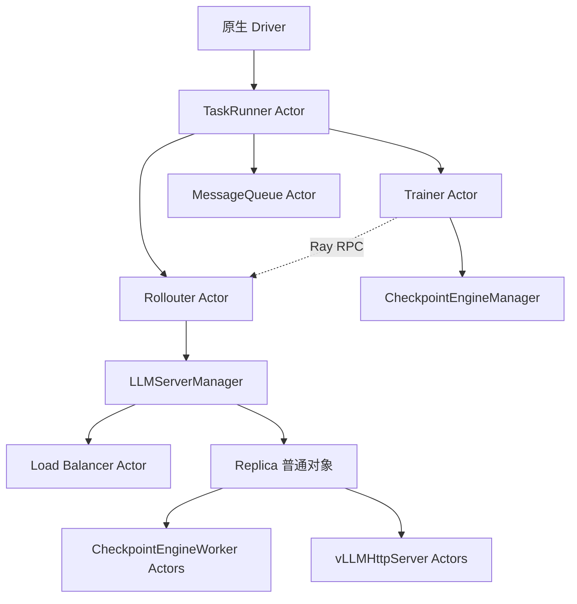
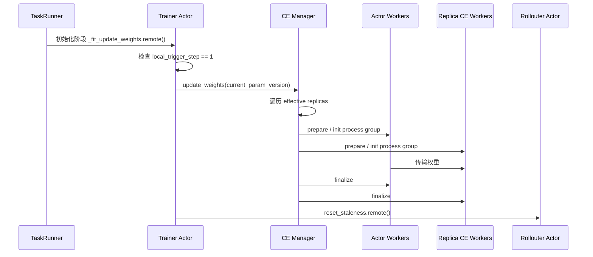
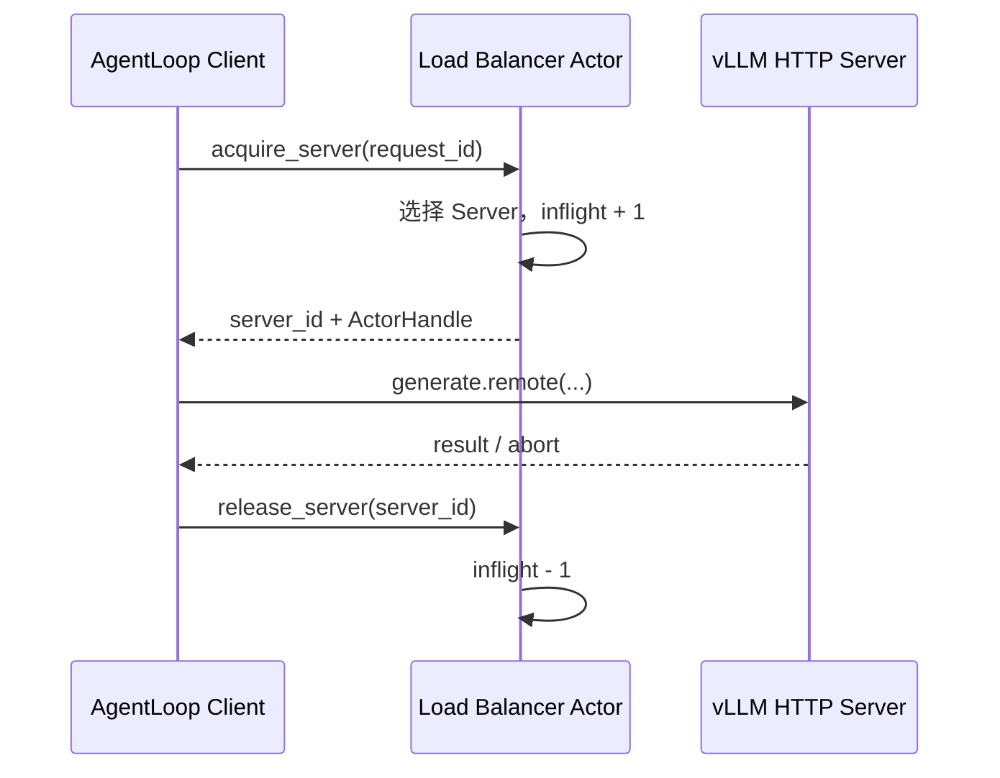

# VERL 5.3 源码阅读指南：动态流程编排与参数同步

> 面向读者：第一次接触 VERL、准备在 `verl-multi-task` 中开发“动态流程编排与参数同步”的开发者。  
> 核对日期：2026-09-09。  
> 适用范围：experimental Fully Async、纯 STANDALONE、vLLM、非 PD、非 naive Checkpoint Engine。  
> 本文是源码阅读和实现定位文档，不表示 5.3 已经实现。文中行号对应当前工作区，后续升级 VERL 时可能变化。

## 1. 阅读目标

完成第一轮阅读后，不要求掌握 PPO 算法、vLLM 内核或 NCCL 实现。只需要能够回答下面五个问题：

1. Fully Async 任务启动时，Trainer、Rollouter、MessageQueue 按什么顺序创建？
2. Trainer 在什么条件下发布下一版参数？
3. Checkpoint Engine 根据哪一份 Replica 集合建立通信组？
4. Rollouter、Manager、Load Balancer 分别维护什么状态？
5. 为什么动态 ADD/REMOVE 必须和原生参数同步使用同一把任务内互斥锁？

本文只阅读与这五个问题直接相关的八个位置：

| 顺序 | 文件和起点 | 阅读目的 |
|---|---|---|
| 1 | `verl/experimental/fully_async_policy/fully_async_main.py:35` | 组件创建顺序和 Actor 关系 |
| 2 | `verl-multi-task/.../experimental_fully_async/task_runner.py:34` | 伴生类如何替换原生创建目标 |
| 3 | `verl/experimental/fully_async_policy/fully_async_trainer.py:676` | 参数版本递增和同步触发条件 |
| 4 | `verl/checkpoint_engine/base.py:449` | CE 有效集合、建组和传权全过程 |
| 5 | `verl/experimental/fully_async_policy/fully_async_rollouter.py:1199` | Replica 变化后如何更新生成容量 |
| 6 | `verl/workers/rollout/router.py:170` | 请求路由和 in-flight 请求计数 |
| 7 | `verl-multi-task/.../experimental_fully_async/llm_server_manager.py:12` | Manager、Replica、LB 扩展接入点 |
| 8 | `verl-multi-task/rollout/replica.py:13` | HTTP Server 和 CE Worker 如何挂入 Replica |

第一轮可以暂时跳过 PPO loss、advantage、Dataset、Reward Model、SGLang、TensorRT-LLM、V1 Trainer、HYBRID 和 COLOCATED 业务。

## 2. 先记住四个概念

### 2.1 Ray Actor 和普通 Python 对象

Ray Actor 是独立进程中的远程对象。调用 Actor 方法通常使用：

```python
result_ref = actor_handle.method.remote(argument)
result = ray.get(result_ref)
```

普通 Python 对象只存在于当前进程，可以直接调用。当前链路中的主要归属是：

```text
Driver
└── TaskRunner ActorHandle

TaskRunner Actor 进程
├── Trainer ActorHandle
└── Rollouter ActorHandle

Trainer Actor 进程
└── CheckpointEngineManager（普通 Python 对象）

Rollouter Actor 进程
└── LLMServerManager（普通 Python 对象）
    └── GlobalRequestLoadBalancer ActorHandle
```

因此，Trainer 和 Rollouter 不能共享普通的 Python `list`、`asyncio.Lock` 或对象引用。二者之间必须通过 Ray RPC 传递可序列化数据或 ActorHandle。

### 2.2 Replica

Replica 是一个能够独立处理 rollout 推理请求的模型服务实例。一个 Replica 可以使用一张或多张 GPU。它持有一组用于参数接收的 Worker，并创建 HTTP Server Actor 对外处理生成请求。

```text
Replica（普通 Python 对象）
├── workers：CheckpointEngineWorker ActorHandle 列表
├── server_handle：vLLMHttpServer ActorHandle
├── server_address：Load Balancer 使用的服务标识
└── resource_pool / placement：资源和放置信息
```

### 2.3 Checkpoint Engine（CE）

这里的 CE 主要是训推参数同步系统，不是普通意义上的“把 checkpoint 保存到磁盘”。

- `CheckpointEngineManager` 在 Trainer Actor 进程中协调同步。
- `CheckpointEngineWorker` 位于 Replica 一侧，接收训练端发送的权重。
- NCCL、NIXL 等 backend 负责具体通信拓扑和数据传输。

### 2.4 三份不能混为一谈的状态

动态流程必须同时协调三份状态：

| 状态所有者 | 回答的问题 |
|---|---|
| LLMServerManager | Replica 是否存在、由谁拥有、能否休眠或销毁？ |
| CheckpointEngineManager | 下一次原生参数同步包含哪些 Replica？ |
| Load Balancer | 当前哪些 Server 可以接收新请求？ |

“Manager 已创建 Replica”不等于“Replica 已经可以接流”；“加入 CE”也不等于“已经加入 LB”。

## 3. 总体运行图



训练和生成并行运行：

```text
Rollouter 持续生成样本 → MessageQueue → Trainer 取样并更新参数
                                         ↓
                            到达原生触发条件后同步权重
                                         ↓
                              CE → 全部有效 Replica
```

## 4. 第一站：`fully_async_main.py`——组件创建顺序

文件：`verl/experimental/fully_async_policy/fully_async_main.py`  
起点：`FullyAsyncTaskRunner`，约第 35 行。

### 4.1 先看 `run()`

```python
def run(self, config):
    self._initialize_components(config)
    self._run_training_loop()
```

TaskRunner 是一个 Ray Actor。它先完成组件初始化，再启动长期运行的 Trainer 和 Rollouter。

### 4.2 再看 `_initialize_components()`

初始化主顺序是：

```text
1. 加载 tokenizer / processor
2. 创建训练 Worker 类型映射和资源池
3. 创建并初始化 Trainer Actor
4. 按需取得 hybrid worker group
5. 创建并初始化 Rollouter Actor
6. 把 Rollouter ActorHandle 交给 Trainer
7. 创建 MessageQueue，并把 client 交给两侧
8. Trainer 和 Rollouter 加载 checkpoint
9. Trainer 执行第一次参数同步
10. 按配置执行训练前验证
```

最值得标记的是第 9 步：

```python
ray.get(self.components["trainer"]._fit_update_weights.remote())
```

这说明初始参数同步和训练期间的后续同步使用同一个 Trainer 方法。未来给 `_fit_update_weights()` 加 gate 时，必须同时覆盖初始化同步和训练期间同步。

### 4.3 看 `_run_training_loop()`

```python
rollouter_future = self.components["rollouter"].fit.remote()
trainer_future = self.components["trainer"].fit.remote()
```

两个 Actor 的 `fit()` 同时运行。TaskRunner 使用 `ray.wait()` 监视它们，而不是自己执行训练或生成。

### 4.4 这一站与 5.3 的关系

当前 TaskRunner 的 `run()` 是长生命周期调用。未来 GS 要在训练期间下发 ADD/REMOVE 命令，TaskRunner 必须能够在 `run()` 尚未结束时响应控制 RPC。这属于 5.4 的控制入口前置条件；5.3 的编排方法最终会由这些控制 RPC 调用。

### 4.5 读完自测

- Trainer 和 Rollouter 谁先创建？
- 为什么要在二者创建后再互相传 ActorHandle？
- 初始参数同步从哪个 Actor 发起？
- `fit.remote()` 为什么不会立即返回训练结果？

## 5. 第二站：MultiTask `task_runner.py`——替换创建目标

文件：`verl-multi-task/src/multi_task_scheduler/integration/verl/experimental_fully_async/task_runner.py`  
起点：`MultiTaskFullyAsyncTaskRunner`，约第 34 行。

### 5.1 继承策略

```python
class MultiTaskFullyAsyncTaskRunner(
    unwrap_native_actor_class(FullyAsyncTaskRunner)
):
```

原生 `FullyAsyncTaskRunner` 已被 `@ray.remote` 包装。伴生代码先取得其底层 Python 类，再继承它，最后把 MultiTask 子类重新包装成 Ray Actor。

这样做的目的不是复制原生训练入口，而是复用原生 `run()`、初始化流程和训练循环，只替换必要创建点。

### 5.2 `run()` 增加 GS 生命周期

当前 MultiTask 流程为：

```text
发现或创建 GroupScheduler
→ 取得当前 TaskRunner Actor ID 和 ActorHandle
→ attach_task
→ super().run(config)
→ finally 中 detach_task
```

`finally` 很重要：正常完成或训练抛错时都尝试注销当前任务，同时清理错误不能掩盖原始训练错误。

### 5.3 只覆盖两个工厂方法

伴生类覆盖：

- `_create_trainer()`：将原生 `FullyAsyncTrainer` 换成 `MultiTaskFullyAsyncTrainer`。
- `_create_rollouter()`：将原生 `FullyAsyncRollouter` 换成 `MultiTaskFullyAsyncRollouter`，并额外传入 GS ActorHandle。

其余初始化仍由原生父类执行。这是后续开发应保持的原则：优先覆盖窄扩展点，避免复制整段 VERL 主循环。

### 5.4 当前能力边界

当前 TaskRunner 只完成 GS attach/detach 和类型替换。它尚未实现：

- 训练期间的控制方法；
- ADD/REMOVE/RESTORE 命令入口；
- operation journal；
- 操作状态查询和回执重放；
- 控制 RPC 与长时间 `run()` 的并发隔离。

### 5.5 读完自测

- 为什么不新写一套 `run()`？
- `self.components` 中保存的是 Trainer/Rollouter 对象还是 ActorHandle？
- GS 为什么只经 TaskRunner 下发命令？

## 6. 第三站：`fully_async_trainer.py`——版本与同步条件

文件：`verl/experimental/fully_async_policy/fully_async_trainer.py`  
重点：`_fit_update_local_step()` 和 `_fit_update_weights()`，约第 676 行。

### 6.1 三个关键变量

```python
self.local_trigger_step = 1
self.current_param_version = 0
self.trigger_parameter_sync_step = (
    config.async_training.trigger_parameter_sync_step
)
```

可以这样理解：

- `current_param_version`：当前已经发布给 rollout 的参数版本。
- `local_trigger_step`：当前版本周期内的本地训练步位置。
- `trigger_parameter_sync_step`：经过多少本地更新后发布下一版本。

### 6.2 版本如何推进

```python
if self.local_trigger_step < self.trigger_parameter_sync_step:
    self.local_trigger_step += 1
else:
    self.current_param_version += 1
    self.local_trigger_step = 1
```

到达周期末端时，参数版本加一，并把本地触发步重置为 1。

### 6.3 同步触发条件

```python
if self.local_trigger_step != 1:
    return None
```

只有 `local_trigger_step == 1` 才执行后续参数同步。随后纯 STANDALONE 路径调用：

```python
await self.checkpoint_manager.update_weights(
    global_steps=self.current_param_version,
)
```

最后 Trainer 调用 Rollouter 的 `reset_staleness()`，让 rollout 侧基于新版本恢复陈旧度控制。

### 6.4 5.3 必须保持的语义

GS 不能新增一个“现在同步所有权重”的触发规则。原生同步仍由上述 hook 和条件触发。5.3 只需要保证：

```text
原生 update_weights 全程
与
Replica bootstrap / CE ADD / CE REMOVE / LB 提交
互斥执行
```

建议由 MultiTask Trainer 持有唯一的 task-local `replica-sync gate`，因为 CE Manager 就在 Trainer Actor 进程中，而且 Trainer 应是 CE 有效集合的唯一写入者。

### 6.5 不要直接复制整个方法

后续实现最好通过窄包装调用 `super()._fit_update_weights()`。如果把原生方法整段复制到伴生仓，VERL 更新同步指标、profiler、staleness 或动态调度逻辑时，伴生实现会悄悄落后。

但包装时要注意：父类在 `local_trigger_step != 1` 时本来是 no-op。实现需要确保这个快速返回不会造成无意义的长锁等待，并通过测试确认初始化同步也受保护。

### 6.6 读完自测

- `global_steps` 和 `current_param_version` 是否一定相同？
- 谁决定原生参数同步的触发时机？
- bootstrap 为什么不能递增 `current_param_version`？
- 为什么 gate 应放在 Trainer，而不是 GS？

## 7. 第四站：`checkpoint_engine/base.py`——有效集合与传权

文件：`verl/checkpoint_engine/base.py`  
重点：`CheckpointEngineManager`、`add_replicas()`、`remove_replicas()` 和 `update_weights()`。

### 7.1 Manager 初始化

```python
self.backend = config.backend
self.backend_cls = CheckpointEngineRegistry.get(config.backend)
self.actor_wg = actor_wg
self.replicas = replicas
```

其中：

- `actor_wg` 是训练端 WorkerGroup，是参数发送方。
- `replicas` 是 rollout Replica 集合，是参数接收方视图。
- `backend_cls` 负责 NCCL、NIXL 等后端的通信拓扑。

对 5.3 而言，`self.replicas` 就是第一版唯一的 `effective_replicas`。不要再复制一份所谓同步 snapshot 或 desired membership，否则两份列表可能失去一致性。

### 7.2 原生 ADD/REMOVE 只是改列表

```python
def add_replicas(self, replicas):
    self.replicas.extend(replicas)

def remove_replicas(self, replicas):
    replicas_set = set(replicas)
    self.replicas = [
        r for r in self.replicas
        if r not in replicas_set
    ]
```

这里没有锁、operation ID、状态检查、bootstrap、LB 提交或失败回滚。它们只能作为 CE 集合修改原语，不能代表完整的多任务 ADD/REMOVE 成功。

### 7.3 原生 `update_weights()` 八步流程

非 naive backend 的流程是：

```text
1. abort_replicas：中断并保存未完成请求
2. 遍历 self.replicas，收集全部 Replica Workers
3. release_kv_cache_replicas：释放 KV cache，保留权重 buffer
4. build_process_group：prepare、构建拓扑、初始化通信组
5. actor_wg 与 rollout workers 执行参数传输
6. 两侧 finalize
7. resume_kv_cache_replicas
8. resume_generation_replicas
```

核心片段是：

```python
workers = []
for replica in self.replicas:
    workers.extend(replica.workers)
```

后续通信拓扑正是根据这批 Worker 建立。因此从“读取 `self.replicas`”到“finalize 和恢复生成”期间，有效集合都不能变化。

### 7.4 为什么必须有 gate

如果同步读取完 Worker 后发生 ADD：

```text
CE 列表包含新 Replica
但当前通信组中没有它
```

如果同步建组后发生 REMOVE 并销毁：

```text
当前通信组仍引用旧 Worker
但该 Worker 已被销毁
```

两种情况都可能导致版本混用、Ray Actor 错误或 NCCL 建组/传输失败。因此 gate 必须覆盖整个 `update_weights()`，而不只是第五步的数据传输。

### 7.5 bootstrap 与原生同步的区别

| 对比项 | 新 Replica bootstrap | 原生参数同步 |
|---|---|---|
| 目标 | 只同步新 Replica | 同步全部 effective replicas |
| 数据版本 | 当前已发布 serving version | Trainer 按原生周期发布的新版本 |
| 是否递增版本 | 否 | 按原生逻辑推进 |
| 是否 reset 全局 staleness | 否 | 是，继续原生流程 |
| 触发来源 | ADD/RESTORE 事件 | Trainer 原生 hook |

bootstrap 不能直接拿可能已经领先的 Trainer live weights，然后把它标成旧 serving version；它需要读取不可变的已发布版本来源。该能力当前仍是 5.2/5.3 之间的实现缺口。

### 7.6 读完自测

- `self.replicas` 在同步中被读取了几次、用于什么？
- 为什么 CE ADD 返回不等于 Replica 已经 ACTIVE？
- 为什么 bootstrap 不能调用完整的原生 `update_weights()`？

## 8. 第五站：`fully_async_rollouter.py`——Replica 与并发容量

文件：`verl/experimental/fully_async_policy/fully_async_rollouter.py`  
重点：约第 1199 行的 `add_replicas()`、`remove_replicas()` 和约第 1274 行的 `_update_max_concurrent_samples()`。

### 8.1 原生动态入口

```python
async def add_replicas(self, resource_ids):
    n = await self.llm_server_manager.add_replicas(resource_ids)
    if n > 0:
        self._update_max_concurrent_samples()
    return n
```

REMOVE 的结构相同。Manager 成功修改活跃 Replica 后，Rollouter 重新计算最大并发样本数。

### 8.2 并发容量怎么算

```python
new_val = (
    len(self.llm_server_manager.get_replicas())
    * self.concurrent_samples_per_replica
)
new_val = min(new_val, self.max_required_samples)
```

因此动态 ADD/REMOVE 不只影响 Manager、CE 和 LB，也会影响 Rollouter 的生产背压。如果忘记更新这个值：

- ADD 后，新增 Replica 可能存在但得不到足够请求；
- REMOVE 后，Rollouter 可能仍按旧容量启动过多样本。

### 8.3 不能直接复用为多任务 STANDALONE 借卡

当前原生方法主要管理预注册的 hybrid Replica。它没有完成：

- 根据跨任务租约中的 node ID/GPU IDs 创建 borrowed Replica；
- target-only bootstrap；
- CE 集合事务；
- donor/borrower 所有权隔离；
- 多组件提交回执和失败回滚。

可以复用“Manager 成功后更新容量”的思想，但不能把原生 `add_replicas(resource_ids)` 直接当成 5.3 的完整 ADD。

### 8.4 5.3 建议扩展职责

Rollouter 适合提供：

- `prepare_replica()`：调用 Manager 创建隐藏 Replica，不加入 LB；
- `commit_routable()`：校验操作回执后加入 LB；
- `begin_drain()`：停止给目标 Server 分配新请求；
- `wait_drained()`：等待目标 Server 的请求归零；
- `finish_remove()`：完成路由移除并更新并发容量。

Rollouter 不应反向调用一个需要取得同一 gate 的 Trainer 方法，否则 Trainer 持 gate 等待 Rollouter 回执时会形成跨 Actor 循环等待。

### 8.5 读完自测

- 为什么新增 Replica 后还要更新 `max_concurrent_samples`？
- 原生 `add_replicas()` 目前处理的是哪类 Replica？
- 哪些步骤应该由 Rollouter 做，哪些必须由 Trainer 做？

## 9. 第六站：`router.py`——路由与 in-flight 账本

文件：`verl/workers/rollout/router.py`  
重点：`GlobalRequestLoadBalancer`，约第 133 行开始。

### 9.1 两份核心字典

```python
self._servers = dict(servers)
self._inflight_requests = {sid: 0 for sid in servers}
```

- `_servers` 保存 server ID 到 ActorHandle 的映射。
- `_inflight_requests` 保存每个 Server 的在途请求数。

### 9.2 请求如何进入和退出

`acquire_server()` 先检查 sticky cache，再从有效 Server 中选择负载最小者，并把计数加一：

```text
选择 server → inflight[server] += 1 → 返回 server handle
```

请求结束时，client 调用 `release_server()`：

```text
inflight[server] -= 1
```

所以“瞬时并发为零”只能说明当前没有已登记请求，不能单独证明该 GPU 已可安全捐赠。5.3 还需要结合样本生产窗口、排空过程、Replica 状态和物理释放回执。

### 9.3 原生 add/remove 的行为

`add_servers()` 同时登记 ActorHandle，并把 inflight 初始化为 0。

`remove_servers()` 当前直接执行：

```python
self._inflight_requests.pop(sid, None)
self._servers.pop(sid, None)
```

如果 Server 仍有请求，这会把 in-flight 账本直接删除。动态回收不能直接把它当作“摘流”。

### 9.4 5.3 需要两阶段移除

建议 MultiTask LB 引入至少两种状态：

```text
ROUTABLE：可以接收新请求
DRAINING：不能接收新请求，但保留 Server handle 和 inflight 计数
```

流程为：

```text
begin_drain
→ 从可选路由集合排除
→ 保留并等待 inflight == 0
→ CE REMOVE
→ finish_remove
→ 删除 handle 和计数
```

sticky cache 指向 DRAINING Server 时也必须失效并重新选路，不能继续把同一 request ID 路由过去。

### 9.5 读完自测

- `acquire_server()` 为什么必须原子地返回 ID 和 handle？
- `remove_servers()` 为什么不能直接代表 drain？
- `inflight == 0` 能证明 GPU 已经释放吗？

## 10. 第七站：MultiTask `llm_server_manager.py`——接入点

文件：`verl-multi-task/src/multi_task_scheduler/integration/verl/experimental_fully_async/llm_server_manager.py`  
起点：`MultiTaskLLMServerManager`，约第 12 行。

### 10.1 当前只替换类型

```python
self.rollout_replica_class = MultiTaskvLLMReplica
super().__init__(config, worker_group, rollout_resource_pool)
self._load_balancer_cls = MultiTaskGlobalRequestLoadBalancer
```

这个顺序很重要：先指定 Replica 类，再调用父类初始化，避免父类覆盖选择；父类完成后再选择 MultiTask LB。

### 10.2 LB 如何成为 Ray Actor

`MultiTaskGlobalRequestLoadBalancer` 本身是普通 Python 类。Manager 创建时使用：

```python
ray.remote(self._load_balancer_cls).remote(...)
```

所以运行时的 LB 是 Ray Actor，Manager 保存的是 ActorHandle。调用其方法必须使用 `.remote()`。

### 10.3 GS 句柄的传递链

```text
MultiTask TaskRunner
→ MultiTask Rollouter Actor
→ MultiTask LLMServerManager
→ MultiTask Load Balancer Actor
```

当前传递只建立引用，没有调度副作用。LB 可以向 GS 上报候选空闲信息，但不应自己做跨任务分配决策。

### 10.4 5.3 中 Manager 应负责什么

Manager 是本任务 Replica 运行时引用的所有者，适合维护：

```text
replica_id
kind = native | borrowed
state
node_id / gpu_ids
Replica 对象
server address / ActorHandle
lease_epoch / operation_id
```

它负责创建、休眠、唤醒和销毁的底层调用，但完整 ADD/REMOVE 的事务顺序应由编排层协调，不能塞进一个 Manager 列表修改方法。

### 10.5 读完自测

- Manager 是 Actor 还是普通对象？它在哪个 Actor 进程中？
- LB 是在哪里被包装成 Actor 的？
- 为什么 borrower 只能接收 node/GPU 租约，不能接收 donor Manager 的 Replica 对象？

## 11. 第八站：MultiTask `replica.py`——Server 与 CE Worker

文件：`verl-multi-task/src/multi_task_scheduler/rollout/replica.py`  
起点：`MultiTaskvLLMReplica`，约第 13 行。

### 11.1 选择 MultiTask HTTP Server

```python
self.server_class = ray.remote(MultiTaskvLLMHttpServer)
```

父类后续启动 Server 时，会使用这个 ActorClass。因此 HTTP Server 的 MultiTask 扩展可以在伴生仓实现，而不需要修改原生 `vLLMReplica.launch_servers()`。

### 11.2 选择 MultiTask CE Worker

```python
return RayClassWithInitArgs(
    cls=ray.remote(MultiTaskCheckpointEngineWorker),
    rollout_config=self.config,
    model_config=self.model_config,
    replica_rank=self.replica_rank,
)
```

原生 Replica 初始化 WorkerGroup 时会使用这个描述创建 CE Worker Actors。Trainer 侧 CE Manager 最终通过 `replica.workers` 找到它们。

### 11.3 当前能力边界

当前 MultiTask Replica 仍继承原生资源初始化和放置方式。它尚未实现：

- 根据 immutable node ID 和 GPU IDs 创建 borrowed Replica；
- 不依赖 donor ResourcePool/Placement Group 的 borrower-owned 放置；
- STANDALONE 真正 sleep/wake；
- target-only bootstrap 接收；
- 销毁和物理 GPU 释放证明。

尤其需要注意，原生 vLLM HTTP Server 在 STANDALONE 下的 `sleep()` / `wake_up()` 当前为 skip。这意味着“从 LB 移除”不等于“显存和 GPU 已释放”。

### 11.4 读完自测

- 一个 Replica 内为什么可能有多个 CE Worker？
- HTTP Server 和 CE Worker 分别服务哪条调用链？
- 为什么 borrowed Replica 必须由 borrower 自己创建？

## 12. 把八个位置串成两条运行链

### 12.1 原生参数同步链



训练期间也调用相同 Trainer 方法，只是调用者来自 Trainer 自己的 fit 流程。

### 12.2 请求路由链



这条链解释了为什么 REMOVE 必须先摘流再排空，也解释了为什么 Rollouter 和 Trainer 需要通过回执协调，而不能只改 CE 列表。

## 13. 5.3 的目标流程

以下是 TO-BE，不是当前已实现代码。

### 13.1 ADD：创建并发布 borrowed Replica

```text
1. GS 向 TaskRunner 下发 operation_id、lease_epoch、node_id、gpu_ids
2. Rollouter → Manager 创建隐藏 Replica；此时不加入 LB，不持 gate
3. Trainer 获取 replica-sync gate
4. 固定当前已发布 serving version
5. 只给新 Replica 执行 target-only bootstrap
6. Trainer 把新 Replica 加入 CE effective_replicas
7. Trainer 请求 Rollouter 将 Server 提交为 ROUTABLE
8. Rollouter 更新 max_concurrent_samples
9. Trainer收到完整回执后释放 gate
10. TaskRunner 向 GS 返回 ACTIVE
```

提交不变量：

```text
LB 中 ROUTABLE(replica)
⇒ bootstrap 已成功
且 replica ∈ CE effective_replicas
```

### 13.2 REMOVE：摘流、排空和回收

```text
1. LB 将目标 Server 标为 DRAINING，停止新请求；不持 gate
2. 等待目标 Server 的 in-flight 请求归零
3. Trainer 获取 replica-sync gate
4. Trainer 从 CE effective_replicas 删除目标 Replica
5. 释放 gate
6. Rollouter 更新并发容量并完成 LB 删除
7. borrowed Replica：销毁
8. donor native Replica：真正 sleep，但保留生命周期引用
9. TaskRunner 向 GS 返回 GPU_RELEASED
```

提交不变量：

```text
CE REMOVE 已完成
⇒ replica 不会参与下一次原生参数同步

GPU_RELEASED
⇒ 不仅已从 LB/CE 移除，而且物理资源已经释放并有回执
```

### 13.3 RESTORE：恢复 donor 自有 Replica

```text
1. GS 确认 borrower 已释放租借资源
2. donor Trainer 获取自己的 replica-sync gate
3. donor native Replica 追平 donor 当前 serving version
4. 加回 CE effective_replicas
5. wake up 并恢复 LB ROUTABLE
6. 更新 Rollouter 并发容量
7. 释放 gate 并返回 ACTIVE
```

donor native Replica 不应在捐赠时销毁并重建，因为它的所有权始终属于 donor。

## 14. 当前源码事实、缺口和目标

| 层次 | 当前 AS-IS | 5.3/前置 GAP | TO-BE |
|---|---|---|---|
| TaskRunner | 创建 Trainer/Rollouter，连接 GS | 无训练期间控制入口和操作日志 | 接收命令、转发、查询操作结果 |
| Trainer | 原生版本和同步逻辑；MultiTask 只替换 CE 类 | 无 replica-sync gate | CE 唯一写入者，串行原生同步和成员变更 |
| CE Manager | `self.replicas`、add/remove、完整传权 | add/remove 无锁；无 target-only bootstrap | 单 effective 集合、动态拓扑和 bootstrap 回执 |
| Rollouter | Manager 调用后更新并发容量 | 无 prepare/publish/drain 事务 | 跨 Actor 提交、回执和容量更新 |
| Manager | 原生 Replica 生命周期；MultiTask 选择扩展类型 | 无 borrowed registry 和指定 GPU 创建 | 保存 native/borrowed 完整所有权记录 |
| LB | acquire/release、add/remove、inflight | remove 直接删除账本；无 DRAINING | 两阶段摘流与幂等提交 |
| Replica | 选择 MultiTask HTTP Server 和 CE Worker | STANDALONE sleep/wake、借卡创建未实现 | borrower-owned runtime 和真实资源释放 |
| GS | 保存 TaskRunner ActorHandle | 无资源租约和调度闭环 | 下发命令并根据执行事实更新全局视图 |

## 15. 初学者最容易踩的坑

### 15.1 把原生 hybrid 动态调度当成跨任务借卡

原生 `add_replicas(resource_ids)` 激活的是已注册 hybrid Replica。5.3 的 borrowed Replica 需要根据另一个任务释放的物理 GPU 租约新建 runtime，语义不同。

### 15.2 把一个列表当成完整成功

只更新 Manager、CE 或 LB 中任意一份状态，都不能代表 ADD/REMOVE 完成。必须使用 operation ID 和跨组件回执形成提交边界。

### 15.3 在创建 Replica 时长期持 gate

vLLM 初始化可能很慢。隐藏 CREATE 不修改有效同步和路由视图，不应持 gate。gate 从 bootstrap/CE 提交阶段开始持有。

### 15.4 只给 NCCL 传输语句加锁

通信拓扑在传输前已经读取 Replica 集合并建组。gate 必须覆盖完整 `CheckpointEngineManager.update_weights()`。

### 15.5 用 `remove_servers()` 代替 drain

原生方法会立即删除 in-flight 账本。正确做法是先停止新流量、保留计数、等待排空，再最终删除。

### 15.6 bootstrap 发布了新版本

bootstrap 只是让一个新 Replica 追上当前已发布版本。它不能增加 `current_param_version`、reset 全局 staleness 或让已有 Replica 重复接收。

### 15.7 形成跨 Actor 锁循环

例如：Trainer 持 gate 等待 Rollouter；Rollouter 又回调一个必须取得同一 gate 的 Trainer 方法。这会导致死锁。跨 Actor 协议应保持单向阶段调用和明确回执。

## 16. 建议的实际阅读方法

每到一个方法，用纸或注释记下四项：

```text
运行位置：哪个 Actor/进程？
状态所有者：谁保存这个变量？
调用方式：本地调用还是 .remote()？
失败责任：谁回滚，返回什么回执？
```

推荐分三次阅读：

### 第一次：只看骨架

只看类名、`__init__`、`run()`、创建方法和 `fit.remote()`，画出对象所有权图，不进入 PPO 训练细节。

### 第二次：只跟同步

从 `_fit_update_weights()` 一直跟到 `CheckpointEngineManager.update_weights()`、`build_process_group()` 和 Replica Workers。

### 第三次：只跟请求

从 LB 的 `acquire_server()` 跟到 Server `generate()`，再跟 `release_server()`，观察 in-flight 计数何时变化。

## 17. 阅读完成检查表

- [ ] 我能说出 TaskRunner、Trainer、Rollouter 哪些是 Ray Actor。
- [ ] 我知道 CE Manager 和 LLMServerManager 分别在哪个 Actor 进程中。
- [ ] 我知道初始同步和训练期间同步都调用 `_fit_update_weights()`。
- [ ] 我知道 `local_trigger_step == 1` 是原生同步触发条件。
- [ ] 我知道 CE 的 `self.replicas` 为什么不能在同步中变化。
- [ ] 我能解释 Manager、CE、LB 三份视图的差别。
- [ ] 我知道原生 `remove_servers()` 为什么不能用作动态摘流。
- [ ] 我知道 Replica 数量变化后为什么要更新 `max_concurrent_samples`。
- [ ] 我能解释 bootstrap 和原生同步的区别。
- [ ] 我知道当前 STANDALONE sleep/wake 和 borrowed Replica 创建仍是底层缺口。

完成这些检查后，就具备进入 5.3 第一开发切片的知识基础：先在伴生仓实现不依赖 Ray/GPU 的 gate、operation journal、Replica 状态机、ADD/REMOVE/RESTORE 事务和失败回滚测试，再逐步接入 Trainer、CE、Rollouter、Manager 与 LB。
