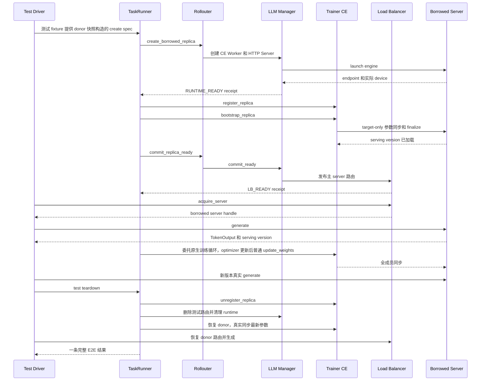

# D0–D4 开发与综合验收文档

本文作为当前 borrowed replica 创建能力的交付与验收说明。第一部分按当前代码说明改动、
类接口与实现边界；第二部分保留综合验收分层、场景矩阵、实际步骤、运行命令和判定标准。
“已实现”指代码存在，不表示全部真实设备场景已经通过。D0–D3 的阶段验收与新版 E2E
综合验收分开记录；本次文档整理没有修改代码。

## 第一部分：开发

### 1.1 交付范围与非测试代码文件清单

核心能力是复用已有 PG/bundle，为 borrower 创建独立 runtime，接通 CE 注册、首次参数
同步和 LB 发布；native 初始化、模型训练、vLLM 启动和底层传输尽量继承原生实现。
生产 sleep/wake/drain/reclaim/destroy、GS 全局资源分配不属于本轮已完成能力。

下表描述相对原生 verl 的插件扩展及后续修复，不将旧设计中尚未实现的接口算作代码。
Python 路径以 `src/multi_task_scheduler/` 为根；`tests/`、`testing/`、测试脚本和
测试配置不列入此开发文件清单。业务类中的测试钩子仍会明确标识，防止被当作生产功能。

| 非测试文件 | 具体修改及目的 |
| --- | --- |
| `integration/verl/runtime_profile.py` | 校验并解析唯一运行 profile，延迟导入扩展 TaskRunner；启用失败不静默退回原生；增加可选 E2E 配置守卫 |
| `integration/verl/ray_actor.py` | 从原生 Ray ActorClass 取真实 Python 类，供子类继承，不创建替身类 |
| `scheduler/group_scheduler.py` | 新增最小 GS Actor，保存 TaskRunner 注册信息；调度策略仍为空 |
| `scheduler/discovery.py` | 在已初始化的 Ray 中发现/创建命名 GS，并检查其类型 |
| `integration/verl/experimental_fully_async/task_runner.py` | 替换 Trainer/Rollouter 创建点，增加任务级 create 命令与串行锁；注册 GS、汇总创建链回执 |
| `integration/verl/experimental_fully_async/rollouter.py` | 选择扩展 LLM Manager，增加 create、版本回写、CE 投影、READY 的远程薄转发；保留原生 AgentLoop |
| `integration/verl/experimental_fully_async/llm_server_manager.py` | spec 归一化、任务内 rank 分配、按 lease 去重、runtime 所有权、CE 投影及 LB_READY 发布；失败回执补齐类型/阶段/traceback |
| `rollout/replica.py` | 新增按 claim 解析已有 PG/bundle 的创建路径；新建 CE Workers，重建 borrower rank/拓扑，继承 HTTP/engine 启动；校验实际放置并保存失败清理诊断 |
| `integration/verl/experimental_fully_async/trainer.py` | 选择扩展 CE Manager，新增 rank 级注册/bootstrap/注销入口与同步 gate；记录严格训练完成回执；保留原生训练算法 |
| `checkpoint/checkpoint_engine_manager.py` | 动态 CE 成员、pending/effective/suspended 投影、target-only bootstrap、同步版本记录和可选逐参数校验 |
| `checkpoint/checkpoint_engine_worker.py` | 复用原生接收/加载，增加可选 receiver manifest；TCPStore 端口冲突时记录实际通信环境，不自行改端口 |
| `checkpoint/hccl_checkpoint_engine.py` | 注册独立 `multitask_hccl` 后端，适配 Ascend communicator 销毁接口；增加 actor 源参数 manifest |
| `rollout/load_balancer.py` | 新增幂等 `commit_ready`，重复提交不重置在飞计数，拒绝同地址替换不同 Actor |
| `rollout/http_server.py` | 保留原生 HTTP/engine 实现；仅增加可选生成审计和测试 sleep/wake 钩子，不是生产生命周期扩展 |
| `multi_task_run.sh` | 沿用服务器模型/数据/Ascend 配置，经原生 fully_async/main_ppo 启动；固定插件及 verl 的 PYTHONPATH，避免外层 vllm 目录遮蔽；透传 `"$@"` |
| `async_run.sh` | 原生 fully_async 启动配置，作为多任务脚本的配置参照；不是 borrowed 实现或第二套 Python 训练入口 |
| `pyproject.toml` | 使用 src 布局打包 `multi_task_scheduler`；依赖现有服务器 verl/Ray/vLLM 环境，没有新增训练 console entry |

原生 `fully_async_ppo_trainer.yaml` 的可选 `multitask.runtime.profile` 与
`fully_async_main.py` 的 profile 解析调用是既有外部接线前提，不是本轮对原生类的修改。
`run.sh` 是用户已验证的配置参照，不作为本轮扩展文件；包的 `__init__.py` 组织包并声明
版本/阶段常量，没有运行时初始化副作用。

### 1.2 组件关系、身份和状态

```text
原生 fully_async_main → resolve_runtime_profile → 原生 run_ppo
  → MultiTaskFullyAsyncTaskRunner（任务命令入口）
      → MultiTaskFullyAsyncRollouter
          → MultiTaskLLMServerManager（本地 runtime 所有者）
              → MultiTaskvLLMReplica(vLLMReplica)
                  → 新 CE Workers + 继承 launch_servers 创建 HTTP/Engine
              → MultiTaskGlobalRequestLoadBalancer（路由和在飞计数）
      → MultiTaskFullyAsyncTrainer
          → MultiTaskCheckpointEngineManager（同步成员/版本投影）
              → actor_wg + replica.workers → 原生 backend 传输
```

Manager、Replica、CE Manager 是所属 Actor 内的普通对象；CE Worker、HTTP Server、LB、
Trainer、Rollouter、TaskRunner 和 GS 是 Ray Actors。Rollouter 向 Trainer 返回的 replica
是含 Worker/server handles 的任务内部投影，不是让两个进程共享同一个可变 Python 对象。
因此同步成功后还需显式回写 Rollouter 侧的版本。对外 operation receipt 只返回元数据。

| 名称 | 当前含义与使用位置 |
| --- | --- |
| `replica_rank` | 任务内 replica 身份，跨任务不唯一；与该 replica 内 CE Worker 的 `rank`、通信域 rank 不同 |
| `operation_id` | 一次调用尝试标识；相同 lease 的重试允许换 operation_id，不据此重复创建 |
| `lease_id` | borrower 创建请求的主租约标识，是 `borrowed_operations` 的 key |
| `claim_id`、claim 的 `lease_id` | 单项资源声明标识及其 donor 源租约；一个 borrower 可聚合多个 donor/源租约 |
| `world_size` | borrower 自己的 TP×DP×PP，等于本 replica 的 claim/CE Worker 数，不要求与 donor 相同 |
| `serving_version` | 已完成参数同步确认的模型版本；不是通信拓扑版本、LB 路由版本，也不是权重张量 |
| `placement_epoch`、`expires_at` | 输入授权版本号与有效期；当前校验格式/过期，不替代 GS 的全局授权与撤销校验 |

**创建状态分层：** Replica 对象经历 `CREATING → RUNTIME_READY` 或 `FAILED`；Manager
的 operation 另有 `READY_COMMITTING → LB_READY`。CE 的 `WEIGHTS_READY` 是同步回执，
并非 Replica 的 runtime_state。当前代码不会因 LB_READY 自动把 Replica.runtime_state
改成同名值。创建失败的 `released=false` 不能被误读为已经归还资源。

下文保留源码方法参数与已有返回注解；未注解的方法另说明实际返回值。字段类型是阅读
说明，不表示源码已全部增加类型注解。原生未改的方法只列关键复用点，不重复其完整 API。

### 1.3 插件入口、GS 与任务级编排

#### 1.3.1 profile 与原生 Actor 适配

| 函数/类型 | 分类、返回值和执行内容 |
| --- | --- |
| `ProfileConfigurationError(ValueError)` | 新增配置错误类型，没有额外业务字段 |
| `_select(config, path, default=_MISSING)` | 新增内部函数；返回 mapping 路径对应值或默认值，父节点类型错误时抛异常 |
| `validate_runtime_profile(config) -> bool` | 新增；关闭 profile 返回 False；开启时校验唯一 profile、standalone、非 PD、vLLM async、非 naive backend、并行规模及原生资源映射 |
| `resolve_runtime_profile(config)` | 新增；实际返回扩展 ActorClass 或 None；可选 E2E 守卫 → 配置校验 → 延迟导入 TaskRunner；不初始化 Ray、不发现 GS |
| `unwrap_native_actor_class(actor_class: object) -> type` | 新增；读取 `__ray_actor_class__`，让扩展类继承真实原生类；不兼容时明确失败 |

`multi_task_run.sh` 将 PYTHONPATH 设置为插件 `src` 与原生源码根，不加入外层模型目录；
切到原生源码根后调用 `python -m verl.experimental.fully_async_policy.fully_async_main`。
仍由原生 `run_ppo` 初始化 Ray 并创建所选 TaskRunner，没有绕开 main_ppo。

#### 1.3.2 `GroupScheduler` 与 discovery

这是新增的最小注册 Actor，不是完整资源调度器。新增字段
`task_runners: dict[str, ActorHandle]` 的 key 为 TaskRunner actor ID，value 为其句柄。

| 方法 | 分类与功能 |
| --- | --- |
| `__init__(self) -> None` | 新增；初始化任务表 |
| `runtime_kind(self) -> str` | 新增；返回类型标识，防止拿到同名错误 Actor |
| `attach_task(self, task_id: str, task_runner: ActorHandle) -> None` | 新增；校验并注册任务，拒绝同 ID 替换不同 Actor |
| `detach_task(self, task_id: str) -> None` | 新增；幂等移除注册 |
| `get_task_runners(self) -> dict[str, ActorHandle]` | 新增；返回任务表副本，供初始化核验 |
| `schedule(self) -> list` | 预留；当前返回空列表，没有全局 lease 分配、资源公平性或回收策略 |
| `get_or_create_group_scheduler()` | discovery 模块函数；实际返回 ActorHandle；要求 Ray 已初始化，发现/创建固定名称、固定 namespace 的 detached GS，再以 30 秒上限核验类型 |

**GS 边界的实际情况：** 设计要求 GS 只与 TaskRunner 通信；当前只有 TaskRunner 执行
GS 注册/注销 RPC，但历史构造链仍把 `group_scheduler` 句柄传给 Rollouter、Manager、LB
并保存。不能声称“其他组件已经不持有 GS”。这些兼容字段的去除属于后续代码清理，本次
只记录事实，不修改代码。当前 GS 也没有验证测试 spec 的真实跨任务授权。

#### 1.3.3 `MultiTaskFullyAsyncTaskRunner`

继承解除 Ray 包装后的 `FullyAsyncTaskRunner`，再包装为
`@ray.remote(num_cpus=1, max_concurrency=8)`。

```python
components: dict                    # [原生] 名称 -> 组件句柄或 config/tokenizer/processor 等
running, shutdown_event             # [原生] 运行标记与退出事件；配置在 components["config"]
group_scheduler: ActorHandle        # [新增] 当前注册的 GS 句柄
_replica_operation_lock: threading.Lock  # [新增] 同任务 create 全链串行化
```

| 方法 | 分类、返回值与功能 |
| --- | --- |
| `__init__(self)` | 重写；实际返回 None，初始化原生状态及命令锁 |
| `run(self, config)` | 重写；返回原生 run 结果；检查可选 E2E 配置 → 发现 GS → attach（120 秒）→ 原生 run → 可选旧 smoke；finally detach（30 秒），注销失败仅记诊断 |
| `_create_rollouter(self, config) -> None` | 重写创建点；选择扩展 Rollouter，保留原生初始化、资源参数和 components 登记 |
| `_create_trainer(self, config) -> None` | 重写创建点；保留原生训练资源池和 role 参数，选择扩展 Trainer |
| `execute_replica_operation(self, operation: str, request: dict \| None = None) -> dict` | 新增生产命令入口；当前只实现 create；其他操作返回 `LIFECYCLE_NOT_IMPLEMENTED` |
| `_run_training_loop(self)` | 重写、包含测试分支；普通运行直接继承，E2E 开启时由 fixture 包装原生训练循环；实际返回原生结果 |
| `_maybe_run_d4_runtime_smoke(self, config) -> None` | 新增测试钩子；旧 D4 smoke，默认关闭 |

**create 执行流程：** 校验 request 是 dict → 获取任务锁 → 确认 Trainer/Rollouter 已就绪
→ `Rollouter.create_borrowed_replica(spec)` → 若返回不是 RUNTIME_READY 则原样返回
（包括重复请求已得到 LB_READY）→ `Trainer.register_replica(rank)` →
`Trainer.bootstrap_replica(rank)` → `Rollouter.commit_replica_ready(rank)` → 返回包含
runtime、registration、bootstrap、ready 的元数据回执。

任务锁防止同 Task 命令相互穿插，但当前没有全链持久事务日志或自动回滚；后半段注册、
bootstrap、LB RPC 异常可直接向上传播，不能写成跨 Actor 的原子提交。

#### 1.3.4 `MultiTaskFullyAsyncRollouter`

继承解除包装后的 `FullyAsyncRollouter`，再包装为
`@ray.remote(num_cpus=10, max_concurrency=100)`。原生生成、样本队列、Worker 初始化保留。

```python
config, tokenizer, processor        # [原生] 配置及预处理器
llm_server_manager                 # [原生字段·扩展赋值] MultiTaskLLMServerManager
async_rollout_manager              # [原生] 原生 FullyAsyncAgentLoopManager
group_scheduler                    # [新增兼容字段] 当前仍接收 GS 句柄，没有调度 RPC
```

| 方法 | 分类、返回值与功能 |
| --- | --- |
| `__init__(self, config, tokenizer, processor=None, device_name=None, *, group_scheduler=None)` | 重写；实际返回 None，透传原生参数并保存兼容字段 |
| `async _init_async_rollout_manager(self)` | 重写；实际返回 None；创建扩展 LLM Manager → 可选 D2 hook → 创建原生 AgentLoopManager，仍使用原生 FullyAsyncLLMServerClient |
| `async create_borrowed_replica(self, spec: dict) -> dict` | 新增；只转发 Manager 创建，不在此处分配 rank、创建 PG 或执行 CE 同步 |
| `async commit_replica_ready(self, replica_rank: int) -> dict` | 新增；转发 Manager 的 LB 发布 |
| `async get_borrowed_replica_for_ce(self, replica_rank: int)` | 新增；实际返回任务内部 replica 投影，供 Trainer 获得 Worker/server handles |
| `async mark_replica_serving_version(self, replica_rank: int, version: int) -> dict` | 新增；把 CE 确认的版本回写 Manager 所有的对象 |

其余 `run_*_smoke`、`prepare_*_smoke`、`probe_replica_ready`、`test_operation_snapshot`、
`cleanup_*_runtime`、`e2e_test_action(action, payload)` 均为测试薄转发，不扩展生产调度能力；
用途和执行场景归第二部分。它们不会替代 Trainer/CE Manager 的同步职责。

### 1.4 核心：`MultiTaskvLLMReplica(vLLMReplica)`

native 与 borrowed 使用同一个扩展类。native 沿用 `init_standalone()` 等原生资源初始化；
borrowed 新增 `init_from_lease()`，复用已有 PG 的指定 bundles，创建自己的 Workers 和
server/engine。该方案仍使用 Ray，不复用 donor CE Worker，不新建 borrower PG。

#### 1.4.1 字段

```python
# 原生字段：保留，或由 borrowed 创建路径重新赋值
replica_rank: int                   # [继承] 本任务 replica 身份
config, model_config               # [继承] RolloutConfig 与模型配置
world_size, nnodes: int             # [继承·扩展赋值] borrower TP×DP×PP 与节点数
gpus_per_node, gpus_per_replica_node: int  # [继承·扩展赋值] borrower 每节点卡数
workers: list[ActorHandle]          # [继承·扩展赋值] 新建 CE Workers，按 borrower rank 排序
servers: list[ActorHandle]          # [继承] 原生 launch_servers 创建的逐节点 servers
resource_pool, bundle_indices      # [继承] native 使用；borrowed 不获得 donor PG 所有权
rollout_mode                       # [继承·扩展赋值] borrowed 设置 STANDALONE
_server_address, _server_handle    # [继承] 主 HTTP endpoint 与主 server 句柄
server_class                       # [原生字段·扩展赋值] ray.remote(MultiTaskvLLMHttpServer)

# 新增字段
allocation_kind: str               # [新增] native 或 borrowed，区分资源来源
lease_id: str | None               # [新增] borrower 主租约；native 为 None
source_lease_ids: list[str]         # [新增] claims 涉及的全部 donor 源租约
donor_task_ids: list[str]           # [新增] donor 任务来源，支持多个 donor
donor_replica_ranks: list[int]      # [新增] donor 任务内 ranks，跨任务不可单独唯一定位
runtime_state: str                 # [新增] CREATING/RUNTIME_READY/FAILED 等本地状态
owns_resource_pool: bool           # [新增] borrowed 必须 False，避免误认 PG 所有权
max_colocate_count: int            # [新增] 本请求 M，默认 10；不会修改已有 PG 容量
claims: list[dict]                 # [新增] 按 borrower rank 排序的资源声明，见下方契约
serving_version: int | None        # [新增] CE 成功后由 Trainer 确认并回写的版本
operation_id: str | None           # [新增] 调用尝试标识，参与新 CE Actor 命名
worker_group: RayWorkerGroup | None # [新增] 包装新建 Worker handles，非新资源池
created_actor_names: list[str]     # [新增] 当前显式记录新 CE Actor 名称，不是所有 HTTP 名称
node_layout: dict[str, dict]       # [新增] node_id -> 节点布局记录和诊断
expected_device_map: dict[int, dict] # [新增] borrower rank -> 输入预期放置
actual_device_map: dict[int, dict] # [新增] borrower rank -> Worker 实测放置及进程信息
cleanup_result: dict              # [新增] 本对象清理请求及错误，不代表资源已释放
creation_stage: str               # [新增] 创建阶段，用于超时/失败定位
```

各 dict 的 value：`node_layout` 为 `{node_rank, ranks, gpu_uuids, local_gpu_indices}`；
`expected_device_map` 为 `{node_id, gpu_uuid, local_rank}`；`actual_device_map` 为
`{node_id, accelerator_id, rank, world_size, local_world_size, actor_id, pid, visible_devices}`，
其中 `visible_devices` 是环境变量名到值的映射。`cleanup_result` 为
`{kill_requested: [actor_id], errors: [错误文本], release_confirmed: false}`。

#### 1.4.2 方法与复用点

| 方法 | 分类与功能 |
| --- | --- |
| `__init__(self, *args, **kwargs)` | 重写；实际返回 None；读取扩展关键字，校验 native 无 lease、borrowed 不拥有 PG，再调用父类构造 |
| `get_ray_class_with_init_args(self) -> RayClassWithInitArgs` | 重写 Worker 工厂；选择扩展 CE Worker，传原生配置、模型配置和 replica_rank |
| `_configure_borrowed_parallelism(self, spec: dict) -> None` | 新增；用 dataclasses.replace 更新 frozen config；检查 TP×DP×PP 并重算节点布局 |
| `_validate_claim_layout(claims: list[dict], world_size: int) -> tuple[dict, dict]` | 新增 static；核对 rank/node/local 顺序及均匀节点布局，返回 node_layout、expected_device_map |
| `_resolve_placement_groups(claims: list[dict]) -> dict[str, PlacementGroup]` | 新增 static；按 PG 名查询已有 PG、检查 bundle 范围；key 是查询用名称，value 是 PG handle |
| `validate_placement(self, spec: dict) -> dict[str, PlacementGroup]` | 新增；校验 lease、布局、单 replica 设备/bundle 唯一及 NPU 排序，再解析 PG |
| `_validate_npu_device_order(device_ids: list[str]) -> None` | 新增 static；要求节点内 NPU ID 为不重复的升序数值，不静默重排外部 spec |
| `async _create_workers_from_claims(self, groups: dict[str, PlacementGroup], spec: dict) -> None` | 新增；逐 claim 创建独立 CE Actor，包装 WorkerGroup 并核对实际放置 |
| `async _validate_workers(self) -> None` | 新增；读取实际 Ray node/device/rank/world_size，逐项与 claim 比对并记录诊断 |
| `async validate_runtime(self) -> dict` | 新增；核对 server 数、逐节点放置及主 endpoint getter，返回 runtime 元数据；不是生成验证 |
| `async init_from_lease(self, spec: dict) -> dict` | 新增 borrowed 创建主方法；有界创建并返回 RUNTIME_READY |
| `runtime_metadata(self, runtime: dict \| None = None) -> dict` | 新增；输出身份、拓扑、实际映射等不含 handles 的诊断 |
| `async _cleanup_runtime(self) -> dict` | 新增失败清理辅助；只对本对象 Workers/servers 发 kill 请求，保持 release_confirmed=False |
| `_lifecycle_receipt(code: str, message: str, *, lease_id: str \| None, state: str) -> dict` | 新增 static；构造未实施生命周期操作的回执 |
| `async destroy(self) -> dict` | 预留；返回 LIFECYCLE_NOT_IMPLEMENTED，未执行生产销毁 |
| `async reclaim(self, lease_id: str) -> dict` | 预留；先拒绝 native 或错误 lease，再返回未实现回执，不归还 claim |

`init_standalone/init_hybrid/init_colocated/launch_servers`、endpoint 属性、原生请求中止、
KV cache 和生成恢复接口继续继承；没有重写出一套生产 sleep/wake 事务。

#### 1.4.3 borrowed 创建的实际执行流程

1. `init_from_lease` 要求 borrowed 且尚无 runtime；复制 claims，检查顺序/布局，按
   borrower 自己的 `parallelism` 重算 world_size、nnodes 和每节点 Worker 数。
2. `validate_placement` 查询已有命名 PG；允许多个 PG、非连续 bundle，但同一个 replica
   内不能重复物理卡或 bundle。`pg_name` 缺省时把 `pg_id` 当作名称查询，当前不是直接
   用十六进制 PG ID 恢复 handle，部署必须保证命名 PG 可发现。
3. 在首个 claim 的 PG/bundle 上调用原生 `get_master_addr_port`。端口控制 task 设置
   `num_cpus=0`，避免共置后剩余 CPU 小于 1 时无法启动控制任务。
4. 逐 claim 用原生 RayClassWithInitArgs 创建新 CE Worker，显式传
   `placement_group/bundle_idx/cpu_request/gpu_fraction`；立即保存已创建句柄供失败清理。
   所有 Worker 使用新的 borrower WORLD_SIZE/RANK/MASTER_ADDR/MASTER_PORT/WG_PREFIX；
   分数资源 Actor 的 LOCAL_RANK=0、LOCAL_WORLD_SIZE=1，RAY_LOCAL_WORLD_SIZE 是本
   borrower 每节点卡数，不能直接复制 donor rank 环境。
5. `RayWorkerGroup.from_detached(worker_handles=...)` 只包装这些新 Worker；
   `_validate_workers` 实测每个落点并打印 BORROWED_WORKER_PLACEMENT。
6. 设 STANDALONE，调用**继承的 `launch_servers()`**：按 CE Workers 实际 node/device
   分组，用 NodeAffinity 创建每节点 HTTP/headless server，传本节点 Worker handles 和
   可见设备；获取首节点启动地址后调用 server.launch_server，原生代码启动 vLLM Engine。
7. `validate_runtime` 检查 server 放置/endpoint，再检查 lease 仍有效，返回 RUNTIME_READY。
   Worker/server 创建受 `min(creation_timeout_s, lease 剩余时间)` 限制；超时包含阶段信息。
8. 失败置 FAILED，对已经记录的自身 Actors 发清理请求后上抛；不删除 donor PG，也不
   把 kill 请求成功当作 engine 子进程退出或显存释放证明。

该路径不做 CE 注册、参数同步或 LB 发布。多副本共享 bundle 依赖真实 Ray 资源余额，
不要求连续 bundle；当前继承的 server 分组仍要求每节点 Worker 数相同。native
standalone 的原生 PG 配置仍使用其自身 max_colocate_count（当前源码为 2）；插件字段
默认 10 不会扩容已有 PG，也不表示显存被隔离或可同时运行十个 engine。

### 1.5 `MultiTaskLLMServerManager`：创建契约和 runtime 所有权

继承 `FullyAsyncLLMServerManager`，是 Rollouter 内普通对象，管理本任务 runtime。

#### 1.5.1 字段与契约

```python
rollout_config, model_config        # [原生] 生成/模型配置
rollout_replicas: list             # [原生·扩展维护] 本地 replica 投影，不是 CE effective set
server_addresses, server_handles: list  # [原生·扩展维护] 已发布主 server 地址/句柄
global_load_balancer               # [原生字段·扩展赋值] 扩展 LB Actor
hybrid_replicas, alive_replicas: dict # [原生] resource_id -> replica 对象
alive_addresses: dict              # [原生] resource_id -> server 地址
rollout_replica_class              # [原生字段·扩展赋值] MultiTaskvLLMReplica
_load_balancer_cls                 # [原生字段·扩展赋值] 调用方类或 MultiTask LB
start_rank: int                    # [原生字段·扩展赋值] native 初始化 rank 起点
group_scheduler                   # [新增兼容字段] 历史向下透传的 GS 句柄，未执行调度
max_colocate_count: int            # [新增] 请求契约默认 M，不修改既存 PG
next_replica_rank: int             # [新增] 自动 rank 分配游标
retired_replica_ranks: set[int]     # [新增] 已退休且不再分配的 rank
borrowed_operations: dict[str, dict] # [新增] borrower lease_id -> 本地创建操作记录
replica_operation_lock: asyncio.Lock # [新增] 保护去重、rank 分配和状态发布
ready_replica_ranks: set[int]       # [新增] 已完成 LB 发布的 borrowed ranks
_d4_test_sleeping_donors: dict[str, list] # [新增·仅测试] lease_id -> 本地 donor 对象列表
```

`borrowed_operations` 的 value 包含：身份 `operation_id/lease_id/borrower_task_id/
replica_rank/claim_ids/source_lease_ids`；状态 `state/cancel_requested/request_spec/result/error`；
runtime `replica/worker_handles/server_handles/created_actor_names`；后续确认
`serving_version/lb_server_id/cleanup`。其中 `request_spec` 是冻结的深拷贝请求；
`result` 是对外回执，`error` 保存错误详情；`cancel_requested` 目前预留，测试使用的
`sleeping_donors` 不属于生产租约管理。这个表既保存去重状态也持有 runtime，不是纯日志，
更不是 GS 的全局 bundle lease 台账。

| 输入 spec 的 key | value / 用途 |
| --- | --- |
| `operation_id/lease_id/borrower_task_id/borrower_replica_id` | 非空字符串，定位尝试、租约及任务；borrower_replica_id 不是内部 rank |
| `replica_rank` | 可选非负 int；缺省由 Manager 分配 |
| `world_size/max_colocate_count/placement_epoch/expires_at` | 卡/Worker 数、声明容量 M、非负 epoch、Unix 到期时间 |
| `claims`（兼容 `selected_slots`） | list[dict]；每项含 claim_id、源 lease_id、donor_task_id、donor_replica_rank、pg_id、bundle_index、node_id、gpu_uuid、rank/node_rank/local_rank、gpu_fraction、cpu_request |
| claim 的 `pg_name/accelerator_id/local_gpu_index` | 可选解析名称与物理设备映射；实际 NPU 校验按 Ray 数值设备 ID，不把 local_rank 当物理设备号 |
| `lease_ids`（兼容 `source_lease_ids`） | list[str]，覆盖所有 claims 的源租约；缺省从 claims 推导 |
| `parallelism` | dict，主要 key 为 tensor_model_parallel_size/data_parallel_size/pipeline_model_parallel_size；缺省 TP=world_size、DP=PP=1，乘积须匹配 |
| `creation_timeout_s` | 正数，缺省 600 秒；还受 lease 剩余时间限制 |

以上是元数据契约，不能用 ActorHandle/PGHandle 代替 placement。校验器只检查当前请求
及本任务记录，不能知道其他 Task 的资源占用；全局授权依赖 GS，最终容量由 Ray 调度。

#### 1.5.2 方法

| 方法 | 分类与功能 |
| --- | --- |
| `__init__(self, config, worker_group=None, rollout_resource_pool=None, start_rank=0, load_balancer_cls=None, *, group_scheduler=None)` | 重写；实际返回 None；父类构造前预选 replica 类，保留原生三参数构造，再初始化扩展状态 |
| `async _init_global_load_balancer(self) -> None` | 重写；创建扩展 LB，显式透传 full_determinism；DEFAULT_ROUTING_CACHE_SIZE 从原生 router 模块导入 |
| `_validate_create_spec(self, spec: dict) -> dict` | 新增；无 Ray 副作用地校验并深拷贝规范化请求 |
| `_used_replica_ranks(self) -> set[int]` | 新增；汇总原生、历史操作、alive/hybrid 和 retired 中已用 ranks |
| `_allocate_replica_rank_locked(self, requested_rank: int \| None = None) -> int` | 新增；锁内分配未使用 rank；自动游标递增，显式未用 rank 也可接受，不重排存量对象 |
| `_same_request(record: dict, spec: dict) -> bool` | 新增 static；比较冻结合同，忽略尝试 operation_id，但请求 rank 必须匹配已分配身份 |
| `_receipt(self, record: dict) -> dict` | 新增；返回结果深拷贝，或 CREATING/OPERATION_IN_PROGRESS，不输出内部 handles |
| `async create_borrowed_replica(self, spec: dict) -> dict` | 新增；去重/分 rank → 创建 runtime → 保存成功或失败回执 |
| `_borrowed_record_by_rank(self, replica_rank: int) -> dict` | 新增；在本地操作表按 rank 查记录，不新增全局 registry |
| `async get_replica_for_ce(self, replica_rank: int)` | 新增；实际返回 RUNTIME_READY/LB_READY 的 replica 投影，供 Trainer 内部使用 |
| `async register_borrowed_replica_for_ce(self, replica_rank: int) -> dict` | 新增；仅登记 Manager 的 rollout_replicas，不是 CE Manager 的 pending 注册 |
| `async mark_replica_serving_version(self, replica_rank: int, version: int) -> dict` | 新增；校验非负版本并回写 replica 和操作记录，不自己传输权重 |
| `async commit_replica_ready(self, replica_rank: int) -> dict` | 新增；确认 runtime/版本/主 endpoint 后提交 LB，更新本地路由投影及 LB_READY 回执 |
| `async reclaim_replica(self, lease_id: str) -> dict` | 预留；校验 lease 后返回未实现/未释放回执 |
| `async retire_replica_rank(self, replica_rank: int, owner_id: str) -> None` | 新增管理接口；核对 owner 后标记 retired；当前不自动判断 DESTROYED，生产调用时点仍待生命周期实现 |

纯校验辅助函数均为新增 static：`_read_max_colocate_count(config) -> int` 读取 M；
`_copy_mapping(value, name: str) -> dict` 深拷贝 dict；
`_required_string(mapping: dict, key: str, *, name: str | None = None) -> str` 检查字符串；
`_required_non_negative_int(mapping: dict, key: str, *, name: str | None = None) -> int`
检查非负整数；`_required_positive_number(mapping: dict, key: str, *, upper: float | None = None) -> float`
检查有限正数及上限。其余 native 初始化、AgentLoop 配合保持继承。

#### 1.5.3 创建与 READY 的关键流程

`_validate_create_spec` 在加锁前验证身份、有效期、claims/ranks/节点对应、当前请求内
资源声明总量、源租约覆盖、并行规模和超时；这一步不解析 PG、不创建 Actor。
随后 `create_borrowed_replica` 在短锁内按 lease 去重、检查 operation_id 冲突、分配 rank，
写 CREATING 记录；耗时的 `replica.init_from_lease` 在锁外执行。相同 lease/相同合同
返回已有结果或“进行中”，不同合同直接拒绝。成功重新加锁保存 RUNTIME_READY 与本地
handles；失败保存 FAILED、创建阶段、异常类型、traceback/cause 和清理请求，不伪报 released。

`commit_replica_ready` 在短锁内检查 RUNTIME_READY、已确认 serving_version 和主 endpoint，
置 READY_COMMITTING；锁外调用 LB.commit_ready，仅发布主 server；成功后更新地址/句柄
列表、ready ranks 和 LB_READY 回执。同一结果重复提交幂等。RPC 失败会恢复 RUNTIME_READY
并保存 LB_READY_FAILED，但响应丢失时 LB 可能已写入；跨 Actor 不确定提交的完整恢复
尚未实现，对应第二部分 S14。

Manager 保留的 `_snapshot_native_claims/_reindex_test_claims/_build_d2_test_spec/
_build_shared_bundle_test_specs/run_*_smoke` 是测试 spec/场景构造；`_local_native_donors/
_test_memory_call/sleep_d4_test_donors/cleanup_d3_runtime/cleanup_d4_runtime` 是测试资源交接；
`probe_replica_ready/test_operation_snapshot` 只做测试观测。它们不是生产 sleep/reclaim。

### 1.6 `MultiTaskFullyAsyncTrainer`：参数版本与 CE 远程入口

继承解除包装后的 `FullyAsyncTrainer`，仍为 `@ray.remote(num_cpus=10)`。保留原生 PPO、
loss、optimizer、数据队列和参数版本递增逻辑，只扩展 CE 创建/调用边界及运行证据。

```python
config, actor_wg, rollouter         # [原生] 配置、训练 WorkerGroup、Rollouter 句柄
current_param_version: int         # [原生] 当前训练参数版本，不另建一套版本计数器
checkpoint_manager               # [原生字段·扩展赋值] MultiTaskCheckpointEngineManager
total_train_steps, progress_bar    # [原生] 目标步数与实际完成进度
parameter_snapshot_gate: asyncio.Lock # [新增] 串行化 bootstrap 与普通 CE 参数同步
parameter_validation_enabled: bool # [新增] 接收侧逐参数校验开关，默认关闭
source_validation_enabled: bool   # [新增] Actor 源端对接收端校验开关，默认关闭
_training_completion: dict | None  # [新增] 最近一次训练完成/失败证据
_d3_bootstrap_rank: int | None     # [新增·仅测试] D3 目标 rank
_d3_cleanup_after_test: bool       # [新增·仅测试] D3 是否清理 runtime
_d3_bootstrap_result: dict | None  # [新增·仅测试] 场景、注册、同步、内存及清理回执
_d3_suspended_donor_ranks: list[int] # [新增·仅测试] D3 借用窗口暂停的 donors
```

`_training_completion` 的 key/value 为 `state: COMPLETED/INCOMPLETE/FAILED`、
`completed: bool`、`completed_steps: int`、`target_steps: int | None`、
`global_steps/current_param_version: int`，
失败附 `error`。成功依据是原生 progress_bar.n 等于目标步数；不能由 total time 或没有
ERROR 推导完成。E2E 专用 `_e2e_syncs` 由测试 fixture 按需附加，不是普通运行必有字段。

| 方法 | 分类、返回值和流程 |
| --- | --- |
| `__init__(self, *args, **kwargs)` | 重写；实际返回 None；原生构造后初始化 gate、校验开关和记录 |
| `_read_parameter_validation_enabled(config) -> bool`、`_read_source_validation_enabled(config) -> bool` | 新增 static；分别读取 multitask.parameter_validation/source_validation.enabled |
| `async _setup_checkpoint_manager(self)` | 重写；实际返回 None；取原生 rollout replicas → 转 CE 配置 → 创建扩展 CE Manager → 设置校验开关 |
| `async register_replica(self, replica_rank: int) -> dict` | 新增 RPC；经 Rollouter 获得真实 runtime 投影，再调用本地 CE Manager.register_replica |
| `async bootstrap_replica(self, replica_rank: int) -> dict` | 新增 RPC；取投影 → 获取 snapshot gate → 读取一次 current_param_version → CE Manager.bootstrap → Rollouter 回写确认版本 |
| `async unregister_replica(self, replica_rank: int) -> dict` | 新增 RPC；取投影并委托 CE Manager 注销；不销毁 runtime |
| `async suspend_donors_for_borrow(self, replica_ranks) -> dict` | 新增 CE 生命周期接入点；只委托 CE Manager suspend，没有 server/LB 操作 |
| `async resume_donors_after_borrow(self, replica_ranks) -> dict` | 新增 CE 生命周期接入点；只委托 resume；wake/真实追版本的前置回执检查仍 TODO |
| `async _fit_update_weights(self) -> dict \| None` | 重写；在 snapshot gate 内调用原生普通同步，不需同步时仍为 None；条件启用 D3/E2E 观测 |
| `get_training_completion(self) -> dict` | 新增；从原生目标及进度生成完成状态和版本记录 |
| `async fit(self)` | 重写；实际返回原生结果；super.fit 后打印严格完成回执，未完成全部步数则报错；异常保留失败记录再上抛 |
| `async load_checkpoint(self)` | 重写、含测试钩子；原生加载 → 可选 D3 smoke → 返回原生加载结果 |
| `async _maybe_run_d3_bootstrap_smoke(self) -> None` | 新增·仅测试；D3 开关启用时构造 runtime、验证 bootstrap/后续同步，不作为生产创建入口 |
| `async e2e_test_action(self, action: str, payload: dict) -> dict` | 新增·仅测试；检查 E2E 开关后分发测试动作、采集同步/版本证据 |

Trainer 的 register 是远程 rank 寻址桥，CE Manager 的 register 才实际修改 CE 成员列表，
两者职责不同。外部 bootstrap 不需要 target_version；Trainer 在入口内部取当前版本，
将该次固定值作为内部 `snapshot_version` 传给 CE Manager。

**当前并发保证的边界：** parameter_snapshot_gate 包围 bootstrap 和 `_fit_update_weights`，
未包围原生 `_fit_update_actor/_fit_update_local_step`。它防止两种 CE 同步互相穿插，
但尚不能证明任意训练时刻的 bootstrap 与 optimizer 更新完全互斥。现有 E2E 首次
bootstrap 在训练前静止窗口执行；生产中任意时刻借卡仍需补齐安全快照边界。

### 1.7 CE 成员、通信和参数校验

#### 1.7.1 `MultiTaskCheckpointEngineManager(CheckpointEngineManager)`

这是 Trainer 内普通对象；保存同步投影，不拥有 GS/LB 或 server 生命周期。

```python
config, backend, backend_cls       # [原生] CE 配置、后端名与后端类
actor_wg: RayWorkerGroup           # [原生] 训练侧参数源
replicas: list[RolloutReplica]     # [原生·扩展维护] 全部注册投影，含 pending/suspended
sync_gate: asyncio.Lock            # [新增] 串行化成员变更、普通同步与 bootstrap
sync_state: str                    # [新增] IDLE/SYNCING/BLOCKED
inflight_replicas: list[RolloutReplica] # [新增] 当前通信事务的固定参与者快照
last_synced_versions: dict[int, int] # [新增] replica_rank -> 成功确认的参数版本
pending_bootstrap: dict[int, int | None] # [新增] replica_rank -> pending 标记，当前只写 None
suspended_replica_ranks: set[int]   # [新增] 暂不参与普通同步的 ranks，不限 native/borrowed
parameter_validation_enabled: bool # [新增] receiver manifest 校验开关
source_validation_enabled: bool    # [新增] actor source/receiver 比较开关
```

effective set 是 `replicas` 过滤 pending 与 suspended 的结果，不是新建 Actor 集合。
`inflight_replicas` 保存本轮 replica 对象及 Worker handles，成功清空、失败保留诊断。
pending 当前仅以 key 是否存在表示状态，其 int 类型 value 尚未用于保存目标版本。
`last_synced_versions` 只在同步/加载/finalize 及启用的校验成功后写入，注册不会提前写。

| 方法 | 分类与功能 |
| --- | --- |
| `__init__(self, config, actor_wg, replicas)` | 重写；实际返回 None；透传原生构造后初始化上述状态 |
| `async register_replica(self, replica) -> dict` | 新增；检查 rank、Worker 数等于 world_size；gate 内追加并置 pending；相同 rank/相同 handles 幂等返回 |
| `async unregister_replica(self, replica_or_rank) -> dict` | 新增；gate 内移除成员、pending、suspended、版本记录并清空投影版本；返回 UNREGISTERED/NOT_REGISTERED，不杀 Actor |
| `async update_weights(self, global_steps: int = None)` | 重写；实际返回原生同步指标；对 effective 快照执行原生同步，成功记录版本，失败置 BLOCKED |
| `async bootstrap_replica(self, replica, snapshot_version: int) -> dict` | 新增；只同步目标 pending replica，成功返回 WEIGHTS_READY/version/finalized 等；不创建新 Worker |
| `async suspend_replicas_for_sync(self, replica_ranks) -> dict` | 新增；检查 ranks 存在并加入 suspended 集，返回 SUSPENDED |
| `async resume_replicas_for_sync(self, replica_ranks) -> dict` | 新增；移除 suspended 标记，返回 RESUMED；当前不验证 wake/追版本回执 |
| `async validate_parameter_sync(self, replicas, expected_version: int \| None = None, source_manifest: dict \| None = None) -> dict` | 新增；取各 CE Worker manifest，核验完整性、版本、参数内容，必要时与源 manifest 比较 |
| `async _get_source_manifest(self) -> dict` | 新增内部；通过 actor_wg 的 backend 调用获取完整源 manifest，缺失即报错 |

新增内部辅助方法：`_replica_rank(replica) -> int` 校验身份；`_handle_key(handle)` 返回
Actor ID 字符串；`_same_workers(cls, left, right) -> bool` 按序比较句柄；
`_find_replica_unlocked(self, replica_rank: int)` 返回 replica 或 None；
`_effective_replicas_unlocked(self)` 返回过滤后的列表；
`_normalize_replica_ranks(replica_ranks) -> set[int]` 校验并去重；
`_manifest_digest(manifest: dict) -> str` 计算排序后摘要；
`_manifest_mismatches(expected: dict, actual: dict, limit: int = 8) -> list[dict]` 返回有限差异。

**普通同步流程：** 获取 sync_gate，BLOCKED 时拒绝普通同步 → 设 SYNCING，固定 effective
快照 → 临时将 self.replicas 置为快照，调用 `super().update_weights` → 原生 abort、
聚合参与者 Workers、构造临时 WorkerGroup、释放 KV、prepare/build_topology/init_process_group、
发送/接收/加载、两侧 finalize、恢复 KV 和生成 → 可选 manifest 校验 → 记录参与者版本，
回 IDLE。finally 恢复完整 replicas；失败保留 inflight 并设 BLOCKED。

**bootstrap 流程：** gate 内确认目标已注册且 Worker handles 相同 → 已同步到同一版本
可幂等返回，非 pending 的其他版本不允许再次 bootstrap → 用目标已有 handles 构造临时
`RayWorkerGroup.from_detached` → 仅对目标 abort/释放 KV → 调用继承的
`build_process_group(target_group)` → actor_wg 发送与目标接收/加载 → 两侧 finalize →
恢复目标 KV/生成 → 可选校验 → 写版本并移除 pending，返回 WEIGHTS_READY。失败按已完成
阶段 best-effort finalize/恢复，保留 pending/BLOCKED，不据此发布 LB。

原生 `build_process_group` 完整复用 prepare → backend.build_topology → init_process_group。
原生 `add_replicas/remove_replicas`、sleep/wake/abort/KV 辅助方法仍可继承访问，但没有
新增 gate/pending/version 语义；本插件创建链使用 register/unregister，不能混用后声称
仍受同一事务保护。当前 bootstrap 入口也没有与普通 update_weights 完全相同的 BLOCKED
检查，故 BLOCKED 不是已实现的全接口故障隔离/自动恢复状态机。

**suspend/resume 不等于 sleep/wake：** 两者只修改 effective 投影。replicas 登记表可同时
保留共卡的 donor/borrower，但它们不能同时作为同一 HCCL 域的不同 active ranks。
borrowed 也可通过该机制暂停；当前没有实现它的完整生产休眠流程。等待正在同步的 gate
不等于主动销毁旧域，清理、真实追版本和 LB 恢复仍由生命周期实现负责。

#### 1.7.2 `MultiTaskCheckpointEngineWorker(CheckpointEngineWorker)`

原生构造继续负责 CE backend、ServerAdapter 和 CPU/Gloo 初始化，PG 绑定由创建方完成。

```python
rollout_config, model_config        # [原生] 生成与模型配置
server_adapter                    # [原生] CE 参数流到推理后端的加载适配器
checkpoint_engine                 # [原生] 实际 receive_weights 传输后端
extra_rollout_args: tuple          # [原生] adapter 附加位置参数
extra_rollout_kwargs: dict         # [原生] 附加参数名 -> adapter 初始化值
parameter_validation_enabled: bool # [新增] 环境中的 receiver/source 校验开关
_last_parameter_manifest: dict     # [新增] 最近一次接收清单，仅元数据，不保存第二份模型
```

| 方法 | 分类、返回值和流程 |
| --- | --- |
| `__init__(self, *args, **kwargs)` | 重写；实际返回 None；透传原生初始化，端口占用时打印 RANK/WORLD_SIZE/MASTER_ADDR/PORT/DIST_INIT_METHOD/WG_PREFIX/PID，再原样抛异常 |
| `_tensor_sha256(tensor: torch.Tensor) -> str` | 新增 static；计算连续张量字节的 SHA-256 |
| `async update_weights(self, global_steps: int = None)` | 重写；实际返回 None；关闭校验时直接 super；开启时在 receive_weights 与 server_adapter.update_weights 之间逐参数记录 manifest，加载返回后才置 complete |
| `get_parameter_manifest(self) -> dict` | 新增 WorkerGroup RPC；返回最近接收清单元数据 |

`execute_checkpoint_engine(method, *args, **kwargs)`、`get_replica_rank()`、`is_leader_rank()`
继续继承。update_weights 保持原生 ONE_TO_ALL、nonblocking dispatch，查询 manifest
使用 ONE_TO_ALL。异常保留 incomplete 清单并上抛，不假装本次接收完整。

#### 1.7.3 `MultiTaskHCCLCheckpointEngine(HCCLCheckpointEngine)`

通过注册名 `multitask_hccl` 与 custom_backend_module 在训练和接收两侧导入，不覆盖
原生 nccl 注册项。prepare、build_topology、init_process_group、receive_weights 以及
原生分桶/ZMQ 传输机制继续继承。

```python
bucket_size, group_name, rebuild_group, rollout_dtype  # [原生] 桶与域配置
pyhccl, device, is_master, topic     # [原生] communicator、设备和通道状态
rank, world_size, send_buf, recv_buf, socket # [原生运行态] 通信 rank、桶、endpoint
source_validation_enabled: bool    # [新增] MULTITASK_SOURCE_VALIDATION == "1"
_source_manifest: dict             # [新增] 最近一轮 Actor 导出参数清单
```

| 方法 | 分类与功能 |
| --- | --- |
| `__init__(self, *args, **kwargs)` | 重写；实际返回 None；父类初始化后增加源端校验状态 |
| `_tensor_sha256(tensor: torch.Tensor) -> str` | 新增 static；与接收端一致的字节摘要 |
| `async send_weights(self, weights, global_steps: int \| None = None)` | 重写；返回原生发送结果；开启校验且 Actor CE rank=0 时，在实际导出 named tensors 流上生成 source manifest，再委托原生传输 |
| `get_source_manifest(self) -> dict` | 新增；供 Manager 在同步完成后查询源端清单 |
| `finalize(self) -> None` | 重写；兼容 Ascend communicator 销毁 API，释放桶并清理设备缓存，详见下文 |

`finalize` 在 rebuild_group=True 且有 communicator 时切换 owning NPU 并 synchronize，
优先调用 `destroyComm(comm)`，否则调用 `hccl.hcclCommDestroy(comm)`；成功后清
pyhccl/rank/world_size。rebuild_group=False 时保留域；send/recv buckets 仍释放。
销毁失败上抛并保留诊断句柄；没有新增 ZMQ endpoint/socket 显式关闭协议。

#### 1.7.4 manifest 格式与证明范围

source 与 receiver 共用以下字典结构：

```python
{
    "complete": bool,              # 本次参数流及对应发送/加载调用完整结束
    "global_steps": int | None,    # 同步版本
    "wire_format": str | None,     # 当前审计支持 named_tensors
    "parameters": [               # 每个参数一项元数据
        {"name": str, "shape": list[int], "dtype": str, "numel": int, "sha256": str}
    ],
    "parameter_count": int, "total_numel": int
}
```

Manager 逐参数核对 name/shape/dtype/numel/sha256 和版本，汇总参与 Worker 数，并计算
稳定 manifest digest；E2E 校验器再将该数量与预期拓扑对照。receiver-only 能证明多个
接收端一致；source 校验进一步证明它们与
Actor 本轮实际导出的参数流一致。manifest 特意保留到 finalize 之后供查询，与释放
通信域/buffer 不冲突，不是漏清理，也不需要再“销毁一次”这些元数据。

**证据止于 CE 接收并交给 ServerAdapter 的参数流**，不是从 vLLM Engine 最终各 TP shard
重新读回 tensor 的逐项比对。真实生成可验证后端可运行，但不能代替 Engine 内存逐参数
复读。hash 在 Worker 内临时转 CPU 字节计算，增加同步开销，因此默认关闭。

### 1.8 LB 发布与 HTTP Server 扩展

#### 1.8.1 `MultiTaskGlobalRequestLoadBalancer(GlobalRequestLoadBalancer)`

```python
_servers: dict[str, ActorHandle]    # [原生] server_id（地址）-> 主 server 句柄
_inflight_requests: dict[str, int] # [原生] server_id -> 在飞请求数
_request_id_to_server: LRUCache    # [原生] request_id -> server_id，sticky 路由缓存
_full_determinism: bool            # [原生] 原生确定性路由开关
group_scheduler                   # [新增兼容字段] 历史透传句柄，没有 GS 调度调用
```

| 方法 | 分类与功能 |
| --- | --- |
| `__init__(self, servers, max_cache_size=DEFAULT_ROUTING_CACHE_SIZE, full_determinism=False, *, group_scheduler=None)` | 重写；实际返回 None；保留原生路由初始化并保存兼容字段 |
| `_same_handle(left, right) -> bool` | 新增 static；比较实际 Actor 身份 |
| `commit_ready(self, servers: dict[str, object]) -> dict` | 新增；输入 server_id -> handle，返回 `{state: READY, server_ids: list, added: list}` |

`commit_ready` 先验证整批输入和既有地址冲突，再一次 Actor 方法内追加新 server 和初始
计数 0。相同 ID/相同 Actor 幂等保留计数；同 ID/不同 Actor 拒绝，避免把旧 runtime
的在飞统计带入新实例。acquire/release/add/remove/get_status 等仍继承原生，未新增
生产 begin_drain/commit_remove、请求迁移或跨 Actor 回滚事务。

#### 1.8.2 `MultiTaskvLLMHttpServer(vLLMHttpServer)`

原生配置、node_rank、engine、launch_server/run_server/run_headless、权重加载 RPC 和
版本接口继续继承。没有新增另一套 HTTP/Engine 创建方法。

新增 `_test_generation_audit: dict` 按需创建，默认关闭。value 保存 enabled、started_calls、
successful_calls、failed_calls、nonempty_calls、token_count、inflight、peak_inflight；
`calls_by_version/nonempty_by_version` 的 key 是返回 global_steps 转成的字符串，value
为计数。该字段只记录真实调用，不制造 token 或同步版本。

| 方法 | 分类与功能 |
| --- | --- |
| `async generate(self, *args, **kwargs)` | 重写；原样返回原生 TokenOutput；审计打开时统计成功/失败、非空 token、版本和在飞数 |
| `async set_test_generation_audit(self, enabled: bool = True, reset: bool = True) -> dict` | 新增·仅测试；空闲时启停/重置审计并返回快照 |
| `get_test_generation_audit(self) -> dict` | 新增·仅测试；返回审计深拷贝 |
| `_require_test_sleep_mode(self) -> None` | 新增·仅测试；要求 enable_sleep_mode/free_cache_engine 配置允许 |
| `async sleep_for_runtime_test(self) -> None` | 新增·仅测试；仅首节点调用 engine.sleep(level=1) 释放权重/KV 空间 |
| `async wake_for_runtime_test(self) -> None` | 新增·仅测试；首节点 engine.wake_up(tags=[weights, kv_cache]) 并 reset_prefix_cache |

测试 wake 恢复休眠快照，不负责追平 Actor 最新参数。旧 D3 清理中的版本标签赋值也
不等于更新权重；新综合 E2E 才在静止窗口额外执行真实同步后恢复 donor 路由。

### 1.9 业务类中的测试钩子与待完成边界

#### 1.9.1 其余测试钩子索引

以下方法位于上述非测试代码文件内，故列出以完整说明类的扩展；它们只服务显式开启的
验收流程。单独的测试文件仍不纳入开发文件清单。Manager 指 MultiTaskLLMServerManager，
Rollouter 指 MultiTaskFullyAsyncRollouter；方法中的参数和返回值如下。

| 所属类 | 完整方法签名 | 目的 |
| --- | --- | --- |
| Manager | `_local_native_donors(self, spec: dict) -> list` | 查本地测试 donor 对象 |
| Manager | `async _test_memory_call(replica, method: str, *args) -> None`（static） | 经 server 转发测试显存/版本方法 |
| Manager | `async _snapshot_native_claims(self, replica, donor_task_id: str) -> list[dict]` | 从真实 native Workers 读取资源声明 |
| Manager | `_reindex_test_claims(claims: list[dict]) -> list[dict]`（static） | 测试布局按节点/实际设备排序，重建 borrower ranks |
| Manager | `async _build_d2_test_spec(self, scenario: str) -> tuple[dict, bool]` | 构造 spec 与是否预期失败的标志 |
| Manager | `async _build_shared_bundle_test_specs(self) -> list[dict]` | 构造共 bundle 的两份独立请求 |
| Manager | `async run_d2_runtime_smoke(self, scenario: str, cleanup_after_test: bool = True) -> dict` | 执行阶段创建 smoke |
| Manager | `async run_d4_shared_bundle_smoke(self) -> dict` | 执行旧 shared-bundle placement smoke，不等于新版 E2E |
| Manager | `async sleep_d4_test_donors(self, spec: dict) -> dict` | 测试前释放本地 donor engine 空间 |
| Manager | `async cleanup_d3_runtime(self, replica_rank: int, global_steps: int \| None = None) -> dict` | 旧 D3 清理/恢复辅助；参数标签赋值不等于真实同步 |
| Manager | `async cleanup_d4_runtime(self, replica_rank: int) -> dict` | 旧 D4 测试路由/runtime 清理辅助 |
| Manager | `async probe_replica_ready(self, replica_rank: int) -> dict` | 查 endpoint/LB 登记，不生成 token |
| Manager | `async test_operation_snapshot(self, lease_id: str) -> dict` | 返回本地操作的测试观察快照 |
| Rollouter | `async _maybe_run_d2_runtime_smoke(self) -> None` | D2 开关控制的初始化 hook |
| Rollouter | `async run_d3_runtime_smoke(self, scenario: str = 'split') -> dict` | 转发 D3 所需 runtime 准备 |
| Rollouter | `async prepare_d4_runtime_smoke(self, scenario: str = 'split') -> dict` | 场景映射、准备 D4 spec 与 donor 测试交接 |
| Rollouter | `async run_d4_shared_bundle_smoke(self) -> dict` | 转发旧共 bundle smoke |
| Rollouter | `async probe_replica_ready(self, replica_rank: int) -> dict` | 转发 Manager endpoint/LB 观察 |
| Rollouter | `async test_operation_snapshot(self, lease_id: str) -> dict` | 转发本地操作快照 |
| Rollouter | `async cleanup_d3_runtime(self, replica_rank: int, global_steps: int \| None = None) -> dict` | 转发旧 D3 清理辅助 |
| Rollouter | `async cleanup_d4_runtime(self, replica_rank: int) -> dict` | 转发旧 D4 清理辅助 |
| Rollouter | `async e2e_test_action(self, action: str, payload: dict) -> dict` | 开关检查后分发 E2E 测试动作 |

TaskRunner、Trainer、HTTP Server 的测试钩子已列在各自小节。E2E fixture 会临时给
Rollouter 附加 `_e2e_context`、给 Trainer 附加 `_e2e_syncs` 等测试状态，分别保存本次
借用窗口上下文和真实普通同步记录；没有把它们设计成生产全局状态或 GS 台账。

#### 1.9.2 能力边界

| 能力 | 当前代码实际交付 | 不能据此宣称的能力 |
| --- | --- | --- |
| 借卡创建 | 同任务真实 fixture 验证入口；跨命名 PG、碎片 bundle、独立 borrower 拓扑的创建实现 | GS 跨任务授权/公平性已实现或已验收；任意不均匀跨节点拓扑可用 |
| 多 CE Worker 共 bundle | 按 claim 的 fraction/CPU 请求交由 Ray 调度；可保留多个 runtime，CE effective 必须避免同卡多 rank | 修改 M 自动扩容既存 PG，或分数 GPU 自动隔离显存 |
| 创建命令并发 | TaskRunner 全链串行锁；Manager 局部去重/状态锁；LB 单方法幂等发布 | 跨 Actor 原子提交、持久回放或任意失败自动回滚 |
| 首次参数同步 | pending 注册、target-only bootstrap、确认版本后 READY | bootstrap 与训练 optimizer 任意并发都具备一致快照 |
| 创建时机 | 综合 E2E 在训练循环前创建，再验证 borrowed 参与训练及普通同步 | 已验证训练进行中新增 replica；该项列为第 2.10 节后续重点 |
| CE suspend/resume | 修改 effective 投影；适用于 native/borrowed rank | 已完成 server sleep/wake、旧域清理、参数追平、LB 摘流恢复 |
| reclaim/destroy | 明确未实现的接口与失败创建清理请求 | donor 卡资源已归还、engine 子进程/显存均已释放 |
| 同步内容校验 | 可选 source → CE receiver 逐参数比对 | 直接读取 vLLM Engine 各 TP shard 内存进行同样比对 |
| 综合 E2E | 测试 fixture 的生成、训练、普通同步、清理及 donor 追版本入口 | 生产生命周期实现；未执行场景已通过 |

因此本轮验收对象是“创建与接流能力 + 已声明的测试设施”，生命周期 TODO 继续由对应
开发者完成。下半部分保留正例与边界矩阵，明确每个场景实际走到哪里、缺少什么证据。

## 第二部分：测试

### 2.1 目标与边界

本文定义 borrowed replica 在 D0–D4 已实现能力上的一次综合验收。它把各阶段的单元测试、真实 Ray/NPU 测试和端到端请求验证串成一条可追溯流程，避免“各阶段分别通过”被误认为“完整链路已经通过”。

D0–D4 的目标链路为：

```text
原生训练基线
  → native replica 和真实 PG/bundle/device 清单
  → GS/TaskRunner 下发创建 spec
  → borrowed CE Worker、HTTP Server、vLLM Engine
  → RUNTIME_READY
  → CE 注册与 target-only bootstrap
  → serving version 确认
  → LB READY
  → 经 LB 生成请求
  → 后续普通参数同步
  → 再次生成
  → 测试清理与资源核验
```

本轮不把生产级 sleep、wake、drain、reclaim、destroy 算入 D0–D4 的完成条件。这些接口目前只保留预留或测试清理行为，不能用测试 teardown 证明生产生命周期已经实现。

`D4_test.sh` 默认保留训练结束后的 command-chain smoke；只有显式设置 `D4_E2E_TEST=1`
才启用训练前创建、训练期保留 borrowed runtime、真实生成和普通 CE 同步的 E2E fixture。
综合脚本对 S1–S5、S7–S9、S16 自动启用该模式，并以一条完整结构化回执判定结果。
本机尚未执行真实 NPU 验收；“已有可执行入口”不表示场景已经通过。实现和本地验证记录见
[D0_D4_e2e_develop.md](D0_D4_e2e_develop.md)。

### 2.2 验收分层

后一层不能用前一层的替身结果代替。

| 层 | 目标 | 允许的替身 | 不能证明的内容 |
| --- | --- | --- | --- |
| U：静态/单元 | spec、幂等、rank、LB 状态、CE 状态机和错误传播 | AST 隔离、mock Actor、假 Worker | Ray 放置、显存、HTTP、HCCL、真实参数 |
| N：原生适配 | 扩展类继承、原生参数转发、profile 选择 | 兼容 verl 源码和轻量 import | GPU engine 和跨进程通信 |
| R：CPU Ray | TaskRunner/GS 句柄注册、管理 RPC 并发、receipt 序列化 | 无 GPU 的 Ray Actor | NPU 显存、PG bundle、vLLM、HCCL |
| G：真实 GPU/NPU | PG/bundle、Worker、server、engine、CE 和请求 | 不允许 mock 关键组件 | 未执行的跨任务或跨节点场景 |
| E：端到端 | 一次操作从 create 到 generate、sync、cleanup 的一致性 | 仅允许测试驱动器 | 未覆盖的故障路径 |

### 2.3 环境与资源前提

#### 2.3.1 环境记录

每次验收开始前生成 environment.json：

```json
{
  "verl_source_root": "/absolute/path/to/verl",
  "multi_task_root": "/absolute/path/to/verl-multi-task",
  "verl_commit": "...",
  "plugin_commit": "...",
  "python": "...",
  "ray": "...",
  "vllm": "...",
  "vllm_ascend": "...",
  "device_type": "npu",
  "visible_devices": ["0", "1", "2", "3", "4", "5", "6", "7"],
  "model_path": "...",
  "train_files": ["..."],
  "val_files": ["..."]
}
```

driver、Ray worker、vLLM server 和 plugin 必须从同一套源码及 Python 环境导入。
当前 batch 严格串行启动独立训练主进程并分开日志；它没有为所有场景自动分配独立
Ray namespace/checkpoint 目录，GS 还使用固定 namespace 的 detached Actor。环境隔离
不能只靠“脚本串行”推导，需核验前一场景所属 Actor、Engine 子进程、端口和资源状态。

#### 2.3.2 资源前提

1. native server 借卡前必须执行测试专用显存释放；不能让 native engine 和 borrowed engine 同时按完整显存预算运行在同一物理卡上。
2. donor CE Worker 必须从 borrower 的 HCCL 通信域中排除，否则同一物理设备对应多个 rank，可能出现 HCCL parameter error。
3. max_colocate_count 只表示 Ray bundle 的 CPU/GPU fractional placement 上限，不表示显存隔离。共卡 server 必须单独验证显存和端口。
4. 跨 PG 或跨任务 spec 必须来自授权快照；测试驱动器不能传递 donor ActorHandle、PGHandle 或 CE Worker 给 borrower。

### 2.4 完整主流程

#### 2.4.1 时序图

下面展示当前同任务测试夹具的正例顺序。placement 输入来自真实 donor 快照，由测试
fixture 构造；它不代表独立 Task 间的 GS 授权、调度策略或公平性已经经过验收。



#### 2.4.2 硬检查

以下 A–G 是整体设计门槛，包含正向路径、契约单元检查和待实现的故障注入。本轮同机
E2E 的实际真机范围以第 2.7 节最终回执为准：创建/placement、bootstrap、真实生成、
原生训练后的普通同步、版本推进及测试清理/恢复。每个 S 正例不会主动注入验证所有
A–G 断言；例如 pending/READY 前不可见、替换 handle 拒绝主要由契约测试覆盖，
底层 communicator 无残留也不能由一条上层状态回执独立证明。

##### A. Native 基线

D0 的独立基线应在相同模型、数据、训练/rollout 卡配置下验证 profile 关闭的原生任务。
当前综合 **S0 实际启用插件 profile，但不创建 borrowed**，用于验证 native replica
训练与 CE 接收校验；不能用 S0 代替 profile 关闭的验证。两类记录均应注明真实入口、
配置和完成步数；详细 native inventory 可另行采集，不宣称 S0 已自动导出全部清单。

##### B. Placement 快照与 spec

从真实 native Worker 读取 task_id、replica_rank、worker_actor_id、pg_id、pg_name、bundle_index、node_id、gpu_uuid、local_gpu_index、node_rank 和 local_rank。测试驱动器只构造不含 ActorHandle/PGHandle 的 spec。

检查 claims 数量等于 borrower world_size、Worker rank 从 0 连续、lease 和 epoch
符合契约、borrower replica_rank 不与本任务既有 native/borrowed 身份冲突、跨 PG claim
完整，并且过期 lease、缺失 PG、重复设备在创建 Actor 前失败。不同任务的 replica_rank
不要求全局唯一；测试 spec 不等于真实 GS 全局授权验收。

##### C. Runtime 创建

经 TaskRunner 调用 create_borrowed_replica，验证：

- 创建 borrower 自己的 CE Worker、HTTP Server 和 vLLM Engine；
- donor PG 不被删除或重新初始化；
- Worker 实际 node/GPU 与 claim 一一对应；
- world_size、nnodes、local_rank、node_rank 与 borrower spec 一致；
- 每个 server 有独立 endpoint、Actor ID 和 engine PID；
- 失败状态不是 READY，receipt 中 released 不得虚报为 true。

##### D. CE target-only bootstrap

在 RUNTIME_READY 和 LB_READY 之间检查：

- borrowed replica 是 pending 成员；
- pending 不进入普通全成员同步；
- current_param_version 在 snapshot gate 内只读取一次；
- target-only 通信域只包含训练 Worker 和目标 borrowed Worker；
- donor/sibling 不被误 abort；
- finalize 成功后才写 last_synced_versions 和 serving_version 并清除 pending；
- bootstrap 失败不进入 READY。

##### E. LB READY 与真实生成

READY 前调用 acquire_server，必须失败或看不到新 borrowed server。READY 后：

1. commit_ready 只发布主 HTTP server，不发布 headless server；
2. 同一 server_id/同一 ActorHandle 重复提交不改变 inflight 计数；
3. 同一 ID 换不同 handle 必须拒绝；
4. acquire_server 返回本次 borrowed server；
5. 通过原生 FullyAsyncLLMServerClient.generate 或等价真实客户端发送 prompt；
6. 响应包含可核对的 request ID、server ID、replica rank、serving version 或等价 trace；
7. 请求完成后 LB inflight 回到创建前基线。

仅调用 get_server_address 或 get_all_servers 不算生成验证。

##### F. 后续普通参数同步

创建并完成一次生成后执行至少一轮 update_weights：

- borrowed 被纳入 effective set；
- donor 被正确排除或恢复，不能形成重复物理 device rank；
- borrowed serving_version 更新到新 actor version；
- donor 在测试借用窗口从路由和 CE effective set 暂停，清理 borrowed 后恢复并同步最新参数；
- 同步后再次生成成功；
- 通信域 finalize 完成，无残留 communicator。

##### G. 清理

清理顺序必须为：

```text
停止/排空请求
→ unregister borrowed CE member
→ 从 LB 移除测试路由
→ 关闭 borrowed server/engine/Worker
→ 独立核验 Actor/engine 执行已退出、HTTP 端口关闭
→ 核对 donor PG、Worker、server 仍存在且可恢复
→ donor 同步最新参数并真实生成，验证资源可重新使用
```

最终 `cleanup` 必须确认测试资源释放、LB 移除、CE 注销、donor PG 保留及 donor 最新版本恢复；
`cleanup.borrowers` 保存各 runtime 的实际清理诊断，包括 Actor RPC 状态、Actor/engine
进程身份、端口状态和错误。`release_confirmed` 表示测试 runtime 的执行资源已核验释放，
生产 claim 的 `released` 仍为 false。只出现 `D4_RUNTIME_CLEANUP` 或 `DESTROYED`
不能证明清理成功。进程退出与被父进程回收分别记录，未回收的 zombie 不冒充 PID 消失。
本轮没有实现 `npu-smi` 逐卡显存回到基线的量化审计；进程/端口观察与 donor 恢复后的
真实同步、生成证明可重新使用，不应写成已经取得显存数值审计。

### 2.5 场景矩阵

成功场景执行当前已实现的正向路径并采集第 2.7 节证据；负例执行到对应预期失败点并核验
清理。A–G 中尚缺真实注入的检查依然保留在相应 `BLOCKED` 场景，不由正例替代。

| 编号 | 场景 | spec/资源布局 | 关键检查 | 当前状态 |
| --- | --- | --- | --- | --- |
| S0 | native replica 基线 | 插件启用、无 borrowed | 全训练 step、CE 接收校验；不证明 profile 关闭路径 | 用户反馈已 PASS，范围限于当前入口 |
| S1 | 单 PG 基础 | 一个 native PG，borrower 使用授权 claims | 创建、bootstrap、逐 rank 真实生成、训练期普通同步和清理 | 用户反馈已 PASS |
| S2 | 一拆二 | donor 4 卡；两个 world_size=2 borrowed 同时存在 | 独立 lease/rank/server、不重叠 claims；两者均生成、参与训练和同步 | 用户反馈已 PASS；严格核对 `[2,2]` |
| S3 | 二合一 | 两个 world_size=2 donor PG；一个 world_size=4 borrower | 全部四个 claim 合并，跨 PG 实际设备、生成和普通同步 | 用户反馈已 PASS；严格核对 donor `[2,2]`、borrower `[4]` |
| S4 | 碎片化 bundle | 真实 donor 的非连续 `source_claims[::2]` | 实际 bundle/device 对应；真实生成、普通同步和清理 | 用户反馈已 PASS |
| S5 | 多 Worker 共 bundle | 同一 PG/bundle 的两个 world_size=1 fractional runtime | A 生成/同步 → A 暂停 → B 生成/训练/同步 → B 暂停 → A 最新参数恢复并生成；两者清理 | 用户反馈已 PASS；串行激活，不要求同设备两个 active CE rank |
| S6 | 跨节点均匀 | 每节点相同 Worker 数 | node/local rank、server 分组、通信域 | `BLOCKED`：缺少多机环境及跨节点 fixture |
| S7 | 异构 world_size | 两个 TP=2 donor 合并为一个 TP=4 borrower | donor/borrower rank 独立，四 Worker 实际 placement、生成和普通同步 | 用户反馈已 PASS |
| S8 | 同 lease 重试 | 相同 spec/lease，串行 create 两次 | 同 rank/server、仅一套 runtime，再完成真实生成/训练/同步/清理 | 用户反馈已 PASS |
| S9 | 并发重复 | 两个并发调用同时提交同 lease | 同 rank/server、仅一套 runtime，再完成真实生成/训练/同步/清理 | 用户反馈已 PASS；不替代跨 Task 并发 |
| S10 | lease 冲突/过期 | 相同 lease 不同 spec；expired lease | 创建前拒绝，无 Actor/PG 副作用 | 用户反馈当前 expired 入口已 PASS；完整冲突检查仍主要为契约单测 |
| S11 | PG/设备错误 | missing PG、duplicate device、错误 node/GPU | 不 READY；donor 不受损；清理可确认 | 用户反馈 missing PG、duplicate device 入口已 PASS；其余待补 |
| S12 | Worker/engine 局部失败 | Worker 失败、OOM、端口冲突或超时 | 不发布 LB；清除部分资源；donor 恢复 | 当前缺少完整故障注入 |
| S13 | CE bootstrap 失败 | finalize、通信域或目标 Worker 更新失败 | pending/失败态；不接流；可诊断 | 有 CE 单元，需真实 backend 证据 |
| S14 | LB RPC 不确定 | LB 写入后模拟响应丢失 | 查询实际路由再重试/失败；不重复或漏删 | 当前未覆盖 |
| S15 | 多任务借用/公平性 | 独立 Task A donor、Task B borrower、GS 授权 claims | 任务隔离、两任务继续运行、跨任务分配公平性 | `BLOCKED`：计划先拆出双 Task 验证，再接真实 GS，见第 2.10 节 |
| S16 | 请求压力边界 | bootstrap 后及训练同步后各发至少四个并发真实请求 | request/server/token/version、路由恢复和 inflight 归零 | 用户反馈已 PASS；属于有界并发验收 |

#### 2.5.1 各场景实际执行步骤与当前可测试性

下面描述综合脚本当前调用的 E2E 模式。`可直接执行`表示面向 1 节点 8 卡、
4 张训练 NPU 加 4 张 rollout NPU 的目标服务器已有完整入口；`已通过测试`依据用户反馈，
并非本地 Windows 环境重跑设备测试的结论。
单独运行不带 `D4_E2E_TEST=1` 的 `D4_test.sh` 仍是旧 smoke。

E2E 共用顺序为：native 初始化 → 暂停 donor CE → 摘除原 native LB 路由 → 测试休眠
donor engine → 真实 create、
target-only bootstrap、LB READY → 每个 borrowed rank 的真实生成 → 委托原生训练循环，
记录 borrowed 请求审计和 optimizer 后普通 CE 同步 → 新版本再次生成 → 测试清理 →
donor 最新参数同步、恢复路由并生成 → 输出唯一 `D0_D4_E2E_RESULT`。fixture 不新增训练入口。
E2E 默认执行两个真实 training step；旧 smoke 仍默认一步，可通过
`D4_TOTAL_TRAINING_STEPS` 调整。

| 场景 | 当前脚本实际经历的步骤 | 当前条件下的结论 |
| --- | --- | --- |
| S0 | `D0_D4_comprehensive_test.sh` → `multi_task_run.sh` → 原生 `main_ppo`（插件 profile 启用）；创建 native replicas，执行 rollout、训练和原生参数同步，检查完成/接收校验回执。 | **可直接执行**。不创建 borrowed、不验证 profile 关闭路径；当前脚本没有导出结构化 native inventory，也不能证明 borrowed 生命周期。 |
| S1 | E2E `basic` 使用一个 donor 的授权 claims，执行共用顺序。 | **可直接执行，已通过测试**。必须同时具备真实 token、训练请求、最终参数普通同步和清理证据。 |
| S2 | E2E `split` 将一个四卡 donor 的完整 claims 分为两份，为两个独立 lease 创建 `[2,2]` borrowed；两个 runtime 保留到训练和同步完成。 | **可直接执行，已通过测试**。逐 rank 检查前后生成、训练审计和普通同步；缺少任一 borrower 证据即 `FAIL`。 |
| S3 | E2E `cross_pg` 使用两个 TP=2 donor 的全部四个 claims，创建一个 TP=4 borrower，执行共用顺序。 | **可直接执行，已通过测试**。严格要求两个 PG、donor `[2,2]`、borrower `[4]`，不再沿用旧 smoke 的每 PG 一个 claim。 |
| S4 | E2E `fragmented` 保留非连续 bundle 构造，核对实际 node/device，再执行共用生成、训练、同步和清理顺序。 | **可直接执行，已通过测试**。不是仅检查 placement 或 endpoint。 |
| S5 | E2E `shared_bundle`：A bootstrap/生成/当前版本普通同步 → A CE 注销并测试暂停 → B bootstrap/生成 → 原生训练及 B 的新版本普通同步/生成 → B 暂停 → A 重新注册、真实 bootstrap 到最终版本并生成 → A/B 清理 → donor 恢复。 | **可直接执行，已通过测试**。`activation_order=[A,B,A]`；前后生成覆盖 A/B，训练审计及 optimizer 普通同步只要求训练期 active B；两者不能同时进入同设备 HCCL effective set。 |
| S6 | 当前没有跨节点启动器或多节点资源配置；不能进入真实多节点 PG、node rank 和 HCCL 通信域验证。 | **不可执行**。当前只有 1 个节点。 |
| S7 | E2E `merge_world_size` 将 rollout TP 设为 2，合并两个 donor 全部 claims 为 TP=4，并执行共用顺序。 | **可直接执行，已通过测试**。与 S3 使用同样严格的四 Worker/双 PG、生成和同步证据。 |
| S8 | E2E `idempotent` 串行两次 create，检查同 rank/server 和一套 runtime，随后该 borrowed 完整参与生成、训练、同步及清理。 | **可直接执行，已通过测试**。三项幂等字段和完整 E2E 证据均须成立。 |
| S9 | E2E `concurrent_idempotent` 用两个线程并发提交相同 spec/lease，检查一套 runtime，再执行共用顺序。 | **可直接执行，已通过测试**。测试任务内并发 duplicate create；跨 Task 并发及公平性留在 S15。 |
| S10 | `D2_runtime_test.sh expired`；native 初始化 → 构造已过期 spec → 在创建 Worker 前被 placement/lease 校验拒绝 → 输出 `EXPECTED_FAILURE` → 主训练流程继续并清理 native 资源。 | **可直接执行,已通过测试**。可以验证 expired lease 不进入 `RUNTIME_READY`；不能替代完整 lease 冲突重试测试。 |
| S11 | `D2_runtime_test.sh missing_pg,duplicate_device`；native 初始化 → 构造缺失 PG 或重复设备的 spec → 创建前校验失败 → 输出预期失败 receipt → 检查没有发布 borrowed runtime。 | **可直接执行**,**已通过测试**。可以验证两类 placement 负例；Worker 中途失败、OOM、端口冲突仍没有真实注入。 |
| S12 | 当前没有第 N 个 Worker 失败、Engine OOM、端口冲突或启动超时的可控注入参数。 | **不可执行**。不能用一次自然 OOM 代替可重复的故障验收。 |
| S13 | 当前没有让 CE register、target-only bootstrap、通信域 finalize 或目标 Worker 更新可控失败的 main_ppo 入口。 | **不可执行**。已有 CE 单元测试不能证明真实 HCCL 失败后的资源状态。 |
| S14 | 当前没有让 LB `commit_ready`/remove RPC 在写入后丢失响应的测试代理，也没有查询后幂等重试入口。 | **不可执行**。不能证明 LB 不确定提交的最终路由一致性。 |
| S15 | 当前 fixture 的 donor/borrower 位于同一 Task；GS 仅参与启动注册，没有真实分配 claims。先补双独立 Task 借用，再验证真实 GS 调度。 | **BLOCKED**。分阶段计划见第 2.10.3 节；同 Task 或跨 PG 通过均不等于跨 Task 通过。 |
| S16 | E2E `pressure` 在 bootstrap 后和原生训练最终同步后，分别通过原生客户端并发发起四个请求，核对每个请求的目标 server、非空 token 和实际版本，再恢复路由并清理。 | **可直接执行，已通过测试**。两阶段 `concurrency>=4` 且每 rank 至少四个独立请求；这是有界压力边界，不是吞吐基准。 |

目标单机服务器可逐个执行 `S0、S1、S2、S3、S4、S5、S7、S8、S9、S10、S11、S16`。
S1–S5、S7–S9、S16 的结果由真实运行回执决定，不硬编码 `PASS` 或 `INCOMPLETE`。
S6、S12–S15 仍为 `BLOCKED`。本机单元测试通过不能替这些场景生成设备验收记录。

### 2.6 故障注入与不变量

| 故障点 | 注入方法 | 必须成立的结果 |
| --- | --- | --- |
| spec 校验 | 删除 claim、修改 world_size、过期 expires_at | 不创建 Actor，不 READY |
| PG 解析 | 删除 PG 或修改 bundle index | 明确错误；donor PG 不删除 |
| device 校验 | 重复 gpu_uuid 或 node/GPU 不匹配 | 不启动 engine，不加入 CE/LB |
| Worker 创建 | 第 N 个 Worker 创建失败 | 清除已成功 Worker；released 未确认前不能为 true |
| Engine 启动 | 显存不足、端口冲突或 engine core 失败 | 不发布 endpoint；有部分资源清理证据 |
| CE 注册 | rank 冲突或不同 Worker handle | 不进入 pending/READY，原成员不变 |
| bootstrap | update 或 finalize 抛错 | 不写确认版本，不进 effective set，LB 无路由 |
| LB commit | RPC 超时、写后断回包 | 查询实际状态后幂等重试或返回不确定 |
| 生成请求 | server 错误或请求超时 | finally 释放 inflight；下一请求仍可路由 |
| cleanup | kill 或通信域释放失败 | receipt 保留 errors，不能只返回 DESTROYED |

每个故障场景检查：

1. donor PG、Worker、server 不被 borrower 清理；
2. 失败 borrowed runtime 不在 LB；
3. 未确认释放时 released 不为 true；
4. 同一 lease 重试不产生第二组 Worker、engine 或 rank。

### 2.7 证据格式

当前脚本实际保存 `environment.json`、逐场景运行日志、`results.tsv` 和 `summary.json`。
E2E 日志中的唯一最终回执保存 topology、bootstrap、普通同步、生成、训练审计和清理信息。
排查复杂部署时可额外拆分保存下列证据；这些独立文件名不是当前脚本全部自动生成的承诺：

```text
environment.json
spec.json
native_inventory.json
task_runner_receipts.jsonl
ce_events.jsonl
lb_events.jsonl
generation_results.jsonl
ray_actors_after_cleanup.json
device_memory_before_after.json
stdout.log
stderr.log
```

创建阶段日志保留 operation_id、lease_id、replica_rank、world_size、state 等字段。
E2E 最终回执以 `D0_D4_E2E_RESULT ` 后的一行 JSON 为准，`schema_version=1`：

| 字段 | 必须可核对的事实 |
| --- | --- |
| `scenario/state` | 与选定场景一致；必须为 `PASSED`，但状态字段单独不构成通过 |
| `training` | `completed=true`、`state=COMPLETED`、正整数 `completed_steps==target_steps`，以及最终 `current_param_version` |
| `topology/bootstrap_versions` | 真实 borrowed rank/world size/donor/PG，场景约束及每 rank 首次版本；S5 还需 active B 与 `[A,B,A]` |
| `normal_syncs` | `origin=optimizer_loop` 的最终新版本覆盖全部训练期 borrowed rank；逐 rank 确认版本/Worker 数与 effective set 一致 |
| `normal_syncs[].parameter_validation` | source/receiver 校验状态、同版本、正参数数量/numel、相同 manifest digest；Worker 总数匹配同步映射 |
| `generation_before/after` | 每 rank 的原生客户端请求，实际 acquired server、独立 request ID、非空 token、bootstrap/最终版本；S16 两阶段均至少四请求并发 |
| `training_audits` | 每个训练期 active rank 有真实非空完成请求，无失败和残留 inflight；S5 仅要求 B |
| `cleanup` | 每个 borrower 的资源释放证据、CE/LB 移除、donor PG 保留、最终版本真实同步和 donor 真实生成 |

`e2e_verdict.py` 只使用 Python 标准库，按绝对源码文件路径执行。它要求训练进程实际退出码
为 0、日志中恰好一条 marker、JSON 完整且内部证据一致。缺失、重复、矛盾、解析失败或
进程失败都返回 `FAIL`，不会从不同日志行或多个运行拼接成功证据。

插件 Trainer 的训练完成回执如下；E2E 最终回执包含同一训练对象，严格核对步数：

```text
MULTITASK_TRAINING_COMPLETE {"state": "COMPLETED", "completed": true,
                             "completed_steps": N, "target_steps": N, ...}
```

`[ASYNC MAIN] One component completed successfully`、`total time`、进程退出码为 0
以及没有 Traceback 都不能单独证明训练完成了全部 step。异常、OOM、HCCL 错误等日志只作为
诊断信息；如果没有 `completed_steps == target_steps` 的回执，场景必须判为失败。脚本仍会
检查子进程和 `tee` 的退出码，用于发现测试驱动器自身没有正常退出；这属于执行完整性检查，
不替代训练完成回执。

参数同步成功还必须有 `CE_PARAMETER_VALIDATION` 回执。启用测试开关后，CE Worker 在接收
每个 named tensor 时记录 name、shape、dtype、numel 和 SHA-256，Manager 比较所有接收
Worker 的完整 manifest，并核对本次冻结的参数版本。只看到 `WEIGHTS_READY` 或
`FULL_SYNC_READY` 而没有逐参数 manifest，不能证明参数内容一致。该校验默认关闭，D0、D3、
D4 验收脚本显式打开，因为逐参数 hash 会增加同步开销。

D3/D4 还显式打开 `MULTITASK_SOURCE_VALIDATION=1` 和
`multitask.source_validation.enabled`。在 `multitask_hccl` 后端中，
Actor rank 0 同时生成 source manifest，Manager 对 source 与每个 CE Worker 的 manifest
逐参数比较。回执必须包含 `"source_state": "SOURCE_TO_RECEIVER_VALIDATED"`；只有
`WEIGHTS_READY`、`FULL_SYNC_READY` 或接收侧 digest 一致而缺少该字段，不能证明参数
确实等于 Actor 源模型。

### 2.8 一键综合脚本实现

`D0_D4_comprehensive_test.sh` 每次只接受一个场景名。它使用 `tee` 实时打印并保存 native
verl、Ray、vLLM 和训练日志，生成 `environment.json`、`results.tsv` 和 `summary.json`。
S1–S5、S7–S9、S16 自动传入 `D4_E2E_TEST=1`；`D4_test.sh` 禁用旧
`multitask.d4_runtime_test`、启用 `multitask.e2e_test`，沿用原训练入口。
子脚本检查实际训练进程与 `tee` 退出码并验证唯一 E2E 回执，综合脚本再核对其捕获日志。
`INCOMPLETE` 仍属于汇总格式，但这些正例已不再固定返回该状态。

当前映射如下：

| 场景 | 执行入口 | 当前判定 |
| --- | --- | --- |
| S0 | `multi_task_run.sh`，只启用 CE 接收侧逐参数校验，不启用 borrowed smoke hook | 必须有全 step 完成回执和 CE manifest 校验才为 `PASS`；默认 `nccl` 不做 source manifest 比对 |
| S1 | E2E `basic` | 单 rank 完整结构化回执通过才 `PASS` |
| S2 | E2E `split` | `[2,2]` 两 rank 完整生成/训练/普通同步/清理证据通过才 `PASS` |
| S3 | E2E `cross_pg` | 双 donor `[2,2]`、双 PG → borrower `[4]` 及完整回执通过才 `PASS` |
| S4 | E2E `fragmented` | 碎片 placement 实测和完整回执通过才 `PASS` |
| S5 | E2E `shared_bundle` | `[1,1]`、A→B→A、两 rank 前后生成、B 训练后普通同步和两者清理通过才 `PASS` |
| S6 | 跨节点环境/fixture | `BLOCKED` |
| S7 | E2E `merge_world_size` | 2+2→4 实测和完整回执通过才 `PASS` |
| S8 | E2E `idempotent` | 串行重试同 rank/server/一套 runtime 及完整回执通过才 `PASS` |
| S9 | E2E `concurrent_idempotent` | 并发 create 同 rank/server/一套 runtime 及完整回执通过才 `PASS` |
| S10 | `D2_runtime_test.sh expired` | 预期拒绝且无 READY 才为 `PASS` |
| S11 | `D2_runtime_test.sh missing_pg,duplicate_device` | placement 负例均按预期失败才为 `PASS` |
| S12、S13、S14 | 缺少可控真实故障注入 | `BLOCKED` |
| S15 | 缺少独立 Task/公平性 fixture | `BLOCKED` |
| S16 | E2E `pressure` | 前后各至少四并发真实请求及完整回执通过才 `PASS` |

成功路径必须经由真实 `main_ppo`。fixture 只负责测试窗口和证据采集；真实模型生成、
optimizer、参数传输、CE 和 LB 使用已有实现。多节点、独立 Task、公平性和故障注入
场景仍需相应环境及 fixture。

返回值：

```text
0  所有选定场景的完整证据通过
1  任一场景失败、证据缺失或清理未确认
2  环境/版本/硬件不满足，或存在 INCOMPLETE/BLOCKED 场景
```

先完整更新插件 checkout，再使用仓内测试入口。外层保留服务器已经跑通的
`multi_task_run.sh`，无需覆盖其模型、数据配置。**不要将外层旧 D4 脚本与仓内新
E2E 校验器混用**；插件的 Git 更新不会同步外层手工复制的文件。

```bash
export VERL_REPO_DIR=/workspace/n00873601/multi_rl_task_gzq_clone
export VERL_SOURCE_ROOT="$VERL_REPO_DIR/verl"
export VERL_MULTI_TASK_ROOT="$VERL_SOURCE_ROOT/multi_task_verl"
export MULTITASK_LAUNCH_SCRIPT="$VERL_REPO_DIR/multi_task_run.sh"
cd "$VERL_SOURCE_ROOT"
```

默认 D2/D3/D4 smoke 与新的综合 E2E 可分别运行：

```bash
D2_RUNTIME_SCENARIOS=basic,split,fragmented,cross_pg bash "$VERL_MULTI_TASK_ROOT/D2_runtime_test.sh"
D3_RUNTIME_SCENARIOS=basic,split,fragmented,cross_pg bash ../D3_test.sh
D4_RUNTIME_SCENARIOS=basic,split,fragmented,cross_pg bash "$VERL_MULTI_TASK_ROOT/D4_test.sh"

# D4 资源边界和 lease 幂等场景
D4_RUNTIME_SCENARIOS=shared_bundle bash "$VERL_MULTI_TASK_ROOT/D4_test.sh"
D4_RUNTIME_SCENARIOS=merge_world_size bash "$VERL_MULTI_TASK_ROOT/D4_test.sh"
D4_RUNTIME_SCENARIOS=idempotent bash "$VERL_MULTI_TASK_ROOT/D4_test.sh"
D4_RUNTIME_SCENARIOS=concurrent_idempotent bash "$VERL_MULTI_TASK_ROOT/D4_test.sh"

# 综合脚本：每次只运行一个场景
D0_D4_SCENARIOS=S0 bash "$VERL_MULTI_TASK_ROOT/D0_D4_comprehensive_test.sh"
D0_D4_SCENARIOS=S1 bash "$VERL_MULTI_TASK_ROOT/D0_D4_comprehensive_test.sh"
D0_D4_SCENARIOS=S5 bash "$VERL_MULTI_TASK_ROOT/D0_D4_comprehensive_test.sh"
D0_D4_SCENARIOS=S16 bash "$VERL_MULTI_TASK_ROOT/D0_D4_comprehensive_test.sh"
D0_D4_SCENARIOS=S10 bash "$VERL_MULTI_TASK_ROOT/D0_D4_comprehensive_test.sh"

# 直接启用同一 D4 E2E 入口；不带开关时仍执行旧 smoke
D4_E2E_TEST=1 D4_RUNTIME_SCENARIOS=split bash "$VERL_MULTI_TASK_ROOT/D4_test.sh"

# 批量运行：每次只启动一个场景；无论当前场景成功、失败或阻塞，
# 脚本都会等待其进程结束并记录结果，然后再启动下一个场景
bash "$VERL_MULTI_TASK_ROOT/D0_D4_batch_test.sh"

# 只运行指定子集；仍然严格串行
D0_D4_BATCH_SCENARIOS=S0,S1,S2,S3,S4,S5,S7,S8,S9,S10,S11,S16 \
  bash "$VERL_MULTI_TASK_ROOT/D0_D4_batch_test.sh"

# 批量结果目录包含每个场景的控制台日志、单场景 summary.json，
# 以及总的 results.tsv 和 summary.json。批量入口不会因为某个场景
# 返回 FAIL 而提前退出，因此可以一次收集全部场景的结果。

# 允许已声明的 BLOCKED 项汇总退出为 0；状态仍为 BLOCKED，不是验收通过
D0_D4_REQUIRE_COMPLETE=0 \
D0_D4_SCENARIOS=S6 \
  bash "$VERL_MULTI_TASK_ROOT/D0_D4_comprehensive_test.sh"
```

批量脚本默认依次执行 S0 到 S16；设置 `D0_D4_BATCH_SCENARIOS` 可以传入逗号或空格
分隔的子集。最终返回 0 表示全部通过，返回 1 表示至少一个场景失败，返回 2 表示存在
环境阻塞或证据不足。

S6、S15 分别需要多节点以及独立 Task/公平性 fixture；脚本明确记录 `BLOCKED`，不能自动
跳过后报告全部通过。运行子集返回 0 只证明该子集，本文件整体门槛仍包含未完成故障场景。

### 2.9 通过标准

D0–D4 综合验收只有在以下条件全部满足时通过：

1. S0 原生基线通过；
2. 至少一个成功场景完成 create → bootstrap → READY → generate → sync → generate → cleanup；
3. S2、S3、S4、S7 覆盖拆分、合并、跨 PG、碎片化和异构 world size；
4. S8、S9、S10 覆盖幂等、并发重复和租约边界；
5. S11–S14 覆盖 placement、engine、CE、LB 四类失败，且没有 READY 或资源残留；
6. 真实日志证明 CE 通信域、参数版本、LB inflight 和生成请求；
7. 清理结果 errors 为空、release_confirmed=true，并确认 donor PG/Worker/server 保留；
8. 目标部署涉及多任务或跨节点时，必须在对应硬件通过；暂不具备时只能标记阻塞；
9. 生产 sleep/wake/reclaim/destroy 另行验收，不得使用本文件的测试 teardown 冒充生命周期完成。

根据用户反馈，当前可执行的 S0–S5、S7–S11、S16 均已 PASS；通过范围以第 2.5.1 节
实际步骤为准。S6、S12–S15 仍为 BLOCKED，训练中途新增 replica 也尚未验证，不能把
已有子集通过解释为全部部署场景、动态创建时序和生产生命周期均已完成验收。

### 2.10 后续重点：待开发与测试项

本节是后续工作的计划，**本次只补充文档，不新增代码、测试开关或脚本场景**。已通过的
场景继续保留通过结论；新列出的专项不追溯改变其结果，也不能被现有 PASS 自动覆盖。

#### 2.10.1 当前测试的创建时机与 Task 边界

| 测试入口 | borrowed 创建时机 | 已证明的范围 | 尚未证明的范围 |
| --- | --- | --- | --- |
| 当前综合 E2E | `testing/e2e_runtime.py::run_training_fixture()` 先执行 `execute_replica_operation("create", spec)`、bootstrap 和 LB READY，再调用 `native_fit()` | 预先创建的 borrowed 参与后续真实生成、训练及普通参数同步 | Trainer 已执行 optimizer step 后，在训练循环尚未结束时动态新增 replica |
| 旧 D4 smoke | `TaskRunner.run()` 中的 `super().run(config)` 返回后才调用 `_maybe_run_d4_runtime_smoke()` | 训练结束后的稳定参数创建与接流检查 | 训练进行中的创建、快照竞争和接流时序 |

因此，“训练期间 borrowed 正常工作”和“训练期间创建 borrowed”是两个独立验收目标。
当前综合 E2E 已覆盖前者，尚未覆盖后者。创建接口已经存在，但不能据此认定它与训练
更新、普通同步并发时已经通过验收。

当前资源借用测试均在**同一个 Task** 内构造 donor 和 borrower。`cross_pg` 仅代表跨
PG；两个 borrowed、两个并发 create 也不代表两个独立 Task。启动时确实会创建/发现
`GroupScheduler` 并 `attach_task()`，但其 `schedule()` 当前返回空列表，没有实际执行
跨任务资源分配。测试 spec 来自 fixture，不是 GS 的真实授权或公平性决策。

#### 2.10.2 重点一：训练进行中创建 replica

**状态：待开发并进行真实环境测试；优先补齐，不能用现有 S1/S9 的通过替代。**

目标是在原生训练入口保持运行的情况下完成一次动态扩容：

```text
native 初始化并开始训练
  → 至少完成一个真实 optimizer step，训练尚未结束
  → 通过 TaskRunner 提交 create(spec)
  → 创建 borrowed CE Worker、HTTP Server、Engine
  → 在安全参数快照点注册并 bootstrap，确认版本 V
  → LB READY，borrowed 接收后续真实训练请求
  → 继续 optimizer 更新，普通 CE 同步到 V'（V' > V）
  → borrowed 使用新版本继续生成，训练完成全部目标 step
  → 测试清理与 donor 最新参数恢复
```

需要先核对并补齐以下实现，再编写独立测试开关；不得直接在现有正例中改变创建时机：

1. **可控触发。** 用真实训练进度事件/握手触发创建，并确保训练不会在创建接流前结束。
   不用固定 `sleep` 秒数猜测时机，不手工增加 step 或 `current_param_version`。
2. **一致参数快照。** 当前 `parameter_snapshot_gate` 包住 `bootstrap_replica()` 和
   `_fit_update_weights()`，没有覆盖完整 optimizer 更新及全部版本推进过程。必须核实
   Actor 执行顺序，建立安全快照边界，使版本 V 与发送的完整权重一致；可以在安全点短暂
   协调等待，不要求 bootstrap 与 optimizer 同时修改/读取权重。原生参数版本按同步周期
   推进，不是每个 optimizer step 都递增；仅读取一次版本整数不能证明权重快照一致。
3. **成员与发布顺序。** 新 replica 先 pending，完成 bootstrap 才可进入 LB；普通 CE
   同步使用稳定的成员快照，不能出现半注册成员。分别覆盖普通同步期间提交 create、
   optimizer 更新邻近时提交 create，验证串行等待或安全接续，无死锁、混合版本或提前接流。
4. **真实后续使用。** borrowed 接流后必须实际承担训练生成，并参与至少一次后续普通
   参数同步；仅在训练外发一个 probe，或创建完成时训练已经结束，均不满足本专项。

通过证据至少包括：创建请求发生时 `1 <= 已完成训练步数 < 目标步数`、bootstrap 捕获的
版本 V 及对应 source/receiver manifest、LB 发布时间、训练期间 borrowed 的真实请求
审计、后续普通同步的 V' 与逐参数比对结果，以及全部训练步完成和清理回执。测试配置
需预留足够训练步数；上述数据是拟增加的验收证据，不表示当前回执已全部包含。

#### 2.10.3 重点二：先拆出 S15 双 Task 验证，再接完整 GS

**状态：两部分均待开发/待测试。先做 S15-A，再做 S15-B。** 这里的 S15-A、S15-B 是
规划中的子项名称，当前脚本尚不支持这些参数，现有 `S15` 仍保持 `BLOCKED`。

| 计划子项 | 目标与依赖 | 通过后能说明什么 |
| --- | --- | --- |
| S15-A：双独立 Task 借用 | 同一 Ray 集群启动独立 Task A/B；从 A 的真实 PG 构造测试 spec，通过 B 的 TaskRunner 创建 borrower；不依赖完整 GS 策略 | 跨 Task 的资源可达性、任务隔离、权重来源和独立同步链路可用 |
| S15-B：真实 GS 调度 | 在 S15-A 基础上接入 GS 的资源视图、授权、租约及调度实现，按明确规则验证分配/回收和公平性 | GS 与多任务完整联调通过；不能由 S15-A 通过推导 |

**S15-A 的最小完整步骤：**

1. 在同一 Ray 集群中启动两个真正独立的 TaskRunner，每个 Task 各自持有 Trainer、
   Rollouter、CE Manager、LB 和 native replicas；记录 task_id、PG、Actor/server 身份。
2. 测试夹具通过 A 的 TaskRunner 取得真实 placement 元数据，并为指定卡准备借用窗口。
   按现有 fixture 方式安全暂停相应 donor CE/路由/engine；这不是生产 sleep 实现的验收。
3. 构造明确属于 B、引用 A 的 PG/bundle 的测试授权 spec，通过 B 的 TaskRunner 执行
   create；B 创建自己的 CE Worker/server/engine，不复用 A 的 CE Worker 或通信域。
   spec 和测试授权只传元数据，PG/Actor 句柄不作为跨任务创建契约传输。
4. 验证 B 的 actual node/device 命中 A 授权的卡，bootstrap 权重来自 **B 的 Actor**。
   A/B 使用结构兼容但可区分的真实参数状态，比较 B source → borrowed receiver manifest；
   不能只比较版本整数，因为两个任务的相同版本号不代表相同参数。
5. B 的 LB 向新 borrowed 分发真实训练请求，B 继续训练并完成后续普通同步；A 在保留的
   推理容量上继续运行，或按声明的借用窗口暂停后恢复。不得让 A 在全部推理容量借出时
   无条件等待采样而死锁。检查两任务 CE/LB 成员隔离、Actor 命名无冲突，任务内 rank
   即使相同也不混淆归属。
6. 测试清理仅移除 B 的 borrowed runtime，确认 A 的 PG/native Worker/server 仍保留；
   donor 追平 **A 自己** 的最新参数后恢复路由并生成，两任务均完成约定训练步数。

单机 8 NPU 原则上可以构造 S15-A，但需单独设计两任务的模型、TP、训练卡和 rollout 卡
预算，并核实每个 PG 的 CPU/fractional GPU 配额与显存空间。不能直接并行运行两套
现有“4 张训练卡 + 4 张 rollout 卡”配置。若具体设备预算无法满足，应记录资源缺口，
不能因为暂缺 GS 公平性代码就把基础双 Task 创建测试一并推迟。新 fixture 使用独立配置
和精确资源清单清理，不修改其他 S 的默认配置，也不清理其他任务的资源。

**S15-B 的后续关注点：** GS 只与 TaskRunner 通信；真实授权不能重复超卖同一 claim；
跨任务请求重试、租约过期/取消、donor 要回资源时的状态保持一致。公平性须先明确策略、
负载和观察指标，再增加足够任务验证。生产 sleep/wake/reclaim/destroy 与 GS 由对应
开发者交付后再联合验收，测试夹具释放资源不能替代真实调度回收。

#### 2.10.4 其余待补项与建议顺序

| 优先级 | 待开发/测试项 | 核心通过条件 |
| --- | --- | --- |
| 高 | S12：Worker/engine 局部失败、超时及端口冲突的可控注入 | 不 READY；失败阶段可诊断；部分创建资源可追踪并清理；不得误删 donor PG。尚不能确认释放时如实返回未释放 |
| 高 | S13：通信域部分建立、bootstrap/finalize 失败 | 失败后禁止不安全接流/同步，清理覆盖部分初始化状态；统一后续操作准入。可以明确要求重启恢复，不强求本轮实现自动容错 |
| 高 | S14：LB 已提交但响应丢失 | 查询实际路由与操作状态后幂等重试/收敛；不能仅因 RPC 抛错就认定 LB 未接流 |
| 中 | 补齐 S10/S11 的真实负例 | 覆盖同 lease 不同 spec、错误 node/GPU、创建期间租约过期；拒绝或清理行为明确，不能由当前 expired/missing_pg 通过替代 |
| 中 | 多轮借用与较长训练 | 多个窗口重复创建、同步与测试清理，观察 Actor/进程、通信域、路由计数和显存是否持续积累；恢复 donor 时核对最新权重 |
| 中 | 冷启动与 bootstrap 开销 | 记录创建、engine 启动、首次同步及 READY 耗时，对照真实空泡窗口判断能否产生借卡收益 |
| 按部署需要 | S6 跨节点拓扑 | 获得多机环境后验证真实跨节点 PG、设备映射、通信域与生成；单机测试不能替代 |
| 独立交付 | 生产生命周期及真实 GS 策略 | 由对应开发者完成后做接口与状态联调；继续保留本轮 fixture 与生产实现的边界 |

建议优先安排“训练中途创建”和“S15-A 双 Task”两个专项，同时补 S12–S14 的可重复故障
测试。S12–S14 的阻塞主要是缺少测试设施及必要异常处理，并非必须等待多机。完整 GS
公平性、生产生命周期和跨节点测试分别跟随对应实现与环境推进。本节的计划需要后续
单独授权开发；本次不改变业务代码，也不宣称新增专项已完成。
