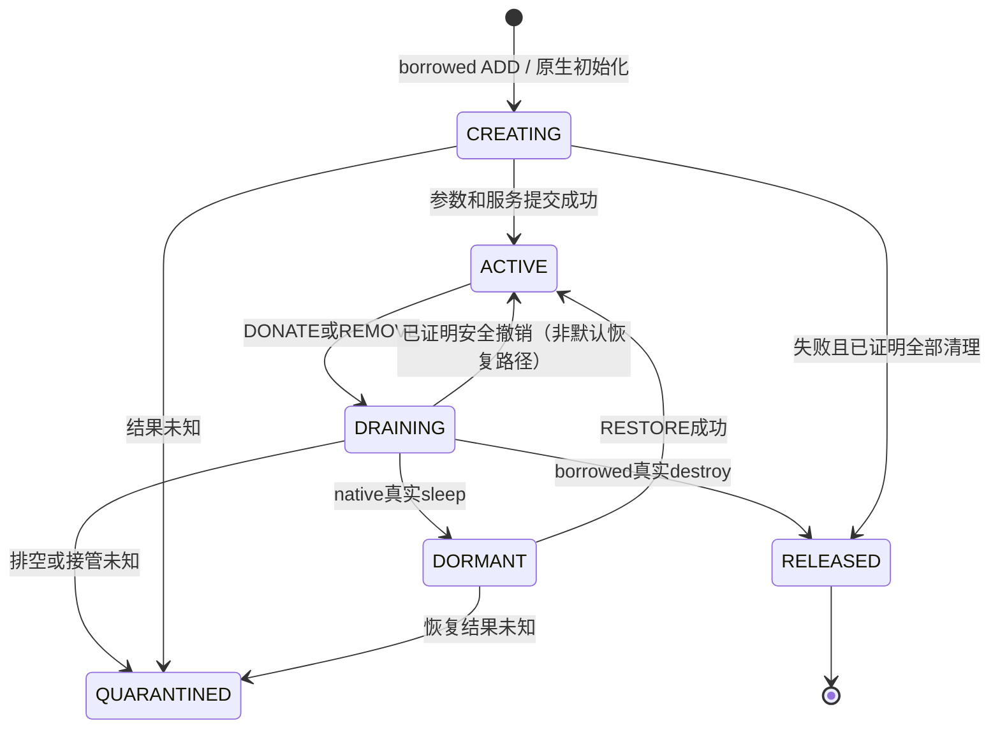
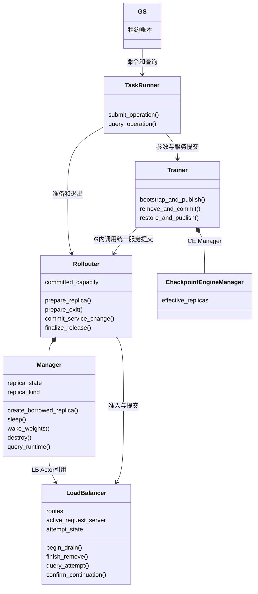
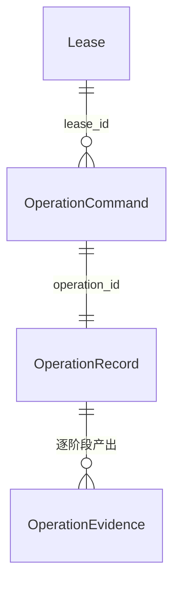
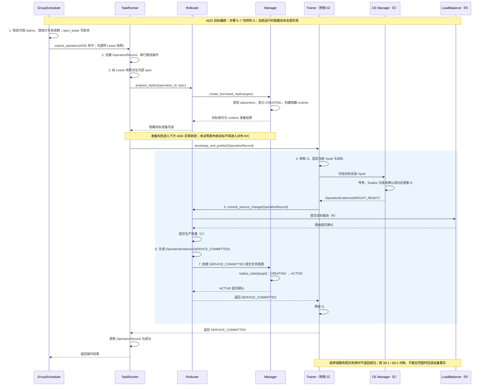
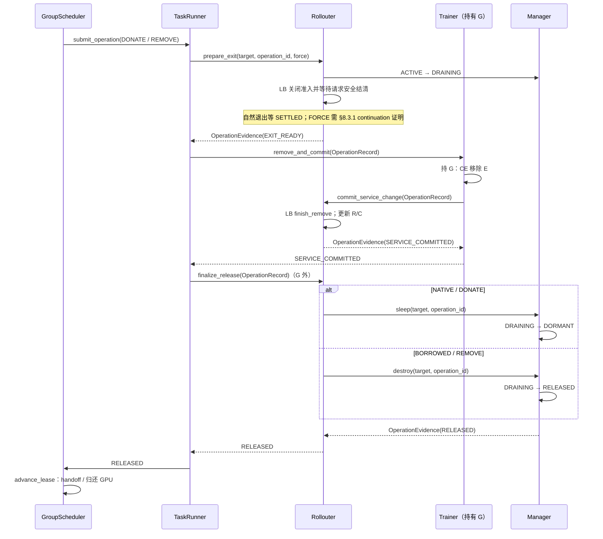
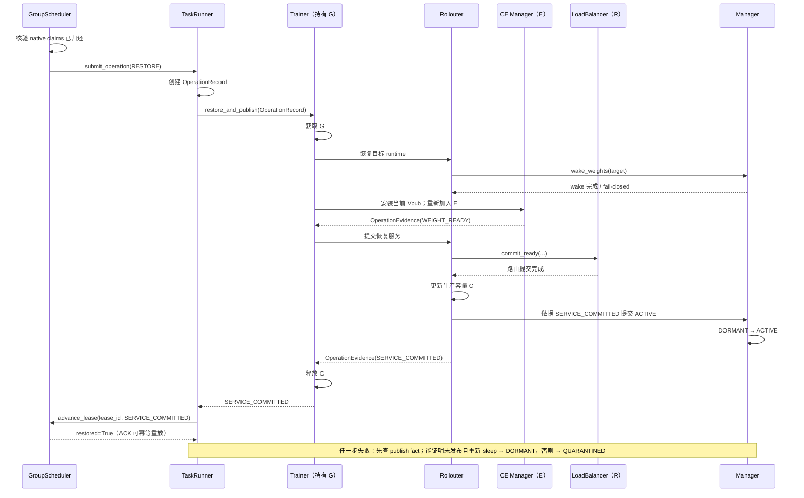
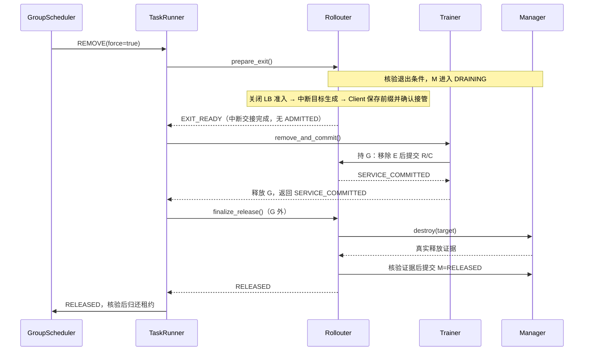
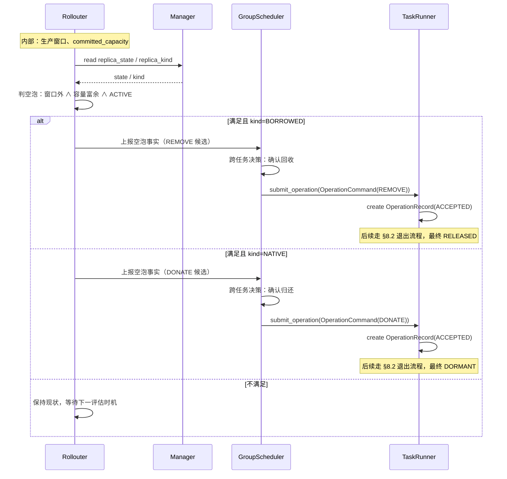
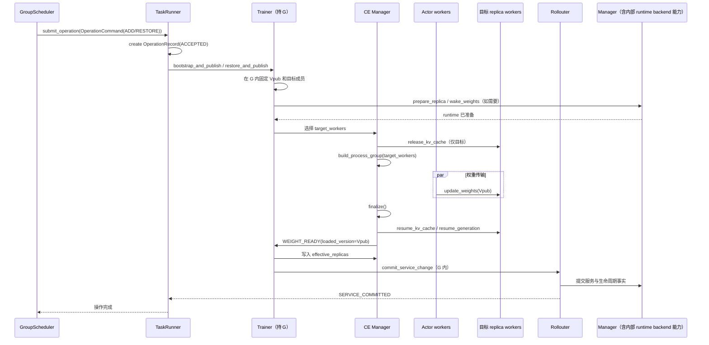
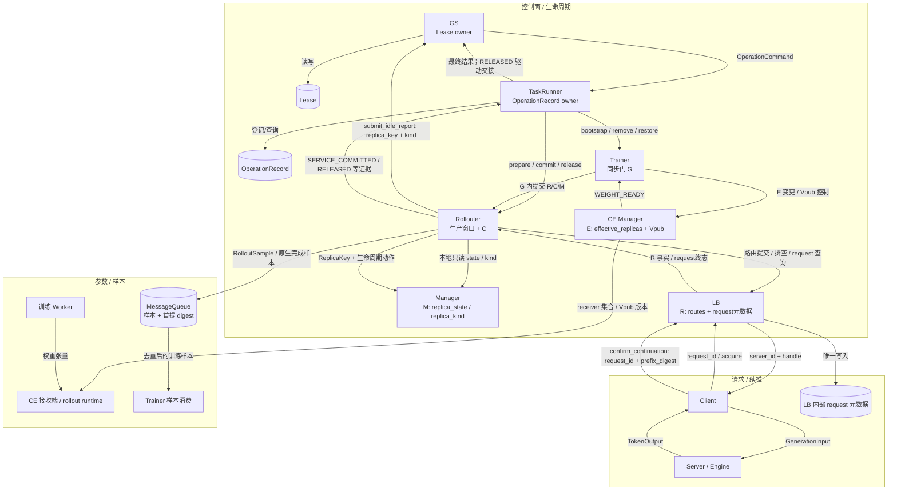

# 多 RL 任务资源共享调度对接 VERL：动态流程编排融合设计

> 文档状态：TO-BE、可评审的接口与流程合同；已按 `chatgpt/092203-simplified-fusion` 当前实现做最小收口，不新增公共接口或数据结构。本文未交付 GPU 实测结果。
>
> 需求：空泡感知与上报、ADD、DONATE、REMOVE（自然与强制）、RESTORE，强制回收是首版必需功能。
>
> 依据：本文是当前可评审的详细设计；《最新精简版》中的硬合同已合并回本文。**不得用于恢复旧接口、旧类型别名或旧 wire shape**。本文定义的类型、接口和证据链必须成套采用。

## 2. 首版范围与简化方法

> **本节一句话**：钉死首版边界——experimental Fully Async + 纯 STANDALONE + vLLM 非 PD、空泡感知、整卡借还、强制回收必需，其余明确不支持、不承诺。

| 项目 | 本版决定 |
|---|---|
| 执行模式 | experimental Fully Async、纯 STANDALONE、vLLM 非 PD |
| 首轮 GPU 验证 | 单节点、整卡、DP=1、PP=1、已验证 TP、完整稠密权重、NCCL |
| 借还粒度 | 首版按整个 replica 的 GPU 集合借还，不能拆散其中的并行 rank；claim/fractional 表达保留为扩展模型，不作为首版物理隔离能力承诺 |
| native | 保留原 runtime 和资源锚点，DONATE 后休眠，RESTORE 唤醒同一个 runtime |
| borrowed | 根据租约新建本任务 runtime，REMOVE 后销毁；复用 lease 授权的资源定位信息，不复用 donor 的 Worker、engine、ServerAdapter 或通信域 |
| 强制回收 | 首版必须支持；仅 borrowed；必须通过 §8.3.1 的续推链路能力门和逐 request 交接证明。当前分支 targeted abort/continuation 尚未完成真实验证，因此保持 fail-closed |
| 并发 | 每任务一场生命周期操作；与原生同步共用 Trainer 内 G。G 只保护提交临界区，不覆盖 Client 接管确认、runtime 释放等外部等待 |
| 对外命令 | ADD、DONATE、REMOVE、RESTORE；REMOVE 带 NATURAL/FORCE_VERIFIED |
| 简化 | 6 个公开生命周期状态；两种 REMOVE 共用退出/销毁；类型按职责分组；不新增通用工作流服务 |
| 暂不承诺 | 自动 HA、客户端崩溃恢复、任意多模态/后端、跨节点布局、固定时限无条件归还 |

支持范围之外明确拒绝。强制能力在首版支持组合上没验证通过，就不能宣布首版交付完成；不能用关闭 capability 代替实现。**纯 Python、mock、AST 或文档检查只能证明控制面合同，不能替代真实 CUDA/NCCL/VERL backend 的设备能力验收；尚未验证的设备原语必须显式失败。** 当前 `chatgpt/092203-simplified-fusion` 分支已落地控制面合同、租约/状态约束、自然退出、borrowed create/destroy、native level-2 sleep / weight wake 及 RESTORE target-bootstrap/service-commit wiring；**ADD 的 `bootstrap_and_publish()` 仍显式 fail-closed，FORCE targeted abort/continuation 仍未完成真实闭环验证**。已有设备路径也仍需真实 GPU/CUDA/NCCL/vLLM 验收，文档描述的是首版安全合同，不把“代码存在”写成“GPU 已验收”。

## 3. 组件总览：谁负责哪件事

补充（VERL 扩展边界）：
- 基于现有 VERL TaskRunner、Trainer、Rollouter、Manager 链路扩展，不新增抽象层。
- M/E/R/C 边界保持：M=生命周期，E=参数成员，R=请求路由，C=已提交容量。
- WorkerGroup、PlacementGroup、runtime handle、GPU/rank 属于实现细节，不进入公共状态模型。

本节只画核心职责与归属；类图见[第 4 章](#logical-class)，接口见第 7 章。框多不代表要新增同样多的 Actor：TaskRunner、Trainer、Rollouter 是任务执行边界；Manager、CE Manager 和 Coordinator 是对应进程内的普通对象。

```text
GS：分配 GPU 使用权、维护租约
└─ TaskRunner：接命令、串流程、记录操作
   ├─ Trainer：唯一同步门 G、当前已发布权重 Vpub
   │  └─ CE Manager：参数接收成员 E、参数传输
   └─ Rollouter：生产窗口、已提交容量 C
      └─ Manager：实例生命周期 M、运行时句柄
         ├─ runtime internal state：本任务的 Worker/Server/资源句柄
         ├─ runtime backend：Manager 内部创建、休眠、唤醒、销毁能力
         └─ LB：路由 R、准入与在途请求（Actor 引用）
```

树表示职责归属，不表示所有节点都是独立进程或唯一调用路径。Client、Server 的强制回收见 §8.3.1，完成样本幂等提交见 §9.1，整体数据流见第 10 章。

### 3.1 统一名称与实现位置

全文按下表使用组件名称。已有实现类可以保留原名称，避免再引入一套语义相同的新类。

| 本文名称 | 对应实现位置或扩展对象 | 唯一主要职责 |
|---|---|---|
| GS | 现有 GroupScheduler / GlobalScheduler 角色 | 决定跨任务使用权，不操作任务内部 Worker/Server |
| TaskRunner（TR） | MultiTaskFullyAsyncTaskRunner | 接受和查询操作，调用 Trainer、Rollouter |
| Trainer | MultiTaskFullyAsyncTrainer | 持唯一 G，协调参数与服务变更的关键提交段 |
| Rollouter（RO） | MultiTaskFullyAsyncRollouter | 提供生产事实，承载准备/排空/容量提交入口 |
| Manager | MultiTaskLLMServerManager | 持有生命周期元数据与运行时句柄，执行实例管理 |
| CE Manager（接口前缀 CE） | MultiTaskCheckpointEngineManager | 唯一写入 E，管理实际参数快照与接收者 |
| LB | MultiTaskGlobalRequestLoadBalancer | 唯一写入路由和逐 request 状态 |

当前分支直接由 TaskRunner 内部方法承载操作协调，不再引入独立 `OperationCoordinator` 公共对象；整场操作只有一套日志和流程入口。

**Replica 与生命周期数据的关系：** 原生 replica 对象及必要扩展负责适配原生调用；Manager 内部按 `ReplicaKey` 维护 `replica_state` / `replica_kind` 两份最小生命周期元数据，作为 M 的唯一写入点；runtime internal state 只保存实际 runtime 句柄与 native 资源锚点。CE 只持参数侧投影，各视图按完整 `ReplicaKey` 对齐。

只有需要增加行为时才扩展原生 Worker/Server 类；不因为类图出现一个组件，就强制新增对应子类。

<a id="logical-views"></a>

### 3.2 四份状态：四个数据职责，不是四个服务

| 状态 | 唯一写入者 | 回答的问题 | 数据结构 |
|---|---|---|---|
| M 生命周期 | Manager | 拥有哪些实例、处于什么阶段 | 内部 `replica_state` / `replica_kind` |
| E 参数成员 | CE Manager | 下次给谁同步参数 | [OperationEvidence](#ds-OperationEvidence) + CE 内部 effective_replicas |
| R 请求路由 | LB | 哪些 replica 可接新请求、在途请求是否结清 | LB 内部 routes / `active_request_server` / `attempt_state` |
| C 已提交容量 | Rollouter | 已成功接入的实例提供多少生产容量 | Rollouter 内部状态 |

M/E/R/C 是既有组件的数据职责，不是新增控制服务。C 按成功提交的 active_ids 计算，不能拿 Manager 拥有的所有 runtime 直接计数；休眠和准备中的实例不提供服务容量。生产窗口另由 Rollouter 保存。

必须保留的四条约束：

1. LB 开放新请求前，目标已安装当前 Vpub、已加入 E，且身份与租约有效。
2. 原生同步持 G 期间，本轮 E 不变；接入、移除和同步进入同一个 Trainer 提交入口。
3. sleep/destroy 前，目标准入已关闭、旧请求已结清、E 已移除，相关传输已结束。
4. GS 收到与本次操作和租约相符的真实释放证据后，才授权下一使用者。

其中 **M 的具体状态值**由 Manager 内部 `replica_state[ReplicaKey]: ReplicaState` 承载，`replica_kind[ReplicaKey]` 标记 NATIVE/BORROWED；枚举定义见第 5 章。下面的 6 个状态只回答“某一个 replica 现在处于生命周期哪一步”，不描述 E/R/C，也不描述整个任务。

### 3.3 单个 Replica 的 6 个生命周期状态

> **本节一句话**：这 6 个状态只属于单个 Replica/runtime 的生命周期门牌，由 Manager 内部 `replica_state` 唯一维护；它们不是任务状态，也不是整个调度系统状态。枚举的权威定义见第 5 章 `ReplicaState`，本节只给状态机概览。

| 状态 | 人话 | 进入依据 |
|---|---|---|
| CREATING | 临时 runtime 正在创建或接入 | 有效 ADD 已受理；创建/追参/提交进行中 |
| ACTIVE | 接入完成，可处理请求 | CE、路由、容量、Manager 证据完整 |
| DRAINING | 关新订单入口，旧订单结束或转移 | 已启动退出排空，保留所有旧 requests |
| DORMANT | 原 native runtime 已确认休眠 | native 真实 sleep 证明完整，保留恢复能力 |
| RELEASED | 资源已释放 | borrowed 真实 destroy 证明完整，保留终态生命周期值 |
| QUARANTINED | 安全情况不明，先隔离 | 对账预算内不能确认准入/设备/提交结果 |



隔离可以发生在任何无法证明安全的阶段，图只画主要入口；不能直接 set_state(ACTIVE) 解封。初始 native 由原生初始化和首次发布成功建立 ACTIVE 记录。

**RESTORE 的失败落点：回 DORMANT**

RESTORE 是「runtime 唤醒 + 参数同步」的多步流程，中间任何一步都可能失败——`wake_weights` 只醒一半、追参装不上、KV 校验不过、提交丢回执。失败后原 runtime 停在半醒状态，必须给一个确定落点：

| 候选落点 | 为什么不行 / 行 |
|---|---|
| 回 ACTIVE | 没恢复成功，不能接单 |
| 停在半醒中间态 | 不能长期挂 |
| RELEASED | native 永不销毁 |
| **回 DORMANT** | 重新睡回去，回到唤醒前那个干净、可再次 RESTORE 的状态 |

关键在「**已证明**」三个字：必须真实地重新 sleep 并拿到证据，才允许回 DORMANT；证明不了就走 `DORMANT → QUARANTINED`。§9.2 异常表写死：「native 部分唤醒失败 → 不销毁原 native；证明重新 sleep 才回 DORMANT，否则隔离」。这跟「先查事实、不猜结果」「证据链而非布尔」一致：回 DORMANT 靠的是真实的重新休眠证据，不是一条 `set_state(DORMANT)` 的状态翻转。

**state 变更与 OperationEvidence 的对应关系**

`state` 有 6 个取值，`EvidenceType` 只有 4 种，二者不是一一对应。证据只正向背书「证明完成」的 3 个落点（ACTIVE / DORMANT / RELEASED）；另外 3 个 state 由操作受理状态和证据缺失覆盖：

| state | 进入依据 | 由什么驱动 | 需正向 OperationEvidence |
|---|---|---|---|
| CREATING | 有效 ADD 已受理 | `OperationRecord.status` = ACCEPTED/RUNNING | 否（进行态） |
| DRAINING | 已启动退出排空 | `OperationRecord.status` = RUNNING | 否（进行态） |
| ACTIVE | CE/路由/容量/Manager 证据完整 | `SERVICE_COMMITTED`（`WEIGHT_READY` 为前置） | 是 |
| DORMANT | native 真实 sleep 证明完整 | `RELEASED`（native） | 是 |
| RELEASED | borrowed 真实 destroy 证明完整 | `RELEASED`（borrowed） | 是 |
| QUARANTINED | 不能确认准入/设备/提交结果 | 证据缺失：`OperationStatus`=UNKNOWN；若副作用未收敛则不得写 FAILED | 否（负向落点） |

4 种证据的真实角色：

| EvidenceType | 角色 |
|---|---|
| `WEIGHT_READY` | 前置门，不落 state（作为 SERVICE_COMMITTED→ACTIVE 的前提） |
| `EXIT_READY` | 前置门，不落 state（解锁 DRAINING→DORMANT/RELEASED 的资格） |
| `SERVICE_COMMITTED` | 落 ACTIVE |
| `RELEASED` | 落 DORMANT（native）/ RELEASED（borrowed），按 `kind` 区分 |

一句话：进行态靠 `OperationRecord` 状态推进，完成态靠 `OperationEvidence` 正向背书，无法证明靠 QUARANTINED 隔离。这正是「证据链而非布尔」——布尔视角会想给每个 state 配一种证据，真实设计是「完成才需证明、未完成靠工单状态、无法证明靠隔离」。

### 3.4 节点执行与首版取舍

节点执行能力收敛在 Manager 内部，不新增独立 `RuntimeBackend` 服务或公共协议。Manager 以 `ReplicaKey` 维护 runtime 句柄和 borrowed 创建清单，负责放置核验、幂等创建/清理以及 sleep/wake/destroy 的真实设备动作；这些实现明细不进入公共状态模型。

首版 borrowed 必须复用 Lease 给出的 PG/bundle、node_id、gpu_uuid 等定位事实，并在启动前核验真实 Ray placement；`CUDA_VISIBLE_DEVICES` 不能替代使用权和实际放置核验。native DONATE 后保留原 runtime 锚点，borrowed REMOVE 后销毁本任务 runtime。未验证的 GPU/进程原语显式失败并隔离，不用合成证据代替真实执行。

<a id="logical-class"></a>

## 4. 类图与组件映射

补充（VERL 类映射）：

|设计组件|VERL 映射|扩展点|
|-|-|-|
|TaskRunner|`MultiTaskFullyAsyncTaskRunner`|生命周期入口|
|Trainer|`MultiTaskFullyAsyncTrainer`|参数同步和服务提交|
|Rollouter|`MultiTaskFullyAsyncRollouter`|replica 准备、退出、容量控制|
|Manager|`MultiTaskLLMServerManager`|replica/runtime 生命周期|

说明：以上为现有类扩展点，不新增抽象层。MultiTask* 类均以 verl 既有类为基类——`MultiTaskFullyAsyncTaskRunner → FullyAsyncTaskRunner`、`MultiTaskFullyAsyncTrainer → FullyAsyncTrainer`、`MultiTaskFullyAsyncRollouter → FullyAsyncRollouter`、`MultiTaskLLMServerManager → FullyAsyncLLMServerManager`、`MultiTaskCheckpointEngineManager → CheckpointEngineManager`、`MultiTaskGlobalRequestLoadBalancer → GlobalRequestLoadBalancer`（源码位于 `verl-multi-task/src/multi_task_scheduler/`）。FORCE REMOVE 的 request handoff 属于 LB 内部退出逻辑；完成样本幂等提交属于 Queue 内部一致性机制，不新增公共接口。
 核心类图与调用边界

主图只保留实际协作组件。G 和操作日志表现为所属组件的内部状态；工厂、绑定器和排空策略不再单独画成首版必需类。组合箭头表示本地持有，普通箭头表示调用或远程引用。为保证图在文档中可读，主图只保留字段名和方法名，不展开字段类型、参数和返回类型；完整类型合同以第 5 章和第 7 章为准。



图中 CheckpointEngineManager 和 LoadBalancer 分别是 CE Manager、LB 的类名；runtime backend 能力作为 Manager 内部实现，不单独建公共组件。主图只画生命周期主干，方法名与第 7 章接口一一对应，并刻意省略成员类型、方法参数和返回类型；M/E/R/C 字段含义见 4.1，完整数据类型见第 5 章，完整接口签名见第 7 章。

### 4.1 类图字段说明：用 M/E/R/C 理解

类图里的长期字段不需要逐个孤立记忆。可以先把它们分成四份业务真值 M/E/R/C；这份划分与第 5 章 5.7 M/E/R/C 映射一致。

| 视图 | 类图字段 | 唯一主要写入者 | 回答的问题 | 什么时候读取 |
|---|---|---|---|---|
| **M：生命周期真值** | `replica_state` + `replica_kind`（内部） | Manager | 有哪些 replica、当前处于哪个生命周期阶段、来源是 NATIVE/BORROWED？ | ADD/REMOVE/RESTORE、失败补偿和空泡判断时读取。 |
| **E：参数成员真值** | `CheckpointEngineManager.effective_replicas` + `OperationEvidence` | CE Manager | 下一轮正常参数同步应该发送给哪些 replica？每个成员当前实际装了哪个版本？ | 正常同步、ADD/RESTORE 加成员、REMOVE/DONATE 删成员时读取。 |
| **R：路由与请求真值** | `LoadBalancer.routes` + `active_request_server` + `attempt_state`（内部） | LB | 哪些 replica 可以接新请求？当前 request 在哪台 server、是否已安全终结/结清？ | acquire/release、排空、强制接管和服务提交/退出时读取。 |
| **C：已提交容量真值** | `Rollouter.committed_capacity`（内部状态） | Rollouter | 已成功完成服务提交的 ACTIVE Replicas 到底提供多少生产容量？ | 调度容量上下限检查、ADD/REMOVE/RESTORE 提交和 GS probe 时读取。 |

生产窗口（Rollouter 内部）、同步门 G（Trainer 内部）与已发布快照 Vpub（CE 内部）属于支撑上述四份真值的内部状态，不单独成为第 5 章的公共数据结构，具体由第 7 章接口承载。

类图不把操作过程账本和 runtime 句柄画成长期字段：`OperationRecord` 是第 5 章公共结构；runtime 句柄由 Manager 内部桥接，不进入公共数据协议。

因此可以用一句话记：**M 管生命周期，E 管参数成员，R 管接单和旧单，C 管已提交容量。**

### 4.2 类图接口说明

主图只列当前分支已经存在的控制入口；内部参数可用普通 `dict` 传递，不再为 placement、idle report 或 runtime receipt 新建 DTO。

| 组件 | 现有入口 | 设计含义 |
|---|---|---|
| TaskRunner | `submit_operation(command, *, lease=None)` / `query_operation(operation_id)` | GS 的任务内统一入口；ADD 时 GS 解析 `lease_id` 后把不可变 `Lease` 快照作为内部关键字参数传入，外部 `OperationCommand` wire shape 不变。 |
| Trainer | `bootstrap_and_publish` / `remove_and_commit` / `restore_and_publish` | 共用唯一同步门 G；当前分支 REMOVE 与 RESTORE wiring 已落地，ADD target bootstrap 仍 fail-closed。 |
| Rollouter | `submit_idle_report` / `prepare_replica` / `prepare_exit` / `commit_service_change` / `finalize_release` | 空泡上报、准备 borrowed、排空、提交 R/C、协调释放；内部 `spec` 不升级为新协议类型。目标查询属于内部辅助方法。 |
| Manager | `create_borrowed_replica` / `sleep` / `wake_weights` / `destroy` / `query_runtime` | 唯一写 M，并承载 runtime backend 能力；真实 GPU 动作未验证时显式失败。 |
| LoadBalancer | `begin_drain` / `finish_remove` / `query_attempt` / `confirm_continuation` / `commit_ready` / `query_ready_operation` | 唯一写 R；同时保存退出与服务发布的幂等事实。 |

当前分支不增加第二套协调入口：TaskRunner 串整场操作，Trainer 只包住 G 内提交段，Rollouter/Manager/LB/CE 只修改各自真值。

### 4.3 一场操作只由一个入口串联

| 层次 | 负责 | 不重复负责 |
|---|---|---|
| TaskRunner 的操作流程 | 顺序、预算、日志、查询和补偿协调 | 不保存可独立修改的 CE/LB 真值 |
| Trainer 的三个协调方法 | 持 G 追参、变更 E、调用 RO 提交服务 | 不把长时间排空、接管或物理清理包进 G |
| Rollouter / Manager | 准备运行时、排空、核验提交材料、更新 C/M、物理释放 | 不独立发起另一场 bootstrap/CE/LB 完整事务 |
| Manager runtime backend | 校验设备并执行 create/sleep/wake/destroy | 不自行开放路由、修改 E 或转租 GPU |
| LB / CE Manager | 各自原子更新和查询本地事实 | 不替其他组件推断成功 |

例如 ADD：TaskRunner 调 RO 隐藏创建 → 调 Trainer 获取 G 并追参、加入 E → Trainer 仍持 G 调 RO 提交 LB/C/M → 返回服务证据。

每任务同时只允许一场未完成的生命周期操作：TaskRunner 串行推进，同 `operation_id` 的合法重放不产生第二次副作用，不同 `operation_id` 须等当前工单进入终态后再受理。原生同步与关键提交段共用 Trainer 的 G，RO/LB 的短锁不包住远程长等待，查询不等待 G。G 不覆盖 Client continuation、runtime release 等等待阶段。

合并的是对象层次与入口，不是安全条件：强制分支仍需 Client 接管证明；放置校验仍先于启动；G 仍覆盖参数与成员/接流提交；sleep/destroy 仍需 Manager runtime backend 内部逐卡核验，`OperationEvidence(RELEASED)` 仍需显式给出完整 `released_gpu_uuids`。

## 5. 数据结构

> 本节定义插件侧公共数据模型。
> 
> TaskRunner 负责任务内操作编排，GroupScheduler 负责跨任务使用权决策与命令下发；生命周期 M 由 Manager 内部 `replica_state` / `replica_kind` 承载，不再单独定义公共生命周期 DTO。
> 数据结构只承载跨组件传递、幂等查询、生命周期事实和安全证明；实现内部状态不升级为公共协议。

### 5.1 枚举汇总

本小节统一说明数据结构中使用的类型和枚举值，避免接口和流程中出现无法解释的状态名称。

#### ReplicaKind

表示 replica 来源类型。

|枚举值|说明|
|-|-|
|NATIVE|任务自身创建并负责生命周期管理的 replica|
|BORROWED|从共享资源池借入，需要按共享调度流程释放的 replica|

#### ReplicaState

表示 replica 生命周期状态。

|枚举值|说明|
|-|-|
|CREATING|正在创建|
|ACTIVE|已完成服务接入，可处理请求|
|DORMANT|已休眠但保留恢复能力|
|DRAINING|停止接收新请求，等待已有请求结束|
|RELEASED|资源已释放|
|QUARANTINED|状态无法确认，需要隔离|

#### AttemptState

表示单个在途请求（attempt）在 R 视图中的阶段，由 LB 唯一维护。

|枚举值|说明|
|-|-|
|ADMITTED|已准入并在目标 replica 上运行|
|TERMINATED|旧 attempt 已被确认终止：续推前缀已由 Client 捕获并通过 `confirm_continuation()`；这是退出过渡态，不是最终结清态|
|SETTLED|LB 已登记旧 server 不再拥有该 request；自然完成可直接进入，`TERMINATED` 则由 `finish_remove()` 转入；这是最终结清态|

#### OperationKind

表示生命周期操作类型。

|枚举值|说明|
|-|-|
|ADD|创建并接入 replica|
|DONATE|主动释放共享资源|
|REMOVE|退出 replica|
|RESTORE|恢复休眠 replica|

#### OperationStatus

表示整场生命周期操作（OperationRecord）的推进结果，由 TaskRunner 唯一维护。

|枚举值|说明|
|-|-|
|ACCEPTED|已受理，尚未产生副作用|
|RUNNING|推进中|
|SUCCEEDED|全部阶段成功完成|
|FAILED|明确失败，且相关副作用已经对账到已知安全落点；仍有关键副作用未知时不得写 FAILED|
|UNKNOWN|至少一个关键副作用结果无法确认，需继续对账/隔离；不等同于成功或失败|

#### EvidenceType

表示操作证明类型。

|枚举值|说明|
|-|-|
|WEIGHT_READY|参数同步完成|
|EXIT_READY|满足退出条件|
|SERVICE_COMMITTED|服务状态提交完成|
|RELEASED|资源释放完成|

### 5.2 Manager 内部生命周期元数据（M）

Manager 不再定义公共 `ReplicaRecord`，只按 `ReplicaKey` 内部维护：

```python
replica_state: dict[ReplicaKey, ReplicaState]
replica_kind: dict[ReplicaKey, ReplicaKind]
```

`state` 表示六态生命周期，`kind` 区分 NATIVE/BORROWED；`kind` 建立后不变，两个映射仅由 Manager 在同一生命周期临界区维护，其余组件只读。placement、runtime handle、GPU/rank 等继续由 VERL runtime 与 Manager 内部实现维护，不进入 M，也不新增公共 query 接口。

---

### 5.3 LB 内部 request 元数据（R）

不再定义公共 `AttemptRecord`。复用 VERL 的 `request_id`、路由和 inflight 计数，LB 只补两份内部映射：

```python
active_request_server: dict[str, str]   # request_id -> server_id
attempt_state: dict[str, AttemptState]  # request_id -> ADMITTED / TERMINATED / SETTLED
```

`active_request_server` 表示当前实际执行归属，不能用 sticky `_request_id_to_server` 代替；`attempt_state` 只补 FORCE REMOVE 所需的逐 request 安全终态。扩展 LB 通过原生 `require_release_fields()` 请求 `request_id`，使 `release_server()` 能把自然完成推进到 `SETTLED`；续推确认把对应 request 推进到 `TERMINATED`。`ADMITTED` 是唯一阻塞自然排空的状态：目标 server 上没有 `ADMITTED` request，才可生成 `EXIT_READY`。`TERMINATED` 仍需在 `finish_remove()` 中转为 `SETTLED`，之后才算从退出在途集合中最终结清。`SETTLED` 至少保留到当前退出操作结束或有界 GC 后，支持 ACK 丢失重查。首版约束同一 `request_id` 同时最多一个未结清 generation 调用。

---

### 5.4 OperationCommand

```python
OperationCommand:
    operation_id: str
    kind: OperationKind
    target: ReplicaKey
    lease_id: str
    force: bool | None
```

职责：

表示一次生命周期操作输入。

支持：

- ADD
- DONATE
- REMOVE
- RESTORE

字段说明：

|字段|说明|
|-|-|
|operation_id|整场操作幂等 ID|
|kind|操作类型|
|target|目标 replica|
|lease_id|关联租约，指向 §5.8 Lease（出借方/借入方、放置、到期都在租约里）|
|force|是否要求强制路径|

「授权」即租约本身（§5.8 Lease），「placement」由 verl 原生 PG 承载、以 spec/claim 描述（见 `verl能力扩展最新版.md` §1.2/§3.0），均不另立结构——命令只以 `lease_id` 绑定租约，出借方/借入方、放置、到期都从租约读。

---

### 5.5 OperationRecord

```python
OperationRecord:
    operation_id: str
    status: OperationStatus
    result: str | None
```

职责：

保存整场操作账本。

用于：

- 查询；
- 重试；
- 恢复；
- 幂等判断。

---

### 5.6 OperationEvidence

```python
OperationEvidence:
    operation_id: str
    type: EvidenceType
    timestamp: int
    released_gpu_uuids: tuple[str, ...] = ()
```

职责：

表示跨组件安全证明。

类型：

|类型|说明|
|-|-|
|WEIGHT_READY|参数已经可用|
|EXIT_READY|服务退出条件满足|
|SERVICE_COMMITTED|服务提交完成|
|RELEASED|资源释放完成|

Evidence 是安全边界，不代表新的业务状态机。`released_gpu_uuids` 仅允许出现在 `RELEASED`，且必须非空；GS 只接受其集合与本次 Lease 的 `gpu_uuids` 完全一致的释放证明。`advance_lease()` 还必须结合 `OperationKind` 解释证据：DONATE/REMOVE 的 `RELEASED` 用于正常 handoff/归还，RESTORE 的 `SERVICE_COMMITTED` 用于完成恢复并解除临时 claims 预留；ADD/RESTORE 异常补偿若已真实证明 leased GPUs 上无 borrower/唤醒占用，可复用 `RELEASED` **仅释放本次失败操作造成的 Lease 预留**，不得冒充正常成功。该补偿分支复用现有接口和 Evidence，不新增 DTO。

---

### 5.7 M/E/R/C 映射

|视图|数据结构|负责人|回答问题|
|-|-|-|-|
|M 生命周期|内部 `replica_state` + `replica_kind`|Manager|实例当前生命周期与来源|
|E 参数成员|`OperationEvidence` + `effective_replicas`|CE Manager|参数是否可同步|
|R 请求路由|内部 `routes` + `active_request_server` + `attempt_state`|LB|请求是否可进入/结束|
|C 容量|`committed_capacity`（内部状态）|Rollouter|当前有效生产容量|

补充：
- GroupScheduler 负责跨任务协调上述组件，不直接成为 M/E/R/C owner。
- 不新增通用 GroupSchedulerRecord / GroupState；GS 的账本只有一条最小「租约 Lease」（§5.8），逐 rank 的 claim/spec 结构见 `verl能力扩展最新版.md` §1.2/§3.0。

VERL 负责：

- ResourcePool；
- WorkerGroup；
- PlacementGroup；
- Runtime 生命周期。

插件不重复定义。

### 5.8 租约 Lease（GS 账本：哪张卡、借给谁、什么时候还）

§4 类图里 GS 的「租约账本」，其条目就是「租约 Lease」——GS 跨任务调度决策的落点，回答三个问题：**哪张卡、借给谁、什么时候还**。它与 `verl能力扩展最新版.md` 的 `lease_id / claim_id / replica_rank` 模型（§3.0）及 spec 字典（§1.2）对应。

```python
Lease:
    lease_id: str      # 借给谁：borrower 主租约；回收 / 幂等重试主键
    claims: tuple[Mapping, ...]  # 哪几张卡：逐笔 claim（pg_id/bundle_index + node_id/gpu_uuid + 配额）
    expires_at: float  # 什么时候还：租约到期（0 = 不限期；真正归还以释放证据为准）
```

三问落点：

| 问题 | 载体 | 说明 |
|-|-|-|
| 哪张卡 | `claims`（唯一资源真相：`pg_id`/`bundle_index` 调度键 + `node_id`/`gpu_uuid` 校验键 + `gpu_fraction`/`cpu_request` 配额） | 真正 PG/bundle 由 verl 原生 ResourcePool/PlacementGroup 维护（§5.7「VERL 负责」） |
| 借给谁 | `lease_id`（borrower 主租约） | donor 保留 PG 所有权；source lease / donor 记在每笔 claim 内部（verl能力扩展最新版 §3.0） |
| 什么时候还 | `expires_at`（有效期）+ 释放确认（归还状态） | 到期只触发回收；真正交接以真实释放证据为准——lease 到期 ≠ claims 已释放 |

说明：

- **source lease 归入 claim，不在顶层重复**：borrower 主租约是 `lease_id`（`reclaim_replica(lease_id)` 的回收主键，覆盖全部 claims）；每笔 claim 的 source lease、donor 记在 claim 内部（`verl能力扩展最新版.md` §3.0）。`world_size`（== len(claims)）、`placement_epoch`（fence 版本）是校验值/版本值，本文档幂等靠 `operation_id`、归还靠释放证据，不单独建模。
- **最小建模，不重复定义 PG/bundle**：`claims` 只记录调度键 + 校验键；首版固定 `max_colocate_count=2`，claim 的 `gpu_fraction=0.5` 只是 Ray accounting share，不表示允许半张物理 GPU 出借。ResourcePool/WorkerGroup/PlacementGroup 仍由 verl 原生维护。
- **归还证据驱动，不猜结果**：`expires_at` 只触发回收、不直接交接卡；归还以「与本次操作和租约相符的真实释放证据」为准（§3.2 约束 4，与 §9.2「先查事实，不猜结果」一致）。

Lease 在流程中的位置见 §7.1：GS 有 4 个对外控制接口，以及 `open_lease()` / `advance_lease()` 两个内部账本函数。claims 描述授权的资源定位与配额；Manager 的生命周期 M 不重复维护 placement/runtime 明细：

```text
submit_idle_report(§8.4) → GS 读 Lease 账本（谁有可捐 claims、谁缺卡、expires_at 未到）→ 内部 open_lease 建租约
→ submit_operation(lease_id) 下发 → DONATE/REMOVE 以 RELEASED 推进 handoff/归还；RESTORE 以 SERVICE_COMMITTED 完成临时预留；失败补偿按 §9.2 释放冻结预留
```

一句话：**决策时读 Lease、建租约时写 Lease、收到真实释放证据时推进 Lease**——后两步都是 GS 内部账本动作，不对任务侧暴露；TaskRunner/Trainer/Rollouter/Manager 只经 `lease_id` 引用它。

## 6. 数据关系图

四个公共数据结构为 OperationCommand、OperationRecord、OperationEvidence、Lease；M 与 R 的细粒度状态分别收敛为 Manager / LB 内部元数据。`ReplicaKey` 作为共享身份，不单独建表。



`OperationCommand.target` 使用 `ReplicaKey`；请求侧由 Manager/runtime 将目标 replica 对齐到 server_id，LB 再用内部 `active_request_server` 关联当前 request。生命周期 state/kind 直接从 Manager 内部 M 读取。VERL 原生 ResourcePool、WorkerGroup、PlacementGroup 仍由 runtime 内部维护。

## 7. 接口文档：统一约定

> 本章只记录当前分支中跨组件实际使用的控制入口，不为文档新增公共 SPI、DTO 或状态对象。外部 wire 仍是 `OperationCommand / OperationRecord / OperationEvidence / Lease`；placement、idle report、runtime receipt 继续作为 owner 内部字典/状态。
>
> 每个接口统一说明：**谁调用、做什么、返回什么、何时使用**。Manager/LB/CE 的对象内部 helper 不逐一列出。

---

### 7.1 GroupScheduler

#### 对外控制接口

| 接口 | 调用方 | 作用 | 返回值 | 使用时机 |
|---|---|---|---|---|
| `attach_task(task_id, task_runner)` | TaskRunner | 把 `task_id` 与可接收生命周期命令的 TaskRunner Actor 绑定到 GS；首版 `task_id == task_session`。 | `None` | TaskRunner 完成组件初始化后、开放控制面之前调用。只有已 attach 的任务才能上报空泡并接收操作。 |
| `detach_task(task_id)` | TaskRunner | 从 GS 删除 TaskRunner 登记，防止任务退出后继续被调度。 | `None` | TaskRunner `run()` 退出的 `finally` 中调用；detach 后该 `task_session` 的 idle report / operation 不再被接受。 |
| `submit_idle_report(report)` | Rollouter | 接收本任务当前可捐出的 idle replica 候选，并写入 GS 的最新空泡报告。 | `dict`，当前为 `{"accepted": True, "candidate_count": N}` | Rollouter 判定生产窗口关闭且存在可捐 surplus replica 时调用。 |
| `submit_operation(command)` | GS 调度策略/上层调度逻辑 | 校验 `lease_id`、donor/borrower target、handoff 条件和幂等身份，然后把命令转发给目标 TaskRunner。 | `OperationRecord`；是 TaskRunner 当前工单快照，不代表整场操作已经完成。 | 下发 ADD、DONATE、REMOVE、RESTORE 时调用；后续结果用 §7.2 `query_operation()` 查询。 |

`attach_task()` / `detach_task()` 属于**任务进程生命周期**，不是 ADD/DONATE/REMOVE/RESTORE 的一个步骤，因此不重复画进每个操作时序图。当前实现中，TaskRunner 在 `_initialize_components()` 完成后执行 `attach_task(task_session, self_actor)`，在 `run()` 退出时执行 `detach_task(task_session)`。

**异常安全顺序（设计合同）**：GS 必须在调用远端 `TaskRunner.submit_operation()` **之前**，先把 `operation_id → OperationCommand` 意图和本操作需要的 Lease fence 写入自己的现有账本；ADD 先固定 `borrower_target`，RESTORE 先临时预留对应 bundle/GPU。这样 RPC ACK 丢失时仍能用同一 `operation_id` 重放/查询，不能出现“TaskRunner 已执行但 GS 因本地无记录而重新授权 claims”。当前 `chatgpt/0928-merge-verl-expansion` 分支已将 `operation_commands`、ADD 的 `borrower_targets` 和 RESTORE 的 `active_*_owner` 预留放在远端 RPC 之前；ACK 丢失时保留这些事实以供原 `operation_id` 对账。

**实现结构说明（GS 内部字段，不升级公共协议）**：`task_runners / idle_reports` 维护注册与空泡报告；`leases / claim_id_owner / active_bundle_owner / active_gpu_owner` 是同一 Lease 使用权账本及排他索引；`operation_commands / borrower_targets / release_evidence / release_history / handoff_ready_leases` 用于下发意图、交接阶段和失败补偿对账。后两项存在推导/缓存关系，但删除前需要证明 ACK 丢失、ADD 回滚、RESTORE 终结和幂等重放保持正确，目前不做无测试依据的字段合并。M/E/R/C 的唯一 Owner 仍分别是 Manager/CE Manager/LB/Rollouter。

#### GS 内部账本函数

这两个函数不是任务侧公共接口，但它们直接决定 Lease 的建立和交接，因此在设计中明确列出：

| 内部函数 | 调用方 | 作用 | 返回值 | 使用时机 |
|---|---|---|---|---|
| `open_lease(lease)` | GS 内部调度策略 | 幂等写入 Lease，并登记 donor GPU claims、PG bundle、GPU UUID 的当前所有权；冲突租约直接拒绝。 | `Lease`；首次写入返回该 Lease，合法重放返回已有同值 Lease。 | GS 根据 idle report 和 borrower 需求确定 donor replica、对应 GPU claims 及 borrower task 后，先建立 Lease；后续 DONATE 和 ADD 复用同一 `lease_id`，ADD 不重复 `open_lease()`。 |
| `advance_lease(lease_id, evidence)` | TaskRunner / 异常对账路径 | 按 `OperationKind + EvidenceType` 幂等推进 Lease：DONATE/REMOVE+`RELEASED` 做正常 handoff/归还；RESTORE+`SERVICE_COMMITTED` 完成恢复并解除临时预留；ADD/RESTORE+`RELEASED` 仅用于已证明安全的失败补偿，释放冻结 claims，不记为业务成功。 | `dict` ACK；正常释放返回 `released=True`，RESTORE 成功返回 `restored=True`；补偿分支沿用 dict ACK，不新增公共 DTO。 | 正常退出、RESTORE 成功，以及 §8.1/§8.3 已证明无设备占用后的异常收敛。 |

当前 `chatgpt/0928-merge-verl-expansion` 分支的 `advance_lease()` 已包含 ADD/RESTORE+`RELEASED` 安全补偿分支及正常 DONATE/REMOVE/RESTORE 推进，仍使用原有 `borrower_targets / active_bundle_owner / active_gpu_owner` 预留和幂等证据，不新增 `cancel_lease()` 或 Lease 状态 DTO。

因此正常借卡链路是：**TaskRunner attach → 空泡上报 → GS 选择 donor + borrower → `open_lease()` → DONATE → `advance_lease(RELEASED)` 置 handoff-ready → ADD 复用同一 Lease → borrowed REMOVE → `advance_lease(RELEASED)` 归还 claims → RESTORE 临时预留 claims → `advance_lease(SERVICE_COMMITTED)` 完成 native 恢复并关闭该 Lease 生命周期**。任一步失败都保留原 lease/operation 身份按 §9.2 对账；若 ADD/RESTORE 已安全补偿，可通过同一个 `advance_lease()` 的补偿分支释放冻结预留，而不是另建“cancel lease”接口。TaskRunner 退出时再 `detach_task()`。

---

### 7.2 TaskRunner

| 接口 | 调用方 | 作用 | 返回值 | 使用时机 |
|---|---|---|---|---|
| `submit_operation(command, *, lease=None)` | GS | 校验 task_session 和幂等身份，创建/复用工单并启动唯一 lifecycle worker；ADD 时保存 GS 已解析的不可变 Lease 快照。 | `OperationRecord`；立即返回当前快照，通常是 `ACCEPTED`，不是最终完成回执。 | GS 下发任一生命周期命令时。`lease` 仅用于 GS→TaskRunner 的内部调用，不改变 `OperationCommand` wire shape。 |
| `query_operation(operation_id)` | GS / 运维查询 | 查询该 TaskRunner 上整场操作的权威状态。 | `OperationRecord`；不存在时返回 `status=UNKNOWN` 的记录。 | 首次回执丢失、重试、对账或等待最终结果时。 |

TaskRunner 是任务内唯一整场编排入口：串联 Rollouter、Trainer 和 GS，但不直接写 M/E/R/C。生命周期 worker 启动后若异常不足以证明哪些副作用已完成，工单落 `UNKNOWN`，不通过健康检查猜结果。

---

### 7.3 Trainer

| 接口 | 调用方 | 作用 | 返回值 | 使用时机 |
|---|---|---|---|---|
| `bootstrap_and_publish(operation)` | TaskRunner | 持 G 完成 ADD 的目标参数 bootstrap、加入 E，并提交服务接入。 | 成功合同为 `OperationEvidence(SERVICE_COMMITTED)`；当前分支目标级 bootstrap 尚未验收，显式 `NotImplementedError`。 | ADD 隐藏 runtime 创建完成后。 |
| `remove_and_commit(operation)` | TaskRunner | 持 G 从 E 移除目标，并调用 Rollouter 提交 R/C 退出。 | `OperationEvidence(SERVICE_COMMITTED)`。 | `prepare_exit()` 已拿到 `EXIT_READY` 后。 |
| `restore_and_publish(operation)` | TaskRunner | 持 G 对 parked native 做目标 bootstrap，并协调恢复服务；异常时以 LB publish fact 决定向前补齐或 re-sleep。 | `OperationEvidence(SERVICE_COMMITTED)`；当前分支已有实现，真实 GPU/vLLM 闭环仍需作为验收条件。 | RESTORE 时。 |

Trainer 持唯一同步门 G；原生参数同步和生命周期关键提交共用同一门。G 不覆盖长时间 request drain、Client continuation 或最终 runtime release。

---

### 7.4 Rollouter

| 接口 | 调用方 | 作用 | 返回值 | 使用时机 |
|---|---|---|---|---|
| `submit_idle_report()` | Rollouter 自身周期/触发逻辑 | 收集当前可捐 surplus ACTIVE replica，并把报告提交给 GS。 | 无候选时 `None`；有候选时返回 GS 的 `dict` ACK。 | 空泡感知满足 §8.4 条件时。 |
| `prepare_replica(replica_key, *, operation_id, spec)` | TaskRunner | 绑定 operation→target，并把 TaskRunner 由 Lease 派生的 placement `spec` 交给 Manager 创建 borrowed runtime。 | `dict` runtime receipt；当前成功态包含 `RUNTIME_READY` 等内部字段。 | ADD 的第一阶段。 |
| `prepare_exit(replica_key, *, operation_id, force=False)` | TaskRunner | 把 M 推进到 DRAINING，关闭 LB 新准入并等待 request 安全结清；FORCE 还要满足额外接管条件。 | `OperationEvidence(EXIT_READY)`；当前 FORCE 未验证时显式失败。 | DONATE/REMOVE 的退出准备阶段。 |
| `commit_service_change(operation)` | Trainer | 统一服务提交边界：DRAINING 时提交退出 R/C（M 保持 DRAINING）；DORMANT 时提交 RESTORE 的最终 wake + R/C/M；ADD 的 CREATING 分支按 §8.1 TO-BE 复用该入口。 | `OperationEvidence(SERVICE_COMMITTED)`。 | 当前分支已用于 REMOVE/DONATE 与 RESTORE；ADD 等 `bootstrap_and_publish()` 落地后补 CREATING 分支。 |
| `finalize_release(operation)` | TaskRunner | 按 kind 调 Manager `sleep` 或 `destroy`，校验真实 release evidence 后把 M 落到 DORMANT/RELEASED。 | `OperationEvidence(RELEASED)`。 | R/C/E 已退出提交完成后。 |

`spec` 和 runtime receipt 都是内部字典，不升级为公共数据结构。任何 timeout 都不能替代 request settle 或真实释放事实。

#### 内部辅助方法：`get_pending_target(operation_id)`

`get_pending_target` 不属于 Rollouter 的主流程接口，也不产生生命周期状态或阶段证据。它只读取 Rollouter 内部的 `operation_id → ReplicaKey` 绑定，避免 Trainer 或其他组件重复维护目标映射。

- 当前已实现用途：Trainer 的 `remove_and_commit()` 查询退出目标；`restore_and_publish()` 查询 RESTORE 目标；Rollouter 的 `commit_service_change()` / `finalize_release()` 复用同一 operation→target 绑定。
- ADD 用途：`prepare_replica()` 已建立 pending target，但 `bootstrap_and_publish()` 仍 fail-closed；完成目标级 bootstrap 后继续复用该绑定，不新增 ADD 专用目标接口。
- 该方法只读内部绑定，不改变 M/E/R/C，也不替代 `OperationRecord` 或 `OperationEvidence`。

---

### 7.5 Manager 与内部 runtime backend 能力

当前分支不单独定义公共 `RuntimeBackend` 类；真实设备/进程动作由 `MultiTaskLLMServerManager` 内部承载。

| 接口 | 调用方 | 作用 | 返回值 | 当前状态/使用时机 |
|---|---|---|---|---|
| `create_borrowed_replica(spec)` | Rollouter | 校验 lease placement、world_size、rank、PG/bundle/node/GPU，并幂等创建隐藏 borrowed runtime。 | `dict` runtime receipt，成功时为 `RUNTIME_READY`。 | ADD；当前 borrowed create 已进入真实创建/清理链路。 |
| `sleep(...)` | Rollouter | 对 NATIVE runtime 执行受验证的 level-2 sleep，保留恢复锚点并按 worker placement 收集真实 GPU UUID。 | `OperationEvidence(RELEASED)`；当前分支已有实现，GPU 实机验收仍决定是否可在生产启用。 | DONATE / native REMOVE 的最终 release；RESTORE 失败补偿复用底层真实 sleep 证明。 |
| `wake_weights(...)` | RESTORE 链路 | 只唤醒 native 权重分配并保持服务 admission 关闭；完整 wake 在服务提交边界完成。 | 内部 `tuple[dict, ...]` receipt；不是公共 DTO，最终成功仍由 `WEIGHT_READY / SERVICE_COMMITTED` 证明。当前分支已有实现。 | RESTORE。 |
| `destroy(key, *, operation_id)` | Rollouter | 清理 borrowed runtime，并根据实际 claims 生成释放 GPU UUID 证据。 | `OperationEvidence(RELEASED)`。 | borrowed REMOVE 最终 release。 |
| `query_runtime(replica_key)` | 对账/诊断逻辑 | 查询 Manager 当前保存的真实 runtime handle/事实。 | runtime object 或 `None`。 | 结果未知时对账；不作为服务已提交的替代证明。 |

Manager 是 M 的唯一写入者。runtime 存在不等于已经加入 E/R/C；同样，没有真实 sleep/destroy 证明也不能生成 `RELEASED`。

---

### 7.6 LoadBalancer

| 接口 | 调用方 | 作用 | 返回值 | 使用时机 |
|---|---|---|---|---|
| `begin_drain(replica_key, operation_id)` | Rollouter | 把目标 server 从原生可选服务池移出，使其不再接收新请求；LB 仍保留该 server 上已有 `request_id → server_id` 映射和 `attempt_state`，直到这些旧请求全部进入安全终态。 | `str`：目标 `server_id`。 | `prepare_exit()` 开始排空时。 |
| `finish_remove(replica_key)` | Rollouter | 在没有 `ADMITTED` 请求后清理 route，并把已安全终止请求推进到 `SETTLED`。 | `None`。 | 服务退出提交阶段。 |
| `query_attempt(request_id)` | Rollouter / 对账逻辑 | 查询某个 request 的 R 终态。 | `AttemptState | None`。 | FORCE 接管核验、ACK 丢失或异常对账时。 |
| `confirm_continuation(request_id, client_id, prefix_digest)` | Client/接管链路 | 记录 Client 已取得可续推前缀，把 request 从 `ADMITTED` 推进到 `TERMINATED`。 | `OperationEvidence(EXIT_READY)`，绑定当前 drain operation。 | FORCE_VERIFIED 的 request continuation 证明。 |
| `commit_ready(key, server_id, server_handle, operation_id)` | ADD/RESTORE 服务发布链路 | 幂等把已完成参数 bootstrap 的 server 加入 R，并记录 operation→route 提交事实。 | `OperationEvidence(SERVICE_COMMITTED)`。 | RESTORE 当前已使用；ADD 等目标级 `bootstrap_and_publish()` 落地后复用。 |
| `query_ready_operation(operation_id)` | 对账/重放逻辑 | 查询某次服务发布是否已经提交，避免 ACK 丢失导致重复 publish。 | `OperationEvidence | None`。 | ADD/RESTORE 提交结果未知时。 |

LB 是 R 的唯一写入者。自然完成仍沿用原生 `release_server()`，但逐 request 终态由 `active_request_server / attempt_state` 保存；`remove_servers()` 后原生 per-server inflight 消失不能被当成 `EXIT_READY`。


## 8. 关键流程设计

> **任务级前置条件**：TaskRunner 已按 §7.1 `attach_task(task_session, self_actor)` 登记到 GS；以下 ADD/DONATE/REMOVE/RESTORE 均只对已 attach 的任务下发。TaskRunner 退出时执行 `detach_task()`，它不属于单次生命周期操作。
>
> 流程统一采用：
>
> `OperationCommand → OperationRecord → OperationEvidence`（生命周期 M 由 Manager 内部维护）

避免流程中重复出现临时 DTO。

---

### 8.1 ADD

#### 接口调用与数据结构说明

本流程统一围绕 `OperationCommand → OperationRecord → OperationEvidence` 展开；生命周期 state/kind 由 Manager 内部 M 同步推进。

##### 使用接口

|接口|调用方|作用|
|-|-|-|
|submit_operation(OperationCommand)|GS → TaskRunner|受理生命周期操作|
|prepare_replica(..., operation_id, spec)|Rollouter|接收 TaskRunner 由 Lease 派生的内部 placement spec|
|create_borrowed_replica(spec)|Manager|核验 placement 并创建 borrower runtime；未验证 GPU backend 时显式失败|
|bootstrap_and_publish()|Trainer|完成参数同步|
|commit_service_change()|Rollouter|提交服务状态|

##### 使用数据结构

|结构|作用|
|-|-|
|OperationCommand|描述 ADD 操作，携带 `lease_id` 指向本次租约|
|Lease|GS 账本：记录本次 borrow 的哪张卡/借给谁/什么时候还（§5.8）|
|OperationRecord|保存操作状态和幂等信息|
|OperationEvidence|记录 WEIGHT_READY、SERVICE_COMMITTED|

##### 时序图




目标：

创建 borrowed replica 并加入服务。

流程：

1. GS 读 Lease 账本决策 borrow（哪张卡可借、借给谁、`expires_at` 未到），内部 open_lease 建租约（写 §5.8 Lease），提交 `OperationCommand(ADD, lease_id)`。
2. TaskRunner 创建 `OperationRecord`。
3. TaskRunner 用 GS 传入的 Lease 快照派生内部 `spec`；Rollouter 调 Manager `create_borrowed_replica(spec)` 核验放置并创建隐藏实例。
4. Trainer 持 G：
   - 安装当前 Vpub；
   - 更新参数成员。
5. Rollouter 提交服务变化。
6. 生成 `OperationEvidence(SERVICE_COMMITTED)`。
7. Manager 把 `replica_state[target]` 从 CREATING 推进到 ACTIVE。

**M 修改点**（写入者一律是 Manager）：

| 时机 | state 变化 | 触发证据 |
|---|---|---|
| `prepare_replica` 登记 borrowed create intent | 首次建立记录，`state=CREATING` | `OperationRecord.status=RUNNING` |
| 服务提交完成 | `CREATING → ACTIVE` | `OperationEvidence(SERVICE_COMMITTED)` |

关键数据：

|阶段|数据|
|-|-|
|操作入口|OperationCommand|
|过程记录|OperationRecord|
|生命周期|Manager 内部 M|
|完成证明|OperationEvidence|


#### ADD 异常收敛

> **原则**：ADD 的异常恢复先判定“目标是否已经对外提交”。能证明 `SERVICE_COMMITTED` 已发生就向前补齐到 ACTIVE；能证明从未发布才允许清理隐藏 borrowed runtime；发布事实未知时隔离，禁止直接 destroy。所有重试复用原 `operation_id`，ADD 补偿产生的设备释放事实不自动推进 Lease。

| 故障发生点 | 对账后的处理 | 稳定落点 |
|---|---|---|
| `prepare_replica()` 尚未产生 runtime 副作用 | 工单可明确失败；不调用 `advance_lease()`，同一 `lease_id` 保持冻结供原操作对账/后续受控重试。 | 无新 replica；Lease 不交接 |
| borrowed runtime 部分/完整创建，但尚未开始装参 | 查 Manager runtime/创建清单；确认 R 从未发布后清理隐藏 runtime。全部清理可证明才把 M 从 CREATING 收敛到 RELEASED；清理事实不明则隔离。 | RELEASED / QUARANTINED |
| 建组、传参、finalize 失败，尚无 `WEIGHT_READY` | E 保持旧事实；按 §8.5 清理通信组/KV 状态。确认服务从未提交后再 destroy borrowed runtime；不能仅凭 Trainer 异常认定“未发布”。 | RELEASED / QUARANTINED |
| 已有 `WEIGHT_READY` / E 可能已加入，但 `SERVICE_COMMITTED` 未确认 | **先查 `query_ready_operation(operation_id)`**。LB 明确已提交则补齐 C/M→ACTIVE；明确未提交则 Trainer 在 G 内撤 E，再清理 runtime；LB/CE 事实仍未知则隔离。 | ACTIVE / RELEASED / QUARANTINED |
| R 已提交，但 C 或 M 更新/ACK 失败 | 已可能接收请求，禁止 destroy；以同一 operation 补齐 C 和 `CREATING → ACTIVE`，再收敛工单。 | ACTIVE |
| `SERVICE_COMMITTED` 已存在，但 TaskRunner/GS ACK 丢失 | 返回/重放同一成功事实，不重新创建 runtime、不重复上架。 | ACTIVE |
| 补偿 destroy 本身失败或释放 GPU 集合无法证明 | 保留隔离，不能向 GS 宣称资源已释放，也不能据此推进/重开冲突 Lease。 | QUARANTINED |

ADD 失败补偿中的 borrowed destroy 首先证明 **M 已清理**。如果调度器决定继续重试同一 ADD，可保持 Lease 冻结；如果决定放弃本次 ADD，则只有在 `RELEASED.released_gpu_uuids` 完整覆盖 Lease、且 R 已证明从未发布后，才把该证据交给 `advance_lease()` 的 **ADD 补偿分支**释放 borrower/claims 预留。它不会把 ADD 标成成功，也不会产生 handoff-ready；之后 donor 可 RESTORE 或重新建立新的借用链路。

---

### 8.2 DONATE / REMOVE

#### 接口调用与数据结构说明

##### 使用接口

|接口|作用|
|-|-|
|submit_operation()|提交退出操作|
|prepare_exit()|Rollouter 协调 Manager 进入 DRAINING，关闭准入并在 G 外等待无 ADMITTED 请求|
|begin_drain() / has_unsettled_requests()|LB 关闭准入、保留旧请求归属；查询目标是否仍有 ADMITTED 请求|
|finish_remove()|LB 检查无 ADMITTED 请求，将残留 TERMINATED 转为 SETTLED 并清理路由；返回 None，不负责等待或生成服务提交证据|
|remove_and_commit()|TaskRunner 调 Trainer；Trainer 持 G 协调 CE 移除 E 和 Rollouter 提交 R/C|
|commit_service_change()|Rollouter 协调 LB 完成 R 退出、更新 C 后生成 SERVICE_COMMITTED；M 仍为 DRAINING|
|finalize_release()|TaskRunner 调 Rollouter，在 G 外协调 Manager 释放 runtime、核验证据并提交 M 终态|
|Manager.sleep()/destroy()|释放 runtime；必须返回真实 RELEASED 证明|

##### 使用数据结构

|结构|作用|
|-|-|
|OperationCommand|描述 REMOVE/DONATE，携带 `lease_id`|
|LB 内部 `active_request_server` / `attempt_state`|记录在途 request 归属与终态|
|OperationEvidence|记录 EXIT_READY、SERVICE_COMMITTED、RELEASED，分别证明排空准入条件、服务退出提交、物理释放|
|Lease|RELEASED 后 GS 内部 advance_lease 推进、交接使用权（§5.8）|

##### 时序图




统一退出流程：

1. GS 提交 `OperationCommand(DONATE/REMOVE)`；TaskRunner 创建 `OperationRecord`。
2. Rollouter 协调 Manager 将目标从 ACTIVE 推进至 DRAINING，再调用 `begin_drain()`；LB 从可选 server 集合摘除目标，拒绝新 request，但保留 `active_request_server` 和 `attempt_state` 事实。
3. 对目标 server 轮询 request：自然完成由 `release_server()` 直接推进 `ADMITTED → SETTLED`；FORCE_VERIFIED 只有在 continuation 证明成功后才推进 `ADMITTED → TERMINATED`。
4. 当目标 server 不再存在 `ADMITTED` request，且本次退出所需核验全部通过时，由 Rollouter 返回 `OperationEvidence(EXIT_READY)`。这表示允许进入服务退出提交阶段；最终 request 结清仍以 `SETTLED` 为准，`TERMINATED` 是过渡态。排空等待在 G 外完成。
5. TaskRunner 调 Trainer 的 `remove_and_commit()`。Trainer 获取 G，委托 CE 移除目标 E，再调用 Rollouter 的 `commit_service_change()`。Rollouter 调 LB `finish_remove()`，将残留 `TERMINATED` 转为 `SETTLED` 并清理 R；随后协调 Manager 停用服务、重算 C，最后生成 `SERVICE_COMMITTED`。此时 M 保持 DRAINING。Trainer 释放 G 后将证据返回 TaskRunner。
6. TaskRunner 调 Rollouter 的 `finalize_release()`，在 G 外按 kind 调 Manager：NATIVE 走 `sleep()`，BORROWED 走 `destroy()`。Rollouter 核验返回证据的类型及 operation_id，再委托 Manager 将 M 推进至 DORMANT/RELEASED；不能绕过 Rollouter 直接由 TaskRunner 调设备释放。
7. Rollouter 将 `OperationEvidence(RELEASED)` 返回 TaskRunner，再由 TaskRunner 交给 GS。GS 的 `advance_lease` 核验操作与租约绑定以及 `released_gpu_uuids` 完整覆盖后，才推进 Lease 和 GPU 使用权。任何阶段结果不确定都需对账，不以等待超时代替成功证据。

补充（第 2–3 步与 VERL 原生机制的关系）：

- **停止新请求进入**：当前 `MultiTaskGlobalRequestLoadBalancer.begin_drain()` 记录 drain 后直接复用原生 `GlobalRequestLoadBalancer.remove_servers([server_id])`，把目标从 `_servers / _inflight_requests` 中摘除。这样新 request 不会再把该 server 当候选；已有 sticky request 若命中已移除 server，原生 `acquire_server()` 会清理 stale sticky entry 并重新选择健康 server。
- **不能用原生 inflight 计数证明排空**：`remove_servers()` 会同时移除该 server 的 `_inflight_requests` 项，因此摘除后再轮询原生 `get_total_inflight()` 无法证明这个 server 的旧 request 是否已安全结束。当前分支保留自己的 `active_request_server / attempt_state`，排空判断只读这份 R 真值。
- **自然完成路径**：请求正常完成后，扩展 LB 的 `release_server(server_id, request_id=...)` 把该 request 从 `ADMITTED` 推进到 `SETTLED` 并清理 `active_request_server`。`has_unsettled_requests(server_id)` 只阻塞仍为 `ADMITTED` 的请求，因此不会把已取得安全续推终态的 `TERMINATED` 永久卡在 drain 中；`finish_remove()` 再把残留 `TERMINATED` 转为 `SETTLED`，完成 route/drain 元数据清理。
- **与原生 abort 路径的区别**：VERL 原生还存在 `rebalance_requests` 一类 abort-and-retry 路径，以及 hybrid deactivate 的 remove/abort/sleep 路径；它们解决的是“中断后由客户端重试”，不是本文要求的“自然完成或已证明 continuation 后再退出”。因此首版自然 REMOVE/DONATE 不拿原生 abort 结果冒充逐 request 安全终态；FORCE 也必须等 targeted abort/continuation backend 真正验证后才允许产生 `EXIT_READY`。

这段机制解释的是为什么 R 需要保留逐 request 事实：**原生 route/inflight 适合选路和容量计数，但在 server 被摘除后不足以单独证明旧 request 已结清。**

区别：

- NATIVE → sleep，进入 DORMANT；
- BORROWED → destroy，进入 RELEASED。

Lease 推进保持两段语义：native DONATE 的 `RELEASED` 只表示 donor 已安全让出、同一 borrower lease 可开始 ADD；borrowed REMOVE 的 `RELEASED` 才释放该 lease 对 PG bundle/GPU 的占有。

**M 修改点**（写入者一律是 Manager）：

| 时机 | state 变化 | 触发证据 |
|---|---|---|
| 退出排空启动（`prepare_exit` 关闭准入） | `ACTIVE → DRAINING` | 退出操作推进（`OperationRecord.status=RUNNING`） |
| sleep/destroy 逐卡核验完成 | `DRAINING → DORMANT`（native）/ `RELEASED`（borrowed） | `OperationEvidence(RELEASED)` |

#### 异常退出收敛

> **原则**：退出一旦产生副作用，异常恢复优先“续跑原退出”，而不是另起 REMOVE/DONATE 或直接把状态改回 ACTIVE。所有重试复用原 `operation_id`；Lease 只有拿到真实 `RELEASED` 后才能推进。

| 故障发生点 | 对账后的处理 | 稳定落点 |
|---|---|---|
| `begin_drain()` 前，确认尚未产生副作用 | 工单可 `FAILED`；replica 保持 ACTIVE。之后允许重新发起新的退出操作。 | ACTIVE |
| 已进入 DRAINING，但尚无 `EXIT_READY` | 保留 drain/request 事实，用原 operation 继续等待或重查 `query_attempt()`；自然退出超时**不自动升级 FORCE**。只有能证明未发生 continuation 交接、E/R/C 尚未退出且路由可安全恢复时，才允许显式撤销回 ACTIVE；首版不把它作为自动恢复路径。 | DRAINING；已证明安全撤销时才 ACTIVE |
| 已有 `EXIT_READY`，但 `SERVICE_COMMITTED` 未确认 | 先查 CE/LB/RO 的提交事实；确认未提交则继续同一退出提交，确认已提交则补齐后续状态；无法判定则工单 `UNKNOWN`，目标隔离，禁止物理 release。 | DRAINING / QUARANTINED |
| 已有 `SERVICE_COMMITTED`，但 `RELEASED` 缺失 | 该 replica 已逻辑下线，**不得重新开放路由**；以同一 operation 重放 `finalize_release()`。Manager 只在真实 sleep/destroy 已完成或重试完成时返回 `RELEASED`；仍无法证明则隔离，GS 不交接 Lease。 | DORMANT / RELEASED / QUARANTINED |
| `RELEASED` 已产生，但 TaskRunner→GS ACK 或 `advance_lease()` ACK 丢失 | 不重复 sleep/destroy；重发同一 evidence / 同一 `advance_lease(lease_id, evidence)`，依靠 operation+lease 幂等收敛。 | DORMANT / RELEASED，Lease 最终推进 |

`FAILED` 只表示“失败原因明确且所有已发生副作用已收敛到已知安全态”；只要 M/E/R/C/设备释放中仍有一项无法确认，就必须保留 `UNKNOWN`/`QUARANTINED`，不能用 `FAILED` 掩盖未知结果。

---

### 8.3 RESTORE

#### 接口调用与数据结构说明

##### 使用接口

|接口|作用|
|-|-|
|submit_operation()|提交 RESTORE|
|Manager.wake_weights()|唤醒原 native runtime；当前真实 backend 未验证时 fail-closed|
|restore_and_publish()|恢复参数与服务：装当前 Vpub、重加 E、提交 R/C/M|

##### 使用数据结构

|结构|作用|
|-|-|
|OperationCommand|描述 RESTORE|
|Lease|GS 下发前读账本核验 claims 已归还（§5.8）|
|OperationEvidence|保存恢复证明|

##### 时序图




流程：

1. GS 读 Lease 账本核验该 native 的 claims 已归还（无在途 borrower lease）后，提交 RESTORE。
2. TaskRunner 创建 OperationRecord。
3. Manager 内部 runtime backend wake。
4. Trainer 持 G 安装最新参数、重加 E。
5. 提交服务恢复（重开 LB 路由、更新 C/M）。
6. 返回 `SERVICE_COMMITTED`；Manager 把 `replica_state[target]` 从 DORMANT 推进到 ACTIVE。
7. TaskRunner 将同一 `SERVICE_COMMITTED` 回传 GS，GS 调 `advance_lease()` 完成 RESTORE：解除为唤醒过程设置的临时 bundle/GPU 预留，并把本 Lease 生命周期收口。ACK 丢失时幂等重放同一 evidence。

**M 修改点**（写入者一律是 Manager）：

| 时机 | state 变化 | 触发证据 |
|---|---|---|
| 服务恢复提交完成 | `DORMANT → ACTIVE` | `OperationEvidence(SERVICE_COMMITTED)` |
| 无法证明恢复成功 | `DORMANT → QUARANTINED` | 证据缺失（`OperationStatus=UNKNOWN`；未收敛时不得写 FAILED） |
| 可证明重新 sleep | 回 `DORMANT` | 真实重新 sleep 证据 |

#### RESTORE 异常恢复收敛

> **原则**：RESTORE 以 DORMANT 为起点、ACTIVE 为唯一成功终点。异常时先判断“服务是否已经提交”，再决定是补齐 ACTIVE，还是撤销 E 并真实重新 sleep 回 DORMANT；不能仅凭异常或 timeout 猜测回滚成功。

| 故障发生点 | 处理顺序 | 稳定落点 |
|---|---|---|
| `wake_weights()` 尚未开始 | 无设备副作用，工单可明确失败；保持原状态。 | DORMANT |
| wake 已开始/完成，但尚无 `WEIGHT_READY` | R/C 尚未发布；在确认无服务提交后，清理未完成同步并对原 native 执行真实 re-sleep。re-sleep 可证明完成则工单 `FAILED`、M 回 DORMANT；证明不了则 `UNKNOWN` + QUARANTINED。 | DORMANT / QUARANTINED |
| 已有 `WEIGHT_READY` 或 E 可能已加入，但 `SERVICE_COMMITTED` 未确认 | **先查 `query_ready_operation(operation_id)`，不能先 sleep**。LB 明确已提交则补齐 C/M，收敛为 ACTIVE；LB 可达且明确未提交则 Trainer 在 G 内撤销该目标的 E/通信成员，再 re-sleep；LB/CE 事实仍不确定则隔离。 | ACTIVE / DORMANT / QUARANTINED |
| `SERVICE_COMMITTED` 已存在但 ACK/TaskRunner/GS 状态丢失 | 视为服务提交已经发生，不执行 re-sleep；补齐缺失的 E/C/M，并幂等重放 `advance_lease(lease_id, SERVICE_COMMITTED)` 解除 RESTORE 临时 claims 预留，再收敛工单。 | ACTIVE |
| 补偿 re-sleep 自身部分失败 | 保留 runtime 和实际设备事实，不销毁 native、不伪造 DORMANT；等待 owner 对账。 | QUARANTINED |

恢复期间 Manager 不因为“已经 wake_weights”就提前把 M 写成 ACTIVE；`DORMANT → ACTIVE` 以最终服务提交事实为边界。反过来，RESTORE 失败回 DORMANT 也必须来自真实 re-sleep 证明。若 GS 已为 RESTORE 临时预留 bundle/GPU，安全 re-sleep 后还必须把同一 `RELEASED` 交给 `advance_lease()` 的 **RESTORE 补偿分支**只解除临时预留；该分支不写 `restored=True`、不把失败操作记作成功完成，后续仍可重新 RESTORE 或让资源进入新的借用链路。

---

### 8.3.1 强制 REMOVE（FORCE_VERIFIED）

> **使用场景**：FORCE REMOVE 用于 donor 资源需要及时收回、但 borrowed replica 仍有在途请求的场景；它通过 VERL partial rollout 将未完成请求迁移到其他健康 replica 继续生成，从而避免等待自然 drain 阻塞 GPU 回收。

#### 接口调用与数据结构说明

> 强制 REMOVE 与普通 REMOVE 共用退出流程，不新增独立状态机。差异在 `prepare_exit()` 阶段：关闭目标的新请求准入后，中断在途生成，由 Client 保存续推前缀并确认接管。关闭准入、旧请求安全交接、物理资源释放是三个不同的完成点，不能相互替代。

##### 使用接口

|接口|作用|
|-|-|
|submit_operation()|提交 FORCE REMOVE 操作|
|prepare_exit()|核验退出条件，协调关闭准入、中断和旧请求交接|
|begin_drain(target, operation_id)|LB 停止向目标分配新请求，保留此前已分配请求的归属；返回准入关闭确认及 server_id|
|runtime.abort_all_requests()|Rollouter 请求目标 runtime 中断在途生成，向 Client 返回可续推的中断结果|
|query_attempt(request_id)|查询逐 request 终态|
|confirm_continuation(request_id, client_id, prefix_digest)|Client 确认已保存该请求的续推前缀与必要上下文并承担后续续推责任；LB 登记旧 attempt 为 TERMINATED|
|finish_remove()|确认无 ADMITTED 请求，将残留 TERMINATED 转为 SETTLED 并清理路由|
|remove_and_commit()|Trainer 持 G 协调 E/R/C 退出提交；M 保持 DRAINING|
|finalize_release() / Manager.destroy()|TaskRunner 经 Rollouter 协调 Manager 销毁 borrowed runtime，核验 RELEASED 后提交 M 终态|

##### 使用数据结构

|结构|作用|
|-|-|
|OperationCommand|描述 REMOVE(force=true) 请求|
|LB 内部 `active_request_server` / `attempt_state`|记录需要排空或接管的 request|
|OperationEvidence|记录 EXIT_READY、SERVICE_COMMITTED、RELEASED|
|Lease|RELEASED 后由 GS 内部 advance_lease 推进使用权|

##### 接管能力核验

FORCE REMOVE 只有在以下条件同时满足时才能生成 `EXIT_READY`：

```text
FORCE_EXIT_READY =
    kind == BORROWED
    && partial_rollout == true
    && continuation_capable
    && has_alternative_server
    && admission_closed
    && target_abort_succeeded
    && all_interrupted_requests_handed_off
    && !has_unsettled_requests(server_id)
```

其中：

- `kind == BORROWED`：仅 borrowed replica 允许 FORCE REMOVE，`NATIVE` 仍走 DONATE/sleep；
- `partial_rollout == true && continuation_capable`：目标 runtime 和 Client 具备中断、保存前缀及从前缀继续生成的能力；配置开关本身不构成能力证明；
- `has_alternative_server`：存在其他可承接续推请求的 replica；
- `admission_closed`：LB 已关闭目标的新请求准入。此前已分配的请求仍由目标负责，不能因为摘除路由就丢弃这些请求的归属；
- `target_abort_succeeded`：目标 runtime 已确认中断完成；仅发出中断命令不足以继续回收；
- `all_interrupted_requests_handed_off`：每个被中断请求的 Client 均已保存续推前缀和必要上下文，并确认接管。自然完成的请求按正常路径结清；
- `!has_unsettled_requests(server_id)`：目标上已无 `ADMITTED` 请求。已交接的旧 attempt 为 `TERMINATED`，经 `release_server()` 或 `finish_remove()` 最终进入 `SETTLED`。

核验开始时目标须为 ACTIVE 的 borrowed replica；通过前置核验后由 Manager 推进至 DRAINING。上述条件全部满足才能返回 `EXIT_READY`。Client 的接管确认表示旧 runtime 不再承担该请求的生成责任，不表示另一 replica 已生成完整样本；无需等待续推完成才能退出旧 replica。任何阶段都不能以 timeout 代替成功证明。

##### 时序图



流程：

GS 提交 `OperationCommand(REMOVE, force=true)`，TaskRunner 创建 `OperationRecord` 后，按以下八步推进：

1. **核验退出条件**：目标为 ACTIVE 的 borrowed replica，具备中断与前缀续推能力，并存在可承接请求的其他 replica。
2. **关闭准入**：Manager 将目标置为 DRAINING；Rollouter 调 LB `begin_drain()`，停止向目标分配新请求。此前已分配的请求仍须自然完成或安全交接，关闭准入本身不代表请求结束。
3. **中断目标请求**：Rollouter 请求目标 runtime 中断在途生成，并取得中断完成确认；自然完成的请求按正常路径结清。
4. **确认续推交接**：Client 收到中断结果，保存续推前缀和必要上下文，再向 LB 确认接管。LB 将旧 attempt 从 ADMITTED 推进至 TERMINATED，随后由 `release_server()` 或 `finish_remove()` 转为 SETTLED。
5. **确认退出就绪**：目标已无 ADMITTED 请求，且中断与逐请求交接条件满足，Rollouter 返回 EXIT_READY。Client 可在其他 replica 上继续生成，无须等待完整样本生成结束才退出旧 replica。
6. **提交服务退出**：Trainer 持 G 协调 CE 移除 E；Rollouter 调 LB `finish_remove()` 完成 R 退出并更新 C，再生成 SERVICE_COMMITTED，经 Trainer 返回 TaskRunner。M 此时仍为 DRAINING。
7. **释放目标 runtime**：TaskRunner 调 Rollouter `finalize_release()`，在 G 外由 Manager 销毁 borrowed runtime；核验真实释放证据后，委托 Manager 将 M 推进至 RELEASED。
8. **归还资源使用权**：GS 核验释放证据与操作、租约一致，且覆盖全部目标 GPU 后，通过 `advance_lease` 完成租约归还。

**M 修改点**：与 §8.2 共用 borrowed 退出分支：`ACTIVE → DRAINING → RELEASED`；无法证明 destroy 成功则进入 `QUARANTINED`。

安全约束：

- 未通过接管能力核验，不能生成 `EXIT_READY`；
- timeout 不代表请求已经结束；
- 无释放证明不能推进 Lease 交接。


#### FORCE 异常收敛

> **原则**：FORCE 一旦发生 targeted abort 或任一 request 已确认 continuation，就不能把目标直接回滚成 ACTIVE。异常恢复优先继续原 `operation_id` 完成剩余 request 的交接；逐 request 事实不完整时保持 DRAINING/QUARANTINED。

| 故障发生点 | 对账后的处理 | 禁止动作 |
|---|---|---|
| 能力核验失败，且尚未 `begin_drain` / abort | 工单可明确失败，目标保持 ACTIVE。 | 为满足回收时限而跳过能力门 |
| 已关闭准入，但可证明尚未发出 abort、无 request 进入 TERMINATED | 保持 DRAINING 并继续原操作；只有同时证明 E/R/C 未退出且路由可安全恢复时才允许显式撤销，首版不自动回 ACTIVE。 | timeout 后自动切换语义或直接 destroy |
| abort 已发出但 ACK 丢失/结果未知 | 查 runtime abort 事实和 LB `query_attempt()`；先确认每个 request 当前仍是 ADMITTED、已 TERMINATED 还是已自然 SETTLED，再决定继续交接。 | 仅因 ACK 丢失重复结束 request，或把 timeout 当 abort 成功 |
| 部分 request 已 TERMINATED、其余仍 ADMITTED | 已发生不可逆交接，继续同一 FORCE 为剩余 request 获取 continuation；若能力/owner 事实不足则隔离。 | 重新开放目标为 ACTIVE、撤销已确认的 TERMINATED |
| 全部 request 已 TERMINATED/SETTLED，但 `EXIT_READY` ACK 丢失 | 重新查询逐 request 终态；确认无 ADMITTED 后可对同一 operation 重建/返回 `EXIT_READY`，随后按 §8.2 继续。 | 重新 abort 已安全交接的 request |
| 已有 `EXIT_READY` 之后发生故障 | 完全复用 §8.2 的 `SERVICE_COMMITTED → RELEASED → advance_lease` 异常收敛。 | 绕过服务退出提交直接释放 runtime |

Client 已确认 continuation 后，后续承接 replica 暂时不可用不会把旧 attempt“复活”回原 runtime；旧 attempt 的责任边界仍以 `TERMINATED/SETTLED` 为准，新的续推调度属于后续请求执行问题。

---

### 8.4 空泡感知与上报

> **本节一句话**：Rollouter 用生产窗口、已提交容量和 Manager 的 replica state/kind 判断某个 replica 是否已成为「空泡」，满足退出条件就上报，由 GS 决策后下发 DONATE/REMOVE；判断只读，真正状态变化由 §8.2 完成。

#### 空泡是什么

「空泡」是 Rollouter 眼中一个当前不提供生产价值、可以归还的 replica：

- 当前处于生产窗口之外，暂时没有新的 rollout 需求；
- 其已提交容量是富余的，移除它不会破坏已承诺的产能；
- 实例仍处于 ACTIVE（可退出）生命周期态。

空泡是**瞬时判断**，不是一种新状态，也不是一种新数据结构。判定后要么上报退出，要么保持现状等下一次评估。

#### 判据与数据来源

| # | 判据 | 数据来源 | 归属 |
|---|---|---|---|
| 1 | 生产窗口外：当前不在生产节奏内 | Rollouter 生产窗口（内部） | RO |
| 2 | 容量富余：移除不破坏产能承诺 | `committed_capacity`（C，内部） | RO |
| 3 | 实例可退出：处于 ACTIVE 且 kind 明确 | `replica_state` / `replica_kind`（M，内部） | Manager |

前两项是 Rollouter 自己的内部事实，第三项从本地 Manager（组合成员，`Rollouter *-- Manager`）读。在途请求是否结清**不在此处判死**：空泡感知只做「值不值得发起退出」的判断，LB 的 R 不参与空泡判定；只有 GS 决策并进入 §8.2 后，`prepare_exit()` 才读取/推进 R，排空 requests 并以 `EXIT_READY` 兜底。

**「生产窗口」与 `committed_capacity` 在 verl 中的复用**：两者直接对应原生 `FullyAsyncRollouter`（`verl/verl/experimental/fully_async_policy/fully_async_rollouter.py`）的两个字段——`committed_capacity` 复用 `max_concurrent_samples`（`len(get_replicas()) × concurrent_samples_per_replica`，replica 增删时由 `_update_max_concurrent_samples` 重算）；「生产窗口」是原生 `paused`（`pause()`/`_should_pause_generation()` 维护的暂停生成标志）的显式化。文档 C 真值「按成功提交的 active_ids 计算、休眠/准备中不计」正对应 `max_concurrent_samples` 只按活跃 replica 计数、不拿全部 runtime 直接计数。两者仅存于 Rollouter 内部，不进公共协议（§4.1）。

#### 时序图



#### 接口调用与数据结构说明

##### 使用接口

|接口|作用|调用方|
|-|-|-|
|上报空泡事实|Rollouter 把候选 replica 与 kind 报给 GS 决策 | Rollouter → GS |
|submit_operation(OperationCommand)|GS 决策后下发 DONATE/REMOVE 命令 | GS → TaskRunner |

##### 使用数据结构

|结构|作用|
|-|-|
|OperationCommand|描述上报的 DONATE/REMOVE|
|OperationRecord|TaskRunner 受理后登记操作账本|

> `OperationEvidence` 不在本节产生——空泡感知只上报、不释放，`RELEASED` 由下游 §8.2 在真实 sleep/destroy 逐卡核验后才产出。

流程只基于现有状态判断，不新增 Candidate、Snapshot 等数据结构；空泡不作为独立数据结构。

计算来源：

- Rollouter 生产窗口；
- `committed_capacity`；
- Manager 内部 `replica_state` / `replica_kind`。

上报链路：

```text
Rollouter（判空泡）
    |
    v
上报空泡事实
    |
    v
GroupScheduler（跨任务决策）
    |
    v
submit_operation(OperationCommand) → TaskRunner（create OperationRecord）
    |
    v
TaskRunner 串行推进 §8.2 退出流程
    |
    v
OperationEvidence(RELEASED) → GS（提交账本、交接使用权）
```

#### 详细流程

1. **读自己的生产事实**：Rollouter 取出内部「生产窗口」与 `committed_capacity`（C），确定当前是否在生产节奏内、哪些实例的容量是富余的。这两项是 Rollouter 自己的状态，不是从别人那里查的。
2. **读生命周期事实（本地）**：Rollouter 从组合成员 Manager 读 `replica_state[target]` / `replica_kind[target]`；只有 ACTIVE 才参与空泡判断，kind 决定上报 DONATE（native）还是 REMOVE（borrowed）。这是本地只读，不新增公共 query 接口。
3. **判空泡（只读，不写）**：生产窗口外、容量富余、ACTIVE 三个条件同时成立才判为满足。这一步是纯计算，不改任何 M/E/R/C 真值，尤其不 `set_state`。
4. **上报**：满足时 Rollouter 构造空泡事实（候选 `replica_key` + `kind`）上报给 GS，由 GS 做跨任务决策。不满足则保持现状，等生产窗口切换、容量或状态变化后的下一评估时机。
5. **决策与下发**：GS 收到空泡事实后做跨任务决策（读 §5.8 Lease 账本：哪张卡可捐/可借、`expires_at` 是否到期，确认回收/归还），构造 `OperationCommand`（`kind=DONATE` 或 `REMOVE`，`target=目标 replica_key`，`force` 空）并经 `TaskRunner.submit_operation` 下发；TaskRunner 校验幂等身份、创建 `OperationRecord`（`status=ACCEPTED`），并串行推进——**从这一刻起进入 §8.2 的退出流程**，空泡感知的职责到此结束。后续的 EXIT_READY / SERVICE_COMMITTED / RELEASED 及其驱动的 state 变化，都不再由空泡判断负责。

#### 上报后怎么走（交接给 §8.2）

空泡感知只负责「发现 + 上报」，不负责「退出 + 释放」：

- **borrowed → REMOVE**：§8.2 走 `prepare_exit → remove_and_commit → destroy`，最终 `OperationEvidence(RELEASED)`，Manager 把 `replica_state[target]` 从 ACTIVE 推进到 DRAINING 再到 RELEASED，把整卡使用权归还给 GS。
- **native → DONATE**：§8.2 走 `prepare_exit → remove_and_commit → sleep`，最终 `OperationEvidence(RELEASED)`，Manager 把 `replica_state[target]` 推进到 DORMANT，保留原 runtime 供 RESTORE 唤醒。

#### 纪律与边界

- **M 修改点：本节不修改**。空泡感知只读 Manager 的 state/kind，写仍然只有 Manager。
- **只读判断，不写状态**：空泡感知不改任何 M/E/R/C 真值，尤其不直接 `set_state`；真正的 state 变化在 §8.2 由证据驱动完成。
- **不新增结构**：不新增 Candidate、Snapshot 等候选/快照结构，空泡不作为独立数据结构；判断结果直接用 `OperationCommand` 表达，账本用 `OperationRecord`。
- **单写者不被破坏**：Rollouter 只读 Manager 的 M，写仍然只有 Manager；LB 的 R 仍由 LB 唯一写入。
- **上报不是释放**：Rollouter 上报空泡事实只是告诉 GS「这里有可归还的空泡」，GS 决策并下发命令后，GPU 使用权还要等 §8.2 走完、GS 收到真实 `OperationEvidence(RELEASED)` 才交接（§3.2 约束 4）。


#### 异常处理与陈旧报告

空泡感知本身只读，因此它的失败原则是“**不产生生命周期副作用**”：

| 异常 | 处理 |
|---|---|
| 读取生产窗口、C 或 M 失败 | 本轮不形成候选、不上报；保持原 M/E/R/C，下一评估周期重新读取。 |
| `submit_idle_report()` RPC/ACK 丢失 | 不推断 GS 已经下发退出；下一周期基于**当前事实**重新上报。重复报告只更新/复用 GS 的最新候选视图，不生成第二场生命周期操作。 |
| 报告到达 GS 时已陈旧 | GS 在 `open_lease()` / 下发命令前重新核验 task 仍 attached、target 仍 ACTIVE、claims/Lease 无冲突且没有未完成的冲突 operation；任一不满足就丢弃该候选。 |
| `open_lease()` 已成功但命令未被 TaskRunner 接受/ACK 丢失 | Lease 保持冻结，不视为 donor 已释放或 borrower 已取得资源；用同一 lease/operation 身份重查或重试，不能另开冲突 Lease。 |
| `submit_operation()` 已受理后又收到新的空泡报告 | 以已有 `OperationRecord` 为准；新报告不能取消、覆盖或重复触发正在执行的 §8.2。 |

因此空泡链路只有在 `submit_operation()` 被受理后才进入生命周期异常恢复；此前的检测/上报失败不会把 replica 置为 DRAINING，也不会触发资源交接。

补充（四类关键流程调用链）：

ADD / DONATE / REMOVE / RESTORE 均遵循统一调用关系：

```
GroupScheduler
    |
    v
TaskRunner
    |
    +----------------+
    |                |
 Trainer          Rollouter
                    |
          +---------+---------+
          |         |         |
       Manager     LB   runtime backend（Manager 内部）
```

具体流程中（GS 只下发命令、做跨任务使用权决策；任务内步骤由 TaskRunner 推进）：
- ADD：TaskRunner 推进 replica 创建、参数发布和服务提交。
- DONATE/REMOVE：TaskRunner 推进退出准备、请求排空、服务提交和资源释放。
- RESTORE：TaskRunner 推进 runtime 恢复、参数恢复和重新服务。
- 各组件仍只修改自己的事实状态，OperationEvidence 作为跨组件完成证明。

不引入新的流程对象。

---

### 8.5 replica 参数同步（ADD / RESTORE）

> **核心规则**：ADD 和 RESTORE 只给目标 replica 装入当前发布版本 `Vpub`；装参成功后才更新 E，服务提交仍按 §8.1、§8.3 推进。以下是基于 VERL 原生步骤的**拟议编排**，并非现成的目标同步接口。

#### 参与者与职责

|参与者|职责|本节涉及的事实|
|-|-|-|
|TaskRunner|推进 ADD / RESTORE 的阶段顺序，登记操作记录|`OperationCommand`、`OperationRecord`、阶段证据|
|Trainer|持有同步门 G，固定本轮 `Vpub`，协调 CE 与服务提交|`current_param_version`、`WEIGHT_READY`|
|CE Manager|选择接收成员，建立通信组，执行传参并维护 E|`effective_replicas`、`loaded_version`|
|Rollouter|接收服务提交，更新生产容量|R/C、`SERVICE_COMMITTED`|
|Manager（含内部 runtime backend 能力）|维护 replica 生命周期和 runtime 事实|M、runtime handle|

#### 接口调用与数据结构说明

##### 使用接口

|接口 / 调用|作用|调用方 → 被调用方|
|-|-|-|
|`submit_operation(OperationCommand)`|提交 ADD 或 RESTORE 操作|TaskRunner 内部入口|
|`prepare_replica()` / `wake_weights()`|准备目标 replica 或唤醒其 runtime|TaskRunner → Rollouter / Manager 内部 runtime backend 能力|
|`build_process_group(target_workers)`|为训练 worker 与目标 workers 建立通信组|CE Manager → Checkpoint Engine|
|`actor_wg.update_weights()` + `rollout.update_weights()`|执行实际权重传输|CE Manager → Actor / Rollout workers|
|`finalize()`|销毁或结束本轮通信组|CE Manager → 两侧 workers|
|`commit_service_change()`|提交最终服务状态；RESTORE 当前复用，ADD 为 TO-BE CREATING 分支|Trainer → Rollouter|

##### 使用数据结构

|结构 / 字段|作用|写入者|
|-|-|-|
|`OperationCommand`|描述目标 replica、ADD / RESTORE 类型及租约|GS / TaskRunner|
|`OperationRecord`|记录操作阶段和幂等状态|TaskRunner|
|`Vpub`|本轮要装入的整数版本号|Trainer 固定|
|`effective_replicas`|CE 当前有效参数成员集合|CE Manager|
|`loaded_version`|目标 replica 最后一次确认装入的版本|CE Manager|
|`WEIGHT_READY`|证明目标已完成装参|CE Manager → TaskRunner|
|`SERVICE_COMMITTED`|证明 R/C/M 已提交|Rollouter / Manager → TaskRunner|

#### 时序图



#### 原生路径与改动范围

VERL 的 `CheckpointEngineManager.update_weights()` 对 `self.replicas` **全集合**执行：中断请求 → 汇集所有 worker → 释放 KV cache → 建通信组 → 训练端发送、rollout 端接收权重 → finalize → 恢复 KV cache 和生成（`verl/verl/checkpoint_engine/base.py:504-557`）。`naive` 后端直接走训练 worker 更新，不适用这条跨进程装参路径。

ADD / RESTORE 沿用建组、传参、finalize 的顺序，但接收端只包含**目标 replica 的 workers**，KV 操作也只作用于目标。ADD / RESTORE 的目标在本阶段尚未对外服务，正常情况下不应存在该目标的在途请求；若 R 中仍发现该 target/server 的 ADMITTED request，说明前序 route/operation 尚未收敛，应先按 §9.2 对账旧操作并隔离目标，不能为了装参临时触发一场新的 §8.2 退出。`build_process_group(rollout)` 接收指定的 worker group，不读取 `self.replicas`（`base.py:422-447`）；因此可复用它，但目标限定的编排逻辑仍需实现，不能直接调用原生 `update_weights()` 冒充目标同步。`add_replicas()` / `remove_replicas()` 只改成员列表，不会自行重建通信组（`base.py:449-464`）。

#### 详细流程

1. **受理操作**：GS 或本地控制入口提交 `OperationCommand`。TaskRunner 校验目标和幂等身份，创建 `OperationRecord(ACCEPTED)`；从此由 TaskRunner 串行推进，不能让 Rollouter 或 CE 各自直接改变流程状态。
2. **准备目标 runtime**：ADD 创建并准备隐藏 runtime；RESTORE 唤醒已有 runtime。Manager 只写 M 和 runtime 事实，返回目标 workers；目标未准备成功时，不进入装参。
3. **进入同步门 G**：Trainer 固定当前 `Vpub`、目标 `replica_key` 和本轮 operation，阻止目标同步与常规全集合同步并发。这里的 G 只保护成员选择、建组、传参、finalize 以及 E 提交，不包住物理创建、请求排空等可重入步骤。
4. **选择目标 workers**：CE Manager 从目标 replica 取得 workers，构造临时 `RayWorkerGroup`。`build_process_group(rollout)` 可以复用，因为它只使用传入的 worker group；但“选择目标 workers、限定 KV 操作范围、协调传参与证据提交”的编排仍需实现，不能直接调用原生 `update_weights()`。
5. **释放目标 KV 并建组**：只对目标调用 `release_kv_cache()`，再用目标 workers 建通信组。若目标自身仍有在途请求，先交给 §8.2 排空或中断；不能为了目标同步中断其他 replica。
6. **传输当前权重**：Actor worker 发送、目标 workers 接收 `Vpub`。实际传输复用 `actor_wg.update_weights()` 和 `rollout.update_weights()`；完成后双方执行 `finalize()`，再恢复目标 KV cache，必要时恢复生成。
7. **提交 E 与证据**：只有传输和 finalize 都成功，CE Manager 才在 `effective_replicas` 中写入 `replica_key → loaded_version=Vpub`，并产生 `WEIGHT_READY`。E 的写入者只有 CE Manager。
8. **提交服务**：Trainer 保持 G，将 `WEIGHT_READY` 交给 Rollouter。Rollouter 提交 R/C，Manager 提交 M；全部成功后产生 `SERVICE_COMMITTED`，目标才加入对外服务集合。
9. **完成操作**：TaskRunner 将阶段证据写入 `OperationRecord`，向 GS 返回最终结果。GS 只据真实完成证据推进 Lease，不把 `WEIGHT_READY` 当作资源释放证明。

#### 目标集合编排实现要点

目标同步不需要重写 VERL 的权重传输算法；目标集合编排收敛在 CE Manager 现有实现内部，负责把目标 replica 集合接到现有 Checkpoint Engine 原语上，不新增公共方法、公共流程对象或跨组件协议。下面伪代码只表达内部逻辑边界，函数名不构成接口合同。

##### 原生接口的复用关系

|编排动作|复用的 VERL 原语|目标集合约束|
|-|-|-|
|构造接收端|`RayWorkerGroup(worker_handles=...)`|只展开 `targets` 的 workers，不遍历 `self.replicas`|
|建通信组|`build_process_group(target_group)`|训练 worker 与目标 workers 建组|
|发送 / 接收权重|`actor_wg.update_weights()` + `target_group.update_weights()`|目标接收当前 `Vpub`|
|结束通信组|双方 `execute_checkpoint_engine(["finalize"])`|传参与 finalize 成功后才确认装参|
|显存准备与恢复|每个目标的 `release_kv_cache()` / `resume_kv_cache()`|不能调用遍历全部成员的批量包装方法|

##### 简化伪代码

```python
async def _update_weights_for_targets(targets, global_steps):
    validate_targets(targets)
    target_workers = [w for r in targets for w in r.workers]
    target_group = RayWorkerGroup(worker_handles=target_workers, ...)

    await gather(*(r.release_kv_cache() for r in targets))
    try:
        build_process_group(target_group)
        ray.get(
            actor_wg.update_weights(global_steps=global_steps, mode=backend)
            + target_group.update_weights(global_steps=global_steps)
        )
        ray.get(finalize_actor_and_target_groups())

        for replica in targets:
            effective_replicas[replica.key].loaded_version = global_steps
        emit(WEIGHT_READY)
    except Exception:
        cleanup_or_rebuild_process_group()
        raise
    finally:
        await gather(*(r.resume_kv_cache() for r in targets))
```

伪代码表达的是调用边界，不是当前工作区可以直接运行的实现。实际接入时还要补齐 `validate_targets`、通信组清理、E 写入失败后的对账，以及目标请求的排空 / 恢复处理。

##### 实现约束

- **目标不要求预先属于 E**：ADD 的 hidden borrowed 和 RESTORE 的 DORMANT target 在装参前本就不应是 `effective_replicas` 成员。目标必须来自当前 `operation_id → ReplicaKey` 绑定，并能解析到唯一 runtime workers；空集合、重复 target、operation/target 不匹配或 runtime 不可解析直接拒绝。只有传参与 finalize 成功后才把目标加入 E。
- **目标同步与全集合同步共用 G**，不能并发使用同一个 `group_name`。
- **成员集合变化时启用或核验 `rebuild_group=True`**；默认 `False` 可能复用旧组并触发 rank / world size 断言。
- **只对目标执行 KV 操作**，不能调用 `release_kv_cache_replicas()` / `resume_kv_cache_replicas()` 这类全集合包装方法。
- **E 只在传参和 finalize 成功后更新**；E 更新失败时阻止服务提交并执行对账。
- **`naive` 后端不直接走此独立目标同步路径**。它当前是共置训练的 actor 更新旁路，需要单独的共置适配。

`Vpub` 是版本号，不是可读回的权重快照。VERL 的 `FullyAsyncTrainer.current_param_version` 作为 `global_steps` 传给 CE（`fully_async_trainer.py:683-688,733-736`）；`CheckpointEngineWithCache.get_weights()` 只有抽象声明（`base.py:236-243`）。因此 RESTORE 应装**当前**版本，不能承诺恢复到 DONATE 时的旧版本。每个 replica 的 `loaded_version` 记录最后一次**已确认装入**的版本；不在 E 的目标不使用 `None` 或 `-1` 伪装成成员。

#### 必须满足的前提与失败处理

|条件 / 失败点|处理|
|-|-|
|通信组成员变化|目标同步与常规同步在 G 内串行。对 NCCL / HCCL 重建组路径启用并核验 `rebuild_group=True`；默认 `False` 时，旧 `group_name` 可能保留并在成员变化后触发 rank / world size 断言（`nccl_checkpoint_engine.py:139,183-188,297-305`）。|
|显存与 delta 基线|按后端核验 bucket 显存；delta 首次同步须建立全量基线，不能把增量装到未知权重上（`base.py:332`；`delta_checkpoint_engine.py:579-594`）。|
|建组、传参或 finalize 失败|保持 E 的旧事实；目标权重可能不完整，隔离目标并清理 / 重建通信组，重新完整装参。未拿到 `WEIGHT_READY` 与 `SERVICE_COMMITTED` 前，不发布路由。|
|权重已装但 E 更新失败|阻止服务提交，由 CE 对账并恢复一致；不能静默留下“已装参、未入 E”的状态。|


#### 参数同步异常收敛

参数同步失败不能只看 Python 异常；必须先判断 E 和 R 是否已经提交，再交回 ADD/RESTORE 各自的生命周期补偿：

| 故障发生点 | 对账与恢复 |
|---|---|
| 获取 G 前/目标校验失败 | 尚无同步副作用，保持 E/Vpub/M/R/C 原事实，由 §8.1 或 §8.3 结束工单。 |
| `release_kv_cache`、建组、传参或 finalize 中断，尚无 `WEIGHT_READY` | 不写 E；清理/重建通信组。目标 KV/设备状态能证明恢复才继续，否则隔离目标。ADD 转 §8.1 清理 borrowed；RESTORE 转 §8.3 re-sleep。 |
| 权重传输完成但 `WEIGHT_READY`/E 更新 ACK 丢失 | 查 CE 的 `effective_replicas` 与 `loaded_version`。已确认 `loaded_version==Vpub` 则复用该事实继续服务提交；无法确认时先重建同步环境并做完整装参，不能把 delta 叠加到未知基线。 |
| E 已更新，但服务提交失败/未知 | 查 LB `query_ready_operation(operation_id)`；已提交则向前补 C/M→ACTIVE，明确未提交才由所属流程撤 E 并补偿，未知则隔离。 |
| R 已提交后 C/M 更新失败 | 不回滚参数、不释放 runtime；同 operation 补齐 C/M。 |
| 清理通信组或恢复 KV 失败 | 该目标不得发布路由；保持 UNKNOWN/QUARANTINED，阻止同目标后续冲突同步，直到通信/设备事实重新可证明。 |

这里的核心顺序是：**先判 R 是否提交，再决定 E 是否撤销；先证明同步基线，再允许重试传参。** §8.5 只负责参数/通信状态收敛，最终生命周期落点仍分别由 §8.1 ADD 和 §8.3 RESTORE 决定。

**当前分支顺序差异**：`restore_and_publish()` 已实现 target bootstrap，但当前代码在 `commit_service_change()` 中先准备/提交 M、C、R，随后才 `commit_pending()` 把目标正式写入 E。本文的安全合同仍要求：`WEIGHT_READY` 已证明后，最终对外 route 与 E 必须作为同一 G 临界区收敛；如果 R 已经提交而 E 提交失败，**不能回滚/睡眠已可路由 runtime**，必须把操作置 UNKNOWN、封锁同 target 的后续同步并向前补齐 E。后续实现可调整为“E 先提交、R 最终开放”，或保留当前顺序但实现这条 forward-repair；两者都不得留下长期 `R=ready, E=missing`。

**STANDALONE 边界**：vLLM 的普通 `sleep()` / `wake_up()` 在 STANDALONE 分支跳过（`vllm_async_server.py:833-863`），不能据此宣称 DONATE 已卸载权重。同步用 `release_kv_cache()` 另走 `engine.sleep(level=...)`，level 由配置和设备决定（`:876-895,1248-1264`）；其实际释放与恢复必须按目标 runtime 验证。设备资源释放没有可验证原语时，不得产生 `RELEASED` 证据，也不得把 RESTORE 失败写成已回滚。

本节只提出 E 内部的 `loaded_version` 事实和目标限定的编排；不新增公共流程对象。原生实现、拟议接口以及设备侧验证边界分别以上述源码和 §8.1 / §8.3 的操作证据为准。

---

## 9. 配套正确性机制

> **本节一句话**：本节不参与 GPU 使用权和 replica 生命周期编排，只补充动态切换过程中必须保持的数据一致性与失败对账语义。

### 9.1 完整样本幂等提交

动态扩缩容、请求重试或 FORCE REMOVE 的 continuation 可能使同一个逻辑 rollout 样本被重复提交。为避免重复样本进入 Trainer，当前分支保持 VERL 原生 `Rollouter → MessageQueue → Trainer` 数据流和 `put_sample(sample)` / `get_sample()` 调用方式不变，只在 `MultiTaskMessageQueue` 内部按 `(task_session, sample_id)` 与 payload digest 做幂等判重。

- 同一 key + 同一 digest：视为合法重放，不再次入队；
- 同一 key + 不同 digest：视为内容冲突，明确失败；
- `sample is None`、队列满时丢最旧样本并返回 `False` 等 VERL 原生语义保持不变；
- completion ledger、digest 和 `put_sample_once()` 都是 Queue 内部实现细节，不新增公共 DTO/接口，也不参与 M/E/R/C、Lease 或生命周期状态。

因此这里保证的是**完成样本提交侧的逻辑幂等**，不是额外引入一套端到端事务型 exactly-once 协议。

### 9.2 异常与对账：先查事实，不猜结果

> **本节一句话**：异常恢复不是再起一套状态机，而是冻结旧操作，用原 `operation_id` 查询各 owner 的真实事实，选择“继续原流程、补偿回安全态、或隔离”；任何 timeout、进程重启和缓存状态都不能替代副作用证据。

**统一恢复顺序：**

1. **冻结旧操作**：同一 task 在旧工单未收敛前不接受冲突的新生命周期操作；重试复用原 `operation_id`。GS 同时冻结相关 Lease，不重新授权同一 claims。
2. **查 owner 事实**：整场工单查 `query_operation()`；M/runtime 查 Manager `query_runtime()` 与内部生命周期事实；R 查 `query_ready_operation()` / `query_attempt()`；E/Vpub 查 CE；C 查 Rollouter；Lease 查 GS。单个 owner 的缓存不能覆盖另一个 owner 的事实。
3. **选择收敛方向**：已有成功提交证据就向前补齐；能证明关键提交从未发生时才做补偿；任一关键事实仍未知则 `OperationStatus.UNKNOWN`，目标进入/保持 `QUARANTINED`。进入隔离时，对仍可达的 owner 先停止新增副作用（例如关闭新请求准入），但在 release/提交事实未知时不执行不可逆释放。
4. **最后写工单终态**：全部目标状态和证据一致后才写 `SUCCEEDED`；明确失败且所有副作用都已回到已知安全落点后才写 `FAILED`。

这使 `FAILED` 与 `UNKNOWN` 的边界明确：**FAILED = 已知失败 + 已知安全落点；UNKNOWN = 至少一个关键副作用不知道发生没发生。** `query_operation()` 查不到记录本身也属于 UNKNOWN，不能据此认定“从未执行”。

| 异常场景 | 首先查询 | 收敛动作 | 禁止动作 |
|---|---|---|---|
| GS→TaskRunner 下发 ACK 丢失 | GS 预写的 `operation_commands`/Lease fence、TaskRunner `query_operation()` | 保留同一 operation/lease 身份重查或重放；远端 UNKNOWN 时继续冻结 claims | 因 GS 未收到 ACK 就删除 intent、换 operation_id 或重新授权同一 claims |
| ADD 创建/装参中断 | Manager runtime、CE E/loaded_version、LB ready fact、Lease reservation | 按 §8.1：已提交则补齐 ACTIVE；确认未发布才撤 E/清理 borrowed；放弃 ADD 时以完整 RELEASED 走 `advance_lease` 补偿分支释放预留 | 在发布事实未知时 destroy/释放 Lease，或把补偿当作 ADD 成功 |
| 自然 DONATE/REMOVE drain 超时 | LB `attempt_state` | 保持 DRAINING，继续原 drain；见 §8.2 | 自动切 FORCE、直接 sleep/destroy |
| EXIT_READY 后提交 ACK 丢失 | CE/LB/RO 提交事实 | 同 operation 补齐 `SERVICE_COMMITTED` 或继续提交 | 重新开放路由后另起 REMOVE |
| SERVICE_COMMITTED 后 release 失败/ACK 丢失 | Manager release/runtime 事实 | 同 operation 重放 `finalize_release()`；有真实 RELEASED 才交接 Lease | 把逻辑下线的 replica 当 ACTIVE 使用 |
| FORCE abort/接管部分完成或 ACK 丢失 | runtime abort 事实、LB `query_attempt(request_id)` | 按 §8.3.1：逐 request 继续原交接；部分 TERMINATED 后不得回 ACTIVE | timeout 当作 continuation 成功，或重置已交接 request |
| 空泡上报/调度 ACK 丢失或报告陈旧 | 当前 C/M、task attach、Lease/OperationRecord | 按 §8.4 重新校验当前事实；生命周期操作未受理前不产生状态变化 | 用陈旧报告直接触发退出或重复开 Lease |
| 参数同步中断/ACK 丢失 | CE E/loaded_version、LB ready fact、通信组/KV 状态 | 按 §8.5 先收敛同步事实，再交回 ADD/RESTORE 决定清理或向前补齐 | 在未知权重基线上继续 delta，或先撤 E 再查 R |
| RESTORE wake/装参失败 | LB ready fact、CE E、Manager runtime、GS 临时 claim reservation | 先判定是否已提交服务；未提交才撤 E + re-sleep，并用 RELEASED 补偿分支解除临时预留；已提交则补 ACTIVE + 幂等完成 Lease | 在提交事实未知时直接 sleep，或安全回睡后遗留永久 reservation |
| Lease advance ACK 丢失 | 原 `RELEASED`/`SERVICE_COMMITTED` evidence、Lease 当前 reservation/history | 以同一 `lease_id + operation_id + evidence` 幂等重放 `advance_lease()`；补偿分支同样不得换证据 | 重复设备动作、伪造新 evidence 或新建冲突 Lease |
| Queue 完成 ACK 丢失 | `(task_session, sample_id)` + digest | 原样重试 `put_sample(sample)`，由 Queue 判重 | 用新 sample_id 绕过判重 |
| GS/TR/节点进程重启或失联 | 原 `operation_id`、Lease、仍可达 owner 事实 | 调用方保留原 operation/lease 身份并进入对账；事实不足则冻结 claims + QUARANTINED | 因本地账本为空而自动复活/重新授权 |

**迟到副作用处理**：取消 Python task、等待超时或 actor 重启不能撤销已经发出的 CUDA、abort、route commit。阶段 fence/幂等键只能阻止后续重复提交；已经发生的副作用必须由 owner 查询确认，再按 §8.1 / §8.2 / §8.3 / §8.3.1 / §8.5 的所属流程收敛。

**首版恢复边界**：本设计保证的是“有原 `operation_id`/Lease 且各 owner 事实仍可查询时的幂等对账恢复”，不宣称仅靠 TaskRunner 进程内存实现持久化事务恢复。若 TaskRunner 重启后原工单记录丢失，`query_operation()` 的 UNKNOWN 不能清空 Lease 或解除隔离；必须继续依据 M/E/R/C/设备事实收敛。

## 10. 数据流图：谁接触哪些数据

> **本节一句话**：数据按控制面、请求路由、参数/样本三条路径流动；M/E/R/C 各由自己的 owner 写，其他组件只通过稳定 key、命令和证据协作。



**谁接触哪些数据**

| 组件 | 读取 / 接收 | 唯一维护或写入 | 明确不负责 |
|---|---|---|---|
| GS | 空泡上报、操作最终结果、`RELEASED` | `Lease`，并构造 `OperationCommand` | 不读写 M/E/R/C 内部状态，不碰权重张量和样本主体 |
| TaskRunner | `OperationCommand`、各阶段 `OperationEvidence` | `OperationRecord` | 不直接写 M/E/R/C，不操作 Worker/Server |
| Trainer | `OperationRecord`、Vpub/阶段证据 | 同步门 G；协调 E/R/C/M 的关键提交顺序 | 不保存 Lease，不执行物理 create/sleep/destroy |
| Rollouter | 生产窗口、C；本地只读 Manager 的 state/kind；LB/Manager runtime 返回事实 | `committed_capacity`（C）；空泡上报 | 不写 M/E/R，不维护 Lease |
| Manager | `ReplicaKey`、生命周期动作、内部 runtime 运行事实 | `replica_state` / `replica_kind`（M）、runtime handle 与真实设备动作事实 | 不写 E/R/C，不做跨任务授权 |
| CE Manager | Vpub、接收成员、参数同步结果 | `effective_replicas`（E）及参数侧版本事实 | 不维护 M/R/C/Lease |
| LB | request_id、路由提交/移除、Client 续推确认 | routes / `active_request_server` / `attempt_state`（R） | 不参与空泡判定，不写 M/E/C/Lease |
| Client | LB 返回的 server handle、Server 的 `TokenOutput` | Client 内部续推前缀；向 LB 回执 continuation | 不维护 LB 的 request 状态，不产生 `EXIT_READY`，不接触 Lease/M/E/C |
| Queue | Rollouter 提交的原生完成样本 | 内部逻辑 key/digest 证明与样本队列 | 不参与生命周期、路由和参数同步 |

关键边界：

- **空泡上报是 `Rollouter → GS`**：Rollouter 用自己的生产窗口/C + 本地只读 M 判定；LB 的 R 只在后续 `prepare_exit()` 排空时参与。
- **逐 request 状态是 LB 内部 R 真值**：Client 只发送 request/continuation 信息；`active_request_server` / `attempt_state` 不升级成公共 DTO。
- **权重张量不经过 GS/TR**：Trainer/CE 只协调版本和接收成员，真实张量沿训练 Worker → CE 接收端/rollout runtime 传输。
- **样本由 Rollouter 提交 Queue**：Queue 做幂等去重，Trainer 消费；不再画成 Client 直接向 Queue 提交。
- **GS 只凭真实 `RELEASED` 推进 Lease**：中间的 WEIGHT_READY / EXIT_READY / SERVICE_COMMITTED 属于任务内阶段证据，由 TaskRunner 编排使用。

<a id="flow-17"></a>